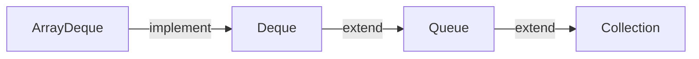
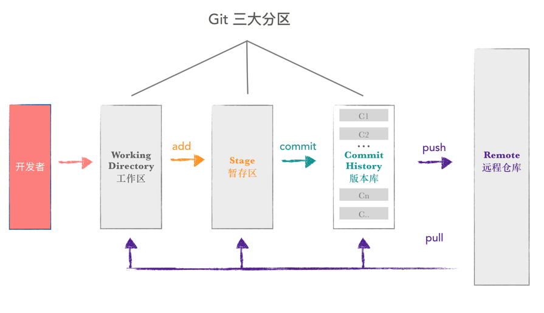
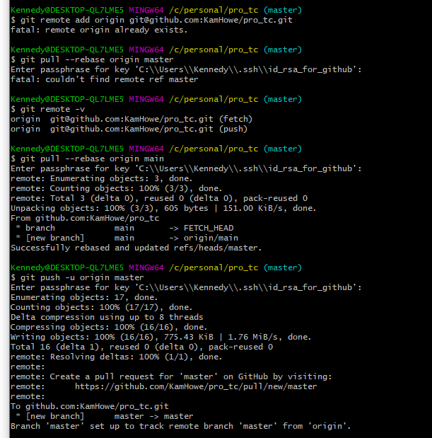
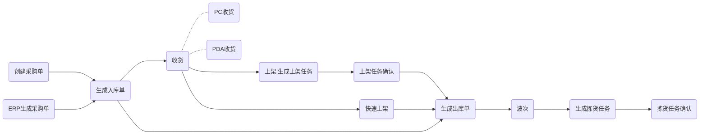

> 整合技术知识
>
> 自己使用
>
> #### 2022


## Links

> 微信开发者文档 -- https://developers.weixin.qq.com/doc/offiaccount/Getting_Started/Getting_Started_Guide.html


GitHub项目：

> springboot  -  https://github.com/ZHENFENG13/spring-boot-projects
>
> spring - https://github.com/wuyouzhuguli/SpringAll
>
> 电子书： https://github.com/itdevbooks/pdf
>
> DevToys: https://devtoys.app/    |   https://github.com/veler/DevToys
>
> CSNote: https://github.com/CyC2018/CS-Notes
>
> advanced-java: https://github.com/doocs/advanced-java
>
> java-basic: https://github.com/Snailclimb/JavaGuide.git


文档：

> mysql - 参考 Mysql-0419.pdf


## MQ

> 参考：https://github.com/doocs/advanced-java/blob/main/docs/high-concurrency/why-mq.md


### 概念

#### why use MQ？

> 核心场景: (优点)
>
> * 解耦
>
>   比如A系统 产生一条关键数据，BCD系统都用到，A系统还需要考虑BCD系统挂了重发的问题
>
>   **产生数据，发送到MQ，哪个系统使用直接去MQ消费即可。**
>
>   通过一个 MQ，Pub/Sub 发布订阅消息这么一个模型，A 系统就跟其它系统彻底解耦了。
>
> * 异步
>
>   使用MQ，可以直接省下等待其它系统执行的时间。
>
> * 削峰
>
>   高并发时能限制每次拉取消息的最大数量，避免请求过大导致系统崩溃。
>
>  
>
> 缺点：
>
> * 系统可用性降低 【MQ可能会挂】
> * 系统复杂性提高 【需要保证没有重复消费】
> * 一致性问题 【A，B系统操作成功了，但C系统失败了，会产生数据不一致的问题】


#### Kafka、ActiveMQ、RabbitMQ、RocketMQ对比

| 特性                     | ActiveMQ                              | RabbitMQ                                           | RocketMQ                                                     | Kafka                                                        |
| ------------------------ | ------------------------------------- | -------------------------------------------------- | ------------------------------------------------------------ | ------------------------------------------------------------ |
| 单机吞吐量               | 万级，比 RocketMQ、Kafka 低一个数量级 | 同 ActiveMQ                                        | 10 万级，支撑高吞吐                                          | 10 万级，高吞吐，一般配合大数据类的系统来进行实时数据计算、日志采集等场景 |
| topic 数量对吞吐量的影响 |                                       |                                                    | topic 可以达到几百/几千的级别，吞吐量会有较小幅度的下降，这是 RocketMQ 的一大优势，在同等机器下，可以支撑大量的 topic | topic 从几十到几百个时候，吞吐量会大幅度下降，在同等机器下，Kafka 尽量保证 topic 数量不要过多，如果要支撑大规模的 topic，需要增加更多的机器资源 |
| 时效性                   | ms 级                                 | 微秒级，这是 RabbitMQ 的一大特点，延迟最低         | ms 级                                                        | 延迟在 ms 级以内                                             |
| 可用性                   | 高，基于主从架构实现高可用            | 同 ActiveMQ                                        | 非常高，分布式架构                                           | 非常高，分布式，一个数据多个副本，少数机器宕机，不会丢失数据，不会导致不可用 |
| 消息可靠性               | 有较低的概率丢失数据                  | 基本不丢                                           | 经过参数优化配置，可以做到 0 丢失                            | 同 RocketMQ                                                  |
| 功能支持                 | MQ 领域的功能极其完备                 | 基于 erlang 开发，并发能力很强，性能极好，延时很低 | MQ 功能较为完善，还是分布式的，扩展性好                      | 功能较为简单，主要支持简单的 MQ 功能，在大数据领域的实时计算以及日志采集被大规模使用 |


综上，各种对比之后，有如下建议：

一般的业务系统要引入 MQ，最早大家都用 ActiveMQ，但是现在确实大家用的不多了，没经过大规模吞吐量场景的验证，社区也不是很活跃，所以大家还是算了吧，我个人不推荐用这个了。

后来大家开始用 RabbitMQ，但是确实 erlang 语言阻止了大量的 Java 工程师去深入研究和掌控它，对公司而言，几乎处于不可控的状态，但是确实人家是开源的，比较稳定的支持，活跃度也高。

不过现在确实越来越多的公司会去用 RocketMQ，确实很不错，毕竟是阿里出品，但社区可能有突然黄掉的风险（目前 RocketMQ 已捐给 [Apache](https://github.com/apache/rocketmq)，但 GitHub 上的活跃度其实不算高）对自己公司技术实力有绝对自信的，推荐用 RocketMQ，否则回去老老实实用 RabbitMQ 吧，人家有活跃的开源社区，绝对不会黄。

所以**中小型公司**，技术实力较为一般，技术挑战不是特别高，用 RabbitMQ 是不错的选择；**大型公司**，基础架构研发实力较强，用 RocketMQ 是很好的选择。

如果是**大数据领域**的实时计算、日志采集等场景，用 Kafka 是业内标准的，绝对没问题，社区活跃度很高，绝对不会黄，何况几乎是全世界这个领域的事实性规范


#### 高可用

> https://github.com/doocs/advanced-java/blob/main/docs/high-concurrency/how-to-ensure-high-availability-of-message-queues.md

##### RabbitMQ的高可用

RabbitMQ 是比较有代表性的，因为是**基于主从**（非分布式）做高可用性的，我们就以 RabbitMQ 为例子讲解第一种 MQ 的高可用性怎么实现。

RabbitMQ 有三种模式：**单机模式、普通集群模式、镜像集群模式**。

###### 单机模式

> 单机模式，就是 Demo 级别的，一般就是你本地启动了玩玩儿的，没人生产用单机模式。

###### 普通集群模式（无高可用性）

> 普通集群模式，意思就是在多台机器上启动多个 RabbitMQ 实例，每台机器启动一个。你**创建的 queue，只会放在一个 RabbitMQ 实例上**，但是每个实例都同步 queue 的元数据（元数据可以认为是 queue 的一些配置信息，通过元数据，可以找到 queue 所在实例）。你消费的时候，实际上如果连接到了另外一个实例，那么那个实例会从 queue 所在实例上拉取数据过来。

> **没有什么所谓的高可用性**，**这方案主要是提高吞吐量的**，就是说让集群中多个节点来服务某个 queue 的读写操作。

###### 镜像集群模式（高可用性）

> 这种模式，才是所谓的 RabbitMQ 的高可用模式。跟普通集群模式不一样的是，在镜像集群模式下，你创建的 queue，无论是元数据还是 queue 里的消息都会**存在于多个实例上**，就是说，每个 RabbitMQ 节点都有这个 queue 的一个**完整镜像**，包含 queue 的全部数据的意思。然后每次你写消息到 queue 的时候，都会自动把**消息同步**到多个实例的 queue 上。

> 那么**如何开启这个镜像集群模式**呢？其实很简单，RabbitMQ 有很好的管理控制台，就是在后台新增一个策略，这个策略是**镜像集群模式的策略**，指定的时候是可以要求数据同步到所有节点的，也可以要求同步到指定数量的节点，再次创建 queue 的时候，应用这个策略，就会自动将数据同步到其他的节点上去了。

> 这样的话，好处在于，你任何一个机器宕机了，没事儿，其它机器（节点）还包含了这个 queue 的完整数据，别的 consumer 都可以到其它节点上去消费数据。坏处在于，第一，这个性能开销也太大了吧，消息需要同步到所有机器上，导致网络带宽压力和消耗很重！第二，这么玩儿，不是分布式的，就**没有扩展性可言**了，如果某个 queue 负载很重，你加机器，新增的机器也包含了这个 queue 的所有数据，并**没有办法线性扩展**你的 queue。你想，如果这个 queue 的数据量很大，大到这个机器上的容量无法容纳了，此时该怎么办呢？


##### Kafka 的高可用性

Kafka 一个最基本的架构认识：由多个 broker 组成，每个 broker 是一个节点；你创建一个 topic，这个 topic 可以划分为多个 partition，每个 partition 可以存在于不同的 broker 上，每个 partition 就放一部分数据。

这就是**天然的分布式消息队列**，就是说一个 topic 的数据，是**分散放在多个机器上的，每个机器就放一部分数据**。

> 实际上 RabbitMQ 之类的，并不是分布式消息队列，它就是传统的消息队列，只不过提供了一些集群、HA(High Availability, 高可用性) 的机制而已，因为无论怎么玩儿，RabbitMQ 一个 queue 的数据都是放在一个节点里的，镜像集群模式下，也是每个节点都放这个 queue 的完整数据。


Kafka 0.8 以后，提供了 HA 机制，就是 replica（复制品） 副本机制。每个 partition 的数据都会同步到其它机器上，形成自己的多个 replica 副本。所有 replica 会选举一个 leader 出来，那么生产和消费都跟这个 leader 打交道，然后其他 replica 就是 follower。写的时候，leader 会负责把数据同步到所有 follower 上去，读的时候就直接读 leader 上的数据即可。只能读写 leader？很简单，**要是你可以随意读写每个 follower，那么就要 care 数据一致性的问题**，系统复杂度太高，很容易出问题。Kafka 会均匀地将一个 partition 的所有 replica 分布在不同的机器上，这样才可以提高容错性。


这么搞，就有所谓的**高可用性**了，因为如果某个 broker 宕机了，没事儿，那个 broker 上面的 partition 在其他机器上都有副本的。如果这个宕机的 broker 上面有某个 partition 的 leader，那么此时会从 follower 中**重新选举**一个新的 leader 出来，大家继续读写那个新的 leader 即可。这就有所谓的高可用性了。

**写数据**的时候，生产者就写 leader，然后 leader 将数据落地写本地磁盘，接着其他 follower 自己主动从 leader 来 pull 数据。一旦所有 follower 同步好数据了，就会发送 ack 给 leader，leader 收到所有 follower 的 ack 之后，就会返回写成功的消息给生产者。（当然，这只是其中一种模式，还可以适当调整这个行为）

**消费**的时候，只会从 leader 去读，但是只有当一个消息已经被所有 follower 都同步成功返回 ack 的时候，这个消息才会被消费者读到。


#### 消息可靠性传输

> https://github.com/doocs/advanced-java/blob/main/docs/high-concurrency/how-to-ensure-the-reliable-transmission-of-messages.md

##### RabbitMQ

总结：


###### 生产者弄丢了数据

生产者将数据发送到 RabbitMQ 的时候，可能数据就在半路给搞丢了，因为网络问题啥的，都有可能。

此时可以选择用 RabbitMQ 提供的事务功能，就是生产者**发送数据之前**开启 RabbitMQ 事务 `channel.txSelect()` ，然后发送消息，如果消息没有成功被 RabbitMQ 接收到，那么生产者会收到异常报错，此时就可以回滚事务 `channel.txRollback()` ，然后重试发送消息；如果收到了消息，那么可以提交事务 `channel.txCommit()` 。

```java
try {
    // 通过工厂创建连接
    connection = factory.newConnection();
    // 获取通道
    channel = connection.createChannel();
    // 开启事务
    channel.txSelect();
    
    // 这里发送消息
    channel.basicPublish(exchange, routingKey, MessageProperties.PERSISTENT_TEXT_PLAIN, msg.getBytes());
    
    //模拟异常
    int result = 1 / 0;
    
    channel.commit();
    
} catch(IOException | TimeoutException e) {
    //捕捉异常，回滚事务
    channel.txRollback();
}
```

但是问题是，RabbitMQ 事务机制（同步）一搞，基本上**吞吐量会下来，因为太耗性能**。

所以一般来说，如果你要确保说写 RabbitMQ 的消息别丢，可以开启 `confirm` 模式，在生产者那里设置开启 `confirm` 模式之后，你每次写的消息都会分配一个唯一的 id，然后如果写入了 RabbitMQ 中，RabbitMQ 会给你回传一个 `ack` 消息，告诉你说这个消息 ok 了。如果 RabbitMQ 没能处理这个消息，会回调你的一个 `nack` 接口，告诉你这个消息接收失败，你可以重试。而且你可以结合这个机制自己在内存里维护每个消息 id 的状态，如果超过一定时间还没接收到这个消息的回调，那么你可以重发。

事务机制和 `confirm` 机制最大的不同在于，**事务机制是同步的**，你提交一个事务之后会**阻塞**在那儿，但是 `confirm` 机制是**异步**的，你发送个消息之后就可以发送下一个消息，然后那个消息 RabbitMQ 接收了之后会异步回调你的一个接口通知你这个消息接收到了。

所以一般在生产者这块**避免数据丢失**，都是用 `confirm` 机制的。

> 已经在 transaction 事务模式的 channel 是不能再设置成 confirm 模式的，即这两种模式是不能共存的。

客户端实现生产者 `confirm` 有 3 种方式：

1.**普通 confirm 模式**：每发送一条消息后，调用 `waitForConfirms()` 方法，等待服务器端 confirm，如果服务端返回 false 或者在一段时间内都没返回，客户端可以进行消息重发。

```java
channel.basicPublish(ConfirmConfig.exchangeName, ConfirmConfig.routingKey, MessageProperties.PERSISTENT_TEXT_PLAIN, ConfirmConfig.msg_10B.getBytes());
if (!channel.waitForConfirms()) {
    // 消息发送失败
    // ...
}
```

2.**批量 confirm 模式**：每发送一批消息后，调用 `waitForConfirms()` 方法，等待服务端 confirm。

```java
channel.confirmSelect();
for (int i = 0; i < batchCount; ++i) {
    channel.basicPublish(ConfirmConfig.exchangeName, ConfirmConfig.routingKey, MessageProperties.PERSISTENT_TEXT_PLAIN, ConfirmConfig.msg_10B.getBytes());
}
if (!channel.waitForConfirms()) {
    // 消息发送失败
    // ...
}
```

3.**异步 confirm 模式**：提供一个回调方法，服务端 confirm 了一条或者多条消息后客户端会回调这个方法。

```java
SortedSet<Long> confirmSet = Collections.synchronizedSortedSet(new TreeSet<Long>());
channel.confirmSelect();
channel.addConfirmListener(new ConfirmListener() {
    public void handleAck(long deliveryTag, boolean multiple) throws IOException {
        if (multiple) {
            confirmSet.headSet(deliveryTag + 1).clear();
        } else {
            confirmSet.remove(deliveryTag);
        }
    }

    public void handleNack(long deliveryTag, boolean multiple) throws IOException {
        System.out.println("Nack, SeqNo: " + deliveryTag + ", multiple: " + multiple);
        if (multiple) {
            confirmSet.headSet(deliveryTag + 1).clear();
        } else {
            confirmSet.remove(deliveryTag);
        }
    }
});

while (true) {
    long nextSeqNo = channel.getNextPublishSeqNo();
    channel.basicPublish(ConfirmConfig.exchangeName, ConfirmConfig.routingKey, MessageProperties.PERSISTENT_TEXT_PLAIN, ConfirmConfig.msg_10B.getBytes());
    confirmSet.add(nextSeqNo);
}
```


###### RabbitMQ 弄丢了数据

就是 RabbitMQ 自己弄丢了数据，这个你必须**开启 RabbitMQ 的持久化**，就是消息写入之后会持久化到磁盘，哪怕是 RabbitMQ 自己挂了，**恢复之后会自动读取之前存储的数据**，一般数据不会丢。除非极其罕见的是，RabbitMQ 还没持久化，自己就挂了，**可能导致少量数据丢失**，但是这个概率较小。

设置持久化有**两个步骤**：

- 创建 queue 的时候将其设置为持久化。这样就可以保证 RabbitMQ 持久化 queue 的元数据，但是它是不会持久化 queue 里的数据的。

- 第二个是发送消息的时候将消息的 `deliveryMode` 设置为 2。就是将消息设置为持久化的，此时 RabbitMQ 就会将消息持久化到磁盘上去。

必须要同时设置这两个持久化才行，RabbitMQ 哪怕是挂了，再次重启，也会从磁盘上重启恢复 queue，恢复这个 queue 里的数据。

注意，哪怕是你给 RabbitMQ 开启了持久化机制，也有一种可能，就是这个消息写到了 RabbitMQ 中，但是还没来得及持久化到磁盘上，结果不巧，此时 RabbitMQ 挂了，就会导致内存里的一点点数据丢失。

所以，持久化可以跟生产者那边的 `confirm` 机制配合起来，只有消息被持久化到磁盘之后，才会通知生产者 `ack` 了，所以哪怕是在持久化到磁盘之前，RabbitMQ 挂了，数据丢了，生产者收不到 `ack` ，你也是可以自己重发的。


###### 消费端弄丢了数据

RabbitMQ 如果丢失了数据，主要是因为你消费的时候，**刚消费到，还没处理，结果进程挂了**，比如重启了，那么就尴尬了，RabbitMQ 认为你都消费了，这数据就丢了。

这个时候得用 RabbitMQ 提供的 `ack` 机制，简单来说，就是你必须关闭 RabbitMQ 的自动 `ack` ，可以通过一个 api 来调用就行，然后每次你自己代码里确保处理完的时候，再在程序里 `ack` 一把。这样的话，如果你还没处理完，不就没有 `ack` 了？那 RabbitMQ 就认为你还没处理完，这个时候 RabbitMQ 会把这个消费分配给别的 consumer 去处理，消息是不会丢的。

> 为了保证消息从队列种可靠地到达消费者，RabbitMQ 提供了消息确认机制。消费者在声明队列时，可以指定 noAck 参数，当 noAck=false，RabbitMQ 会等待消费者显式发回 ack 信号后，才从内存（和磁盘，如果是持久化消息）中移去消息。否则，一旦消息被消费者消费，RabbitMQ 会在队列中立即删除它。


##### Kafka

###### 消费端弄丢了数据

唯一可能导致消费者弄丢数据的情况，就是说，你消费到了这个消息，然后消费者那边**自动提交了 offset**，让 Kafka 以为你已经消费好了这个消息，但其实你才刚准备处理这个消息，你还没处理，你自己就挂了，此时这条消息就丢咯。

这不是跟 RabbitMQ 差不多吗，大家都知道 Kafka 会自动提交 offset，那么只要**关闭自动提交** offset，在处理完之后自己手动提交 offset，就可以保证数据不会丢。但是此时确实还是**可能会有重复消费**，比如你刚处理完，还没提交 offset，结果自己挂了，此时肯定会重复消费一次，自己保证幂等性就好了。

生产环境碰到的一个问题，就是说我们的 Kafka 消费者消费到了数据之后是写到一个内存的 queue 里先缓冲一下，结果有的时候，你刚把消息写入内存 queue，然后消费者会自动提交 offset。然后此时我们重启了系统，就会导致内存 queue 里还没来得及处理的数据就丢失了。

###### Kafka 弄丢了数据

这块比较常见的一个场景，就是 Kafka 某个 broker 宕机，然后重新选举 partition 的 leader。大家想想，要是此时其他的 follower 刚好还有些数据没有同步，结果此时 leader 挂了，然后选举某个 follower 成 leader 之后，不就少了一些数据？这就丢了一些数据啊。

生产环境也遇到过，我们也是，之前 Kafka 的 leader 机器宕机了，将 follower 切换为 leader 之后，就会发现说这个数据就丢了。

所以此时一般是要求起码设置如下 4 个参数：

- 给 topic 设置 `replication.factor` 参数：这个值必须大于 1，要求每个 partition 必须有至少 2 个副本。
- 在 Kafka 服务端设置 `min.insync.replicas` 参数：这个值必须大于 1，这个是要求一个 leader 至少感知到有至少一个 follower 还跟自己保持联系，没掉队，这样才能确保 leader 挂了还有一个 follower 吧。
- 在 producer 端设置 `acks=all` ：这个是要求每条数据，必须是**写入所有 replica 之后，才能认为是写成功了**。
- 在 producer 端设置 `retries=MAX` （很大很大很大的一个值，无限次重试的意思）：这个是**要求一旦写入失败，就无限重试**，卡在这里了。

我们生产环境就是按照上述要求配置的，这样配置之后，至少在 Kafka broker 端就可以保证在 leader 所在 broker 发生故障，进行 leader 切换时，数据不会丢失。

###### 生产者会不会弄丢数据？

如果按照上述的思路设置了 `acks=all` ，一定不会丢，要求是，你的 leader 接收到消息，所有的 follower 都同步到了消息之后，才认为本次写成功了。如果没满足这个条件，生产者会自动不断的重试，重试无限次。


#### 保证消息顺序

> 我也没看懂
>
> https://github.com/doocs/advanced-java/blob/main/docs/high-concurrency/how-to-ensure-the-order-of-messages.md


### 使用

#### 常用命令

> 1、以应用方式启动 
>
> rabbitmq-server -detached 后台启动
>
> Rabbitmq-server 直接启动，如果你关闭窗口或者需要在改窗口使用其他命令时应用就会停止  
>
> 关闭:rabbitmqctl stop
>
> 2、以服务方式启动（安装完之后在任务管理器中服务一栏能看到RabbtiMq） 
>
> rabbitmq-service install 安装服务 
>
> rabbitmq-service start 开始服务 
>
> Rabbitmq-service stop 停止服务 
>
> Rabbitmq-service enable 使服务有效
>
> Rabbitmq-service disable 使服务无效 


#### Virtual host

> 参考文档： https://www.cnblogs.com/hopher/p/7644718.html
>
> 可以应用在不同的项目上


​	什么是virtual_host

> vhost是rabbitmq分配权限的最小细粒度。比如我们可以为一个用户分配一个可以访问哪个或者哪一些vhost的权限。
> 但是不能为用户分配一个可以访问哪一些exchange，或者queue的权限，因为rabbitmq的权限细粒度没有细化到交换器和队列，他的最小细粒度是vhost(vhost中包含许多的exchanges，queues，bingdings)。
> 所以如果exchangeA 和queueA 只能让用户A访问，exchangeB 和queueB 只能让用户B访问，要达到这种需求，只能为exchangeA 和queueA创建一个vhostA，为exchangeB 和queueB 创建vhostB，这样就隔离开来了。
>
> 补充：一个broker可以开设多个vhost，用于不同用户的权限分离
>
> virtual host只是起到一个命名空间的作用，所以可以多个user共同使用一个virtual host，文章开头写的vritual_host = '/'，这个是系统默认的


​    相关命令：

> ps.可以直接在localhost:15672上操作
>
> * 查看所有虚拟主机
>
>   ```bash
>   rabbitmqctl list_vhosts
>   ```
>
> * 添加vhost
>
>   ```bash
>   rabbitmqctl add_vhost test_vhost
>   rabbitmqctl list_vhosts
>   ```
>
> * add_user添加用户
>
>   ```bash
>   rabbitmqctl add_user test1 123456
>   rabbitmqctl add_user test2 123456
>   rabbitmqctl list_users
>   ```
>
>   ps.用户管理命令
>
>   ```bash
>   add_user <username> <password>
>   delete_user <username>
>   change_password <username> <newpassword>
>   clear_password <username>
>   authenticate_user <username> <password>
>   set_user_tags <username> <tag> ...
>   list_users
>   ```
>
> * set_permissions 分配访问
>
>   ```bash
>   rabbitmqctl set_permissions [-p <vhost>] <user> <conf> <write> <read>
>   ```
>
>   其中，权限控制（配置，读，写） 的位置分别用正则表达式来匹配特定的资源，如'^(amq.gen.*|amq.default)'可以匹配server生成的和默认的exchange，'^'可以匹配server生成的和默认的exchange，'^'不匹配任何资源
>
>   > 需要注意的是RabbitMQ会缓存每个connection或channel的权限验证结果、因此权限发生变化后需要重连才能生效。
>
>   ```bash
>   Copyrabbitmqctl set_permissions -p test_host  test1 ".*" ".*" ".*"
>   rabbitmqctl set_permissions -p test_host  test2 ".*" ".*" ".*"
>   ```


#### 交换机
> 常用的交换机有以下三种，因为消费者是从队列获取信息的，队列是绑定交换机的（一般），所以对应的消息推送/接收模式也会有以下几种：


##### Direct Exchange 直连型交换机

> 直连型交换机，根据消息携带的路由键将消息投递给对应队列。
>
> 大致流程，有一个队列绑定到一个直连交换机上，同时赋予一个路由键 routing key 。
> 然后当一个消息携带着路由值为X，这个消息通过生产者发送给交换机时，交换机就会根据这个路由值X去寻找绑定值也是X的队列。


##### Fanout Exchange 扇型交换机

>  扇型交换机，这个交换机没有路由键概念，就算你绑了路由键也是无视的。 这个交换机在接收到消息后，会直接转发到绑定到它上面的所有队列。


##### Topic Exchange 主题交换机

> 主题交换机，这个交换机其实跟直连交换机流程差不多，但是它的特点就是在它的路由键和绑定键之间是有规则的。
>
> 简单地介绍下规则：
>
> \*  (星号) 用来表示一个单词 (必须出现的)
> \# (井号) 用来表示任意数量（零个或多个）单词
>
> 通配的绑定键是跟队列进行绑定的，举个小例子
>
> > 队列Q1 绑定键为 *.TT.*          队列Q2绑定键为  TT.#
> > 如果一条消息携带的路由键为 A.TT.B，那么队列Q1将会收到；
> > 如果一条消息携带的路由键为TT.AA.BB，那么队列Q2将会收到；
>
> 
>
> 主题交换机是非常强大的，为啥这么膨胀？
> 当一个队列的绑定键为 "#"（井号） 的时候，这个队列将会无视消息的路由键，接收所有的消息。
> 当 * (星号) 和 # (井号) 这两个特殊字符都未在绑定键中出现的时候，此时主题交换机就拥有的直连交换机的行为。
> 所以主题交换机也就实现了扇形交换机的功能，和直连交换机的功能。
>
> 另外还有 Header Exchange 头交换机 ，Default Exchange 默认交换机，Dead Letter Exchange 死信交换机，这几个该篇暂不做讲述。


##### Direct Exchange测试

1. 创建rabbitmq-provider项目

   ```xml
   <dependency>
       <groupId>org.springframework.boot</groupId>
       <artifactId>spring-boot-starter-web</artifactId>
   </dependency>
   <dependency>
       <groupId>org.springframework.boot</groupId>
       <artifactId>spring-boot-starter-amqp</artifactId>
   </dependency>
   ```

   ```yml
   server:
     port: 8021
   spring:
     application:
       name: rabbit-provider
     rabbitmq:
       host: 127.0.0.1
       port: 5672
       username: guest
       password: guest
   
   ```

   配置：

   ```java
   @Configuration
   public class DirectRabbitConfig {
       @Bean
       public Queue testDirectQueue() {
           // durable:是否持久化,默认是false,持久化队列：会被存储在磁盘上，当消息代理重启时仍然存在，暂存队列：当前连接有效
           // exclusive:默认也是false，只能被当前创建的连接使用，而且当连接关闭后队列即被删除。此参考优先级高于durable
           // autoDelete:是否自动删除，当没有生产者或者消费者使用此队列，该队列会自动删除。
   //           return new Queue("TestDirectQueue",true,true,false);
   
           return new Queue("TestDirectQueue", true);
       }
   
       @Bean
       DirectExchange testDirectExchange() {
           return new DirectExchange("TestDirectExchange", true, false);
       }
   
       @Bean
       Binding bindingDirect() {
           //绑定  将队列和交换机绑定, 并设置用于匹配键：TestDirectRouting
           return BindingBuilder.bind(testDirectQueue()).to(testDirectExchange()).with("TestDirectRouting");
       }
   
       @Bean
       DirectExchange lonelyDirectExchange() {
           return new DirectExchange("lonelyDirectExchange");
       }
   }
   ```

   发送信息：

   ```java
   @RestController
   @RequestMapping("/send")
   public class SendMsgController {
       @Autowired
       RabbitTemplate rabbitTemplate;
   
       @GetMapping("/sendDirectMessage")
       public String sendMsg() {
           String msgId = String.valueOf(UUID.randomUUID());
           String msgData = "test message";
           String createTime = LocalDateTime.now().format(DateTimeFormatter.ofPattern("yyyy-MM-dd HH:mm:ss"));
           Map<String, Object> map = new HashMap<>();
           map.put("msgId", msgId);
           map.put("msgData", msgData);
           map.put("createTime", createTime);
           rabbitTemplate.convertAndSend("TestDirectExchange", "TestDirectRouting", map);
           return "ok";
       }
   }
   ```

   

2. 创建rabbitmq-customer项目

   pom.xml与appliction.yml同上

   配置：

   ```java
   @Configuration
   public class DirectRabbitConfig {
       @Bean
       public Queue testDirectQueue() {
           return new Queue("TestDirectQueue", true);
       }
   
       @Bean
       DirectExchange testDirectExchange() {
           return new DirectExchange("TestDirectExchange");
       }
   
       @Bean
       Binding bindingDirect() {
           return BindingBuilder.bind(testDirectQueue()).to(testDirectExchange()).with("TestDirectRouting");
       }
   }
   ```

   接收信息：

   ```java
   @Component
   @RabbitListener(queues = "TestDirectQueue")
   public class DirectReceiver {
       @RabbitHandler
       public void process(Map testMessage) {
           System.out.println("Received: " + testMessage.toString());
       }
   }
   ```

   

3. 使用postman发送信息：

   

4. 若使用多个配置相同的RabbitListener监听，则为轮询

   


##### TopicExchange测试

1. rabbitmq-provider中：

   定义TopicRabbitConfig

   ```java
   @Configuration
   public class TopicRabbitConfig {
       public final static String man = "topic.man";
       public final static String woman = "topic.woman";
   
       @Bean
       public Queue firstQueue() {
           return new Queue(TopicRabbitConfig.man);
       }
   
       @Bean
       public Queue secondQueue() {
           return new Queue(TopicRabbitConfig.woman);
       }
   
       @Bean
       TopicExchange topicExchange() {
           return new TopicExchange("topicExchange");
       }
   
       //将firstQueue和topicExchange绑定,而且绑定的键值为topic.man
       //这样只要是消息携带的路由键是topic.man,才会分发到该队列
       @Bean
       Binding bindingExchangeMessage() {
           return BindingBuilder.bind(firstQueue()).to(topicExchange()).with(man);
       }
   
       //将secondQueue和topicExchange绑定,而且绑定的键值为用上通配路由键规则topic.#
       // 这样只要是消息携带的路由键是以topic.开头,都会分发到该队列
       @Bean
       Binding bindingExchangeMessage2() {
           return BindingBuilder.bind(secondQueue()).to(topicExchange()).with("topic.#");
       }
   
   }
   ```

   加入发送信息方法：

   ```java
   @GetMapping("/sendTopicMessage1")
   public String sendTopicMsg1() {
       String msgId = String.valueOf(UUID.randomUUID());
       String msgData = "message M A N";
       String createTime = LocalDateTime.now().format(DateTimeFormatter.ofPattern("yyyy-MM-dd HH:mm:ss"));
       Map<String, Object> map = new HashMap<>();
       map.put("msgId", msgId);
       map.put("msgData", msgData);
       map.put("createTime", createTime);
       rabbitTemplate.convertAndSend("topicExchange", "topic.man", map);
       return "ok";
   }
   
   
   @RequestMapping("/sendTopicMessage2")
   public String sendTopicMsg2() {
       String msgId = String.valueOf(UUID.randomUUID());
       String msgData = "message: woman is all";
       String createTime = LocalDateTime.now().format(DateTimeFormatter.ofPattern("yyyy-MM-dd HH:mm:ss"));
       Map<String, Object> map = new HashMap<>();
       map.put("msgId", msgId);
       map.put("msgData", msgData);
       map.put("createTime", createTime);
       rabbitTemplate.convertAndSend("topicExchange", "topic.woman", map);
       return "ok";
   }
   ```

2. rabbitmq-customer中：

   加入两个信息接受类：

   ```java
   @Component
   @RabbitListener(queues = "topic.man")
   public class TopicManReceiver {
       @RabbitHandler
       public void process(Map testMessage) {
           System.out.println("TopicManReceiver消费者收到消息  : " + testMessage.toString());
       }
   }
   ```

   ```java
   @Component
   @RabbitListener(queues = "topic.woman")
   public class TopicTotalReceiver {
       @RabbitHandler
       public void process(Map testMessage) {
           System.out.println("TopicTotalReceiver消费者收到消息  : " + testMessage);
       }
   }
   ```

3. 测试：

   


## Redis

### 基本数据类型

Redis 主要有以下几种数据类型：

- Strings
- Hashes
- Lists
- Sets
- Sorted Sets

> Redis 除了这 5 种数据类型之外，还有 Bitmaps、HyperLogLogs、Streams 等。


1. Strings

   这是最简单的类型，就是普通的 set 和 get，做简单的 KV 缓存。

   ```bash
   set college szu
   ```

2. Hashes

   这个是类似 map 的一种结构，这个一般就是可以将结构化的数据，比如一个对象（前提是**这个对象没嵌套其他的对象**）给缓存在 Redis 里，然后每次读写缓存的时候，可以就操作 hash 里的**某个字段**。

   ```bash
   hset person name bingo
   hset person age 20
   hset person id 1
   hget person name
   ```

   ```json
   (person = {
     "name": "bingo",
     "age": 20,
     "id": 1
   })
   ```

3. Lists

   Lists 是有序列表，这个可以玩儿出很多花样。

   比如可以通过 list 存储一些列表型的数据结构，类似粉丝列表、文章的评论列表之类的东西。

   比如可以通过 lrange 命令，读取某个闭区间内的元素，可以基于 list 实现分页查询，这个是很棒的一个功能，基于 Redis 实现简单的高性能分页，可以做类似微博那种下拉不断分页的东西，性能高，就一页一页走。

   ```bash
   # 0开始位置，-1结束位置，结束位置为-1时，表示列表的最后一个位置，即查看所有。
   lrange mylist 0 -1
   ```

   比如可以搞个简单的消息队列，从 list 头怼进去，从 list 尾巴那里弄出来。

   ```bash
   lpush mylist 1
   lpush mylist 2
   lpush mylist 3 4 5
   
   # 1
   rpop mylist
   ```

   ps. 可以使用 lpush  or  rpush，在list的前 or 后插入数据， lpop or rpop --- list前or后取值 （只能用 lrange ）

4. Sets

   Sets 是无序集合，自动去重。

   直接基于 set 将系统里需要去重的数据扔进去，自动就给去重了，如果你需要对一些数据进行快速的全局去重，你当然也可以基于 jvm 内存里的 HashSet 进行去重，但是如果你的某个系统部署在多台机器上呢？得基于 Redis 进行全局的 set 去重。

   可以基于 set 玩儿交集、并集、差集的操作，比如交集吧，可以把两个人的粉丝列表整一个交集，看看俩人的共同好友是谁？对吧。

   把两个大 V 的粉丝都放在两个 set 中，对两个 set 做交集。

   ```
   #-------操作一个set-------
   # 添加元素
   sadd mySet 1
   
   # 查看全部元素
   smembers mySet
   
   # 判断是否包含某个值
   sismember mySet 3
   
   # 删除某个/些元素
   srem mySet 1
   srem mySet 2 4
   
   # 查看元素个数
   scard mySet
   
   # 随机删除一个元素
   spop mySet
   
   #-------操作多个set-------
   # 将一个set的元素移动到另外一个set
   smove yourSet mySet 2
   
   # 求两set的交集
   sinter yourSet mySet
   
   # 求两set的并集
   sunion yourSet mySet
   
   # 求在yourSet中而不在mySet中的元素
   sdiff yourSet mySet
   ```

5.  SortedSets

   Sorted Sets 是排序的 set，去重但可以排序，写进去的时候给一个分数，自动根据分数排序。

   ```bash
   zadd board 85 zhangsan
   zadd board 72 lisi
   zadd board 96 wangwu
   zadd board 63 zhaoliu
   
   # 获取排名前三的用户（默认是升序，所以需要 rev 改为降序）
   zrevrange board 0 3
   
   # 获取某用户的排名
   zrank board zhaoliu
   ```

   


### 过期策略

Redis 过期策略是：**惰性删除+定时删除**

**定期删除**

- 含义：每隔一段时间执行一次删除(在redis.conf配置文件设置hz，1s刷新的频率)过期key操作

> 定期删除，指的是 Redis 默认是每隔 100ms 就随机抽取一些设置了过期时间的 key，检查其是否过期，如果过期就删除。
>
> 假设 Redis 里放了 10w 个 key，都设置了过期时间，你每隔几百毫秒，就检查 10w 个 key，那 Redis 基本上就死了，cpu 负载会很高的，消耗在你的检查过期 key 上了。注意，这里可不是每隔 100ms 就遍历所有的设置过期时间的 key，那样就是一场性能上的灾难。实际上 Redis 是每隔 100ms **随机抽取**一些 key 来检查和删除的。
>
> 但是问题是，定期删除可能会导致很多过期 key 到了时间并没有被删除掉，那咋整呢？所以就是惰性删除了。这就是说，在你获取某个 key 的时候，Redis 会检查一下 ，这个 key 如果设置了过期时间那么是否过期了？如果过期了此时就会删除，不会给你返回任何东西。

> 

- 定期删除流程（简单而言，对指定个数个库的每一个库随机删除小于等于指定个数个过期key）
  - 遍历每个数据库（就是redis.conf中配置的"database"数量，默认为16）
    - 检查当前库中的指定个数个key（默认是每个库检查20个key，注意相当于该循环执行20次，循环体时下边的描述）
      - 如果当前库中没有一个key设置了过期时间，直接执行下一个库的遍历
      - 随机获取一个设置了过期时间的key，检查该key是否过期，如果过期，删除key
      - 判断定期删除操作是否已经达到指定时长，若已经达到，直接退出定期删除。


**惰性删除**

惰性删除为被动删除：用到的时候才会去检验key是不是已过期，过期就删除

- 惰性删除流程
  - 在进行get或setnx等操作时，先检查key是否过期，
  - 若过期，删除key，然后执行相应操作；
  - 若没过期，直接执行相应操作


**操作**

> **EXPIRE** 接口定义：EXPIRE key "seconds"
>
> ​	置一个key在当前时间"seconds"(秒)之后过期。返回1代表设置成功，返回0代表key不存在或者无法设置过期时间。
>
>  
>
> **EXPIREAT** 接口定义：EXPIREAT key "timestamp"
>
> ​	设置一个key在"timestamp"(时间戳(秒))之后过期。返回1代表设置成功，返回0代表key不存在或者无法设置过期时间。
>
>  
>
> **PEXPIREAT** 接口定义：PEXPIREAT key "milliseconds-timestamp"
>
> ​	设置一个key在"milliseconds-timestamp"(时间戳(毫秒))之后过期。返回1代表设置成功，返回0代表key不存在或者无法设置过期时间
>
>  
>
> **TTL** 接口定义：TTL key
>
> ​	获取key的过期时间。如果key存在过期时间，返回剩余生存时间(秒)；如果key是永久的，返回-1；如果key不存在或者已过期，返回-2
>
>  
>
> **PTTL** 接口定义：PTTL key
>
> ​	获取key的过期时间。如果key存在过期时间，返回剩余生存时间(毫秒)；如果key是永久的，返回-1；如果key不存在或者已过期，返回-2
>
>  
>
> **PERSIST** 接口定义：PERSIST key
>
> ​	移除key的过期时间，将其转换为永久状态。如果返回1，代表转换成功。如果返回0，代表key不存在或者之前就已经是永久状态
>
>  
>
> **SETEX** 接口定义：SETEX key "seconds" "value"
>
> ​	SETEX在逻辑上等价于SET和EXPIRE合并的操作，区别之处在于SETEX是一条命令，而命令的执行是原子性的，所以不会出现并发问题。


### 内存淘汰机制

Redis 内存淘汰机制有以下几个：

- noeviction: 当内存不足以容纳新写入数据时，新写入操作会报错，这个一般没人用吧.
- **allkeys-lru**：当内存不足以容纳新写入数据时，在**键空间**中，移除最近最少使用的 key（这个是**最常用**的）。
- allkeys-random：当内存不足以容纳新写入数据时，在**键空间**中，随机移除某个 key，这个一般没人用吧，为啥要随机，肯定是把最近最少使用的 key 给干掉啊。
- volatile-lru：当内存不足以容纳新写入数据时，在**设置了过期时间的键空间**中，移除最近最少使用的 key（这个一般不太合适）。
- volatile-random：当内存不足以容纳新写入数据时，在**设置了过期时间的键空间**中，**随机移除**某个 key。
- volatile-ttl：当内存不足以容纳新写入数据时，在**设置了过期时间的键空间**中，有**更早过期时间**的 key 优先移除。


> LRU 就是 Least Recently Used 的缩写，翻译过来就是“最近最少使用”。也就是说 LRU 算法会将最近最少用的缓存移除，让给最新使用的缓存。而往往最常读取的，也就是读取次数最多的，所以利用好 LRU 算法，我们能够提供对热点数据的缓存效率，能够提高缓存服务的内存使用率。
>
> ```java
> public class LRUCache<K, V> extends LinkedHashMap<K, V> {
>     private int capacity;
> 
>     /**
>      * 传递进来最多能缓存多少数据
>      *
>      * @param capacity 缓存大小
>      */
>     public LRUCache(int capacity) {
>         super(capacity, 0.75f, true);
>         this.capacity = capacity;
>     }
> 
>     /**
>      * 如果map中的数据量大于设定的最大容量，返回true，再新加入对象时删除最老的数据
>      *
>      * @param eldest 最老的数据项
>      * @return true则移除最老的数据
>      */
>     @Override
>     protected boolean removeEldestEntry(Map.Entry<K, V> eldest) {
>         // 当 map中的数据量大于指定的缓存个数的时候，自动移除最老的数据
>         return size() > capacity;
>     }
> }
> ```
>
> 


### 缓存问题

#### 缓存雪崩

> 当某一个时刻出现大规模的缓存失效的情况，那么就会导致大量的请求直接打在数据库上面，导致数据库压力巨大，如果在高并发的情况下，可能瞬间就会导致数据库宕机。这时候如果运维马上又重启数据库，马上又会有新的流量把数据库打死。这就是缓存雪崩。
>
> 


**分析：**

造成缓存雪崩的关键在于在**同一时间大规模的key失效**。为什么会出现这个问题呢，有几种可能，第一种可能是**Redis宕机**，第二种可能是采用了相同的过期时间。搞清楚原因之后，那么有什么解决方案呢？


**解决方案：**

1、在原有的失效时间上加上一个随机值，比如1-5分钟随机。这样就避免了因为采用相同的过期时间导致的缓存雪崩。

如果真的发生了缓存雪崩，有没有什么兜底的措施？

2、使用**熔断机制**。当流量到达一定的阈值时，就直接返回“系统拥挤”之类的提示，防止过多的请求打在数据库上。至少能保证一部分用户是可以正常使用，其他用户多刷新几次也能得到结果。

3、提高数据库的容灾能力，可以使用**分库分表，读写分离**的策略。

4、为了防止Redis宕机导致缓存雪崩的问题，可以搭建**Redis集群**，提高Redis的容灾性。


#### 缓存击穿

> 其实跟缓存雪崩有点类似，缓存雪崩是大规模的key失效，而缓存击穿是一个热点的Key，有大并发集中对其进行访问，突然间这个Key失效了，导致大并发全部打在数据库上，导致数据库压力剧增。这种现象就叫做缓存击穿。


**分析：**

关键在于某个热点的key失效了，导致大并发集中打在数据库上。所以要从两个方面解决，第一是否可以考虑热点key不设置过期时间，第二是否可以考虑降低打在数据库上的请求数量。


**解决方案：**

1、上面说过了，如果业务允许的话，对于热点的key可以设置永不过期的key。

2、使用互斥锁。如果缓存失效的情况，只有拿到锁才可以查询数据库，降低了在同一时刻打在数据库上的请求，防止数据库打死。当然这样会导致系统的性能变差。

> [可以采用基于 Redis、zookeeper 等分布式中间件的分布式互斥锁，或者本地互斥锁以保证仅少量的请求能请求数据库并重新构建缓存，其余线程则在锁释放后能访问到新缓存。]


#### 缓存穿透

**什么是缓存穿透？**

> 我们使用Redis大部分情况都是通过Key查询对应的值，假如发送的请求传进来的key是不存在Redis中的，那么就查不到缓存，查不到缓存就会去数据库查询。假如有大量这样的请求，这些请求像“穿透”了缓存一样直接打在数据库上，这种现象就叫做缓存穿透。


**分析：**

关键在于在Redis查不到key值，这和缓存击穿有根本的区别，区别在于**缓存穿透的情况是传进来的key在Redis中是不存在的**。假如有黑客传进大量的不存在的key，那么大量的请求打在数据库上是很致命的问题，所以在日常开发中要对参数做好校验，一些非法的参数，不可能存在的key就直接返回错误提示，要对调用方保持这种“不信任”的心态。


**解决方案：**

1、**把无效的Key存进Redis中**。如果Redis查不到数据，数据库也查不到，我们把这个Key值保存进Redis，设置value="null"，当下次再通过这个Key查询时就不需要再查询数据库。这种处理方式肯定是有问题的，假如传进来的这个不存在的Key值每次都是随机的，那存进Redis也没有意义。

2、**使用布隆过滤器**。布隆过滤器的作用是某个 key 不存在，那么就一定不存在，它说某个 key 存在，那么很大可能是存在(存在一定的误判率)。于是我们可以在缓存之前再加一层布隆过滤器，在查询的时候先去布隆过滤器查询 key 是否存在，如果不存在就直接返回。


### 分布式锁

> 以下搬运自 tc1

> 来源： 怎样实现redis分布式锁？ - Kaito的回答 - 知乎 https://www.zhihu.com/question/300767410/answer/1931519430
>
> 禁止转载，自己去看吧


### 操作

> 客户端：
>
> * redis客户端: ```redis-cli```
>
> * 在远程服务上执行命令：```redis-cli -h host -p port -a password```
>
> Redis键：
>
> * ```bash
>     redis 127.0.0.1:6379> SET runoobkey redis
>     OK
>     redis 127.0.0.1:6379> DEL runoobkey
>     (integer) 1
>     ```
>
> * 其它key命令：
>
>     * **DEL key**  删除key
>     * **DUMP key** 系列化key
>     * **EXIST key**  检查key是否存在
>     * **EXPIRE key seconds**   为给定的key设置过期时间，以秒为单位
>     * **EXPIREAT key timestamp**    都用于为 key 设置过期时间。 不同在于 EXPIREAT 命令接受的时间参数是 UNIX 时间戳(unix timestamp)。
>     * **PEXPIRE key milliseconds**      设置 key 的过期时间以毫秒计
>     * **PEXPIREAT key milliseconds-timestamp**     设置 key 过期时间的时间戳(unix timestamp) 以毫秒计
>     * **KEYS pattern**     查找所有符合给定模式( pattern)的 key 。【比如： KEYS \*O\*】 
>     * **MOVE key db**    将当前数据库的 key 移动到给定的数据库 db 当中。
>     * **PERSIST key**    移除key的过期时间，key将持久保留
>     * **PTTL key**     返回key过期时间，毫秒
>     * **TTL key**     返回key过期时间，秒
>     * **TYPE key**    返回key所存储的值的类型


## Algorithm

### leetcode


#### DP

1. [骑士在棋盘上的概率](https://leetcode-cn.com/problems/knight-probability-in-chessboard/)

```java
public Solution {
    public static int[][] dirs = {{-1, 2}, {-1, -2}, {-2, -1}, {-2, 1}, {1, 2}, {1, -2}, {2, -1}, {2, 1}};
    
    public double knightProbability(int n, int k, int row, int column) {
        double[][][] dp = new double[k + 1][n][n];
        for (int step = 0; step <= k; step++) {
            for (int i = 0; i < n; i++) {
                for (int j = 0; j < n; j++) {
                    if (step == 0) {
                        dp[step][i][j] = 1;
                    } else {
                        for(int[] dir : dirs) {
                            int newi = i + dir[0];
                            int newj = j + dir[1];
                            if(newi >= 0 && newi < n && newj >=0 && newj < n) {
                                dp[step][i][j] += dp[step - 1][newi][newj] / 8;
                            }
                        }
                    }
                }
            }
        }
        return dp[k][row][column];
    }
}
```


#### 双指针
[推多米诺](https://leetcode-cn.com/problems/push-dominoes/)
1.双指针

~~~java
public static String pushDominoesTowPoint2(String dominoes) {
        char[] chars = dominoes.toCharArray();
        int length = chars.length;
        int i = 0;
    char left = 'L';

    while(i < length) {
        int j = i;

        while(j < length && chars[j] == '.') {
            j++;
        }
        char right = j < length ? chars[j] : 'R';

        if (left == right) {
            while(i < j) {
                chars[i++] = right;
            }
        } else if (left == 'R' && right == 'L') {
            int k = j - 1;
            while(i < k) {
                chars[i++] = 'R';
                chars[k--] = 'L';
            }
        }

        left = right;
        i = j + 1;
    }
    return new String(chars);
}
```
~~~
2.广度优先搜索

```java
public static String pushDominoes2(String dominoes) {
    int length = dominoes.length();
    Deque<Integer> queue = new ArrayDeque<>();
    int[] time = new int[length];
    Arrays.fill(time, -1);
    List<Character>[] force = new List[length];
    for (int i = 0; i < length; i++) {
        force[i] = new ArrayList<>();
    }

    for (int i = 0; i < length; i++) {
        char f = dominoes.charAt(i);

        if (f != '.') {
            queue.add(i);
            time[i] = 0;
            force[i].add(f);
        }
    }

    char[] res = new char[length];
    Arrays.fill(res, '.');

    while(!queue.isEmpty()) {
        int index = queue.poll();

        //用来排除平衡的情况
        if (force[index].size() == 1) {
            char f = force[index].get(0);
            res[index] = f;

            int nextIndex = f == 'L' ? index - 1 : index + 1;

            if (nextIndex >= 0 && nextIndex < length) {
                int t = time[index];

                if (time[nextIndex] == -1) {
                    queue.offer(nextIndex);
                    time[nextIndex] = t + 1;
                    force[nextIndex].add(f);

                } else if (time[nextIndex] == t + 1) {
                    force[nextIndex].add(f);
                }
            }
        }
    }
    return new String(res);
}
```


#### other

[仅仅反转字母](https://leetcode-cn.com/problems/reverse-only-letters/)

```java
public String reverseOnlyLetters(String s) {
	char[] chars = s.toCharArray();
    int j = chars.length - 1;
    int i = 0;
    while(i < j) {
        while(i < j && (chars[i] < 'A' || chars[i] > 'z' || (chars[i] > 'Z' && chars[i] < 'a'))) {
            i++;
        }
        while(i < j && (chars[j] < 'A' || chars[j] > 'z' || (chars[j] > 'Z' && chars[j] < 'a'))) {
            j--;
        }
        if(i < j) {
            char temp = chars[i];
            chars[i] = chars[j];
            chars[j] = temp;
        }
        i++;
        j--;
    }
    return new String(chars);
}
```


##### [七进制数](https://leetcode-cn.com/problems/base-7/)

```JAVA
//比较简单的方法
class Solution {
    public String convertToBase7(int num) {
		return Integer.toString(num, 7);
    }
    
    public String convertToBase7_2(int num) {
        if(num == 0) {
            return "0";
        }
        boolean isNegate = num < 0;
        num = isNegate ? -num : num;
        StringBuffer sb = new StringBuffer();
        
        while(num != 0) {
            sb.append(num % 7);
            num = num /= 7;
        }
        if(isNegate) {
            sb.append("-");
        }
        return sb.reverse().toString();
    }
}
```


##### [两个列表的最小索引总和](https://leetcode-cn.com/problems/minimum-index-sum-of-two-lists/)


```java
public String[] findRestaurant(String[] list1, String[] list2) {
	Map<String, Integer> map = new HashMap<>();
    int length = list1.length;
    List<String> res = new ArrayList<>();
    int minIndex = length + list2.length;
    for(int i = 0; i < length; i++) {
        map.put(list1[i], i);
    }
    
    for(int i = 0; i < list2.length; i++) {
        String tmp = list2[i];
        if(map.containsKey(tmp)) {
            int curr = map.get(tmp) + i;
            if(curr < minIndex) {
                res.clear();
                minIndex = curr;
                res.add(tmp);
            } else if(curr == minIndex) {
                res.add(tmp);
            }
        }
    }
    
    return res.toArray(new String[res.size()]);
}
```


给出一个字符串数组 words 组成的一本英语词典。返回 words 中最长的一个单词，该单词是由 words 词典中其他单词逐步添加一个字母组成。

若其中有多个可行的答案，则返回答案中字典序最小的单词。若无答案，则返回空字符串。

 

示例 1：

输入：words = ["w","wo","wor","worl", "world"]
输出："world"
解释： 单词"world"可由"w", "wo", "wor", 和 "worl"逐步添加一个字母组成。
示例 2：

输入：words = ["a", "banana", "app", "appl", "ap", "apply", "apple"]
输出："apple"
解释："apply" 和 "apple" 都能由词典中的单词组成。但是 "apple" 的字典序小于 "apply" 


提示：

1 <= words.length <= 1000
1 <= words[i].length <= 30
所有输入的字符串 words[i] 都只包含小写字母。
链接：https://leetcode-cn.com/problems/longest-word-in-dictionary


### other

#### 红包算法

> https://cloud.tencent.com/developer/article/1699931
>
> https://www.cnblogs.com/alimayun/p/12795698.html
>
> ps.第二个会简短一点，第一个实践比较多


## Data Structure

> 相关内容>>>>>>>>>> tc1.md --- 算法

> struct:
>
> https://www.cs.usfca.edu/~galles/visualization/Algorithms.html

### ArrayDeque



[双端队列](https://www.cainiaojc.com/java/java-arraydeque.html#top)：

```java
ArrayDeque<T> queue = new ArrayDeque<>();
```


#### 方法：

**1.使用add()，addFirst()和addLast()添加元素**

- add() - 将指定的元素插入ArrayDeque双端队列的末尾
- addFirst() -在ArrayDeque双端队列的开头，插入指定的元素
- addLast() - 在ArrayDeque双端队列的末尾插入指定的内容（等效于add()）

**2.使用 offer()，offerFirst()和offerLast()插入元素**

- offer() - 将指定的元素插入ArrayDeque双端队列的末尾
- offerFirst() - 在ArrayDeque双端队列的开始处插入指定的元素
- offerLast() - 将指定的元素插入ArrayDeque双端队列的末尾

**3.使用getFirst()和getLast()访问元素**

- getFirst() - 返回ArrayDeque双端队列的第一个元素
- getLast() - 返回ArrayDeque双端队列的最后一个元素

**4.使用peek()，peekFirst()和peekLast()方法访问元素**

- **peek() - 返回**ArrayDeque双端队列的第一个元素
- peekFirst() - 返回ArrayDeque双端队列的第一个元素（等效于peek()）
- peekLast() - 返回ArrayDeque双端队列的最后一个元素

**5.使用remove()，removeFirst()，removeLast()方法删除元素**

- remove() - 返回并从ArrayDeque双端队列的**第一个元素**删除一个元素
- remove(element) - 返回并从ArrayDeque双端队列的头部**删除指定的元素**
- removeFirst() - 返回并从ArrayDeque双端队列中删除第一个元素（等效于remove()）
- removeLast() - 返回并从ArrayDeque双端队列中删除最后一个元素

**6.使用poll()，pollFirst()和pollLast()方法删除元素**

- **poll() - 返回并删除**ArrayDeque双端队列的第一个元素
- pollFirst() - 返回并删除ArrayDeque双端队列的第一个元素（等效于poll()）
- pollLast() - 返回并删除ArrayDeque双端队列的最后一个元素

**7.删除元素：使用clear()方法**

​	要从ArrayDeque双端队列中删除所有元素，我们使用clear()方法。

```java
queue.clear();
```

**8.迭代遍历ArrayDeque**

- iterator() - 返回可用于遍历ArrayDeque双端队列的迭代器
- descendingIterator() -返回一个迭代器，该迭代器可用于以相反顺序遍历ArrayDeque双端队列

```java
ArrayDeque<String> animals= new ArrayDeque<>();
Iterator<String> desIterator = animals.descendingIterator();
while(desIterator.hasNext()) {
    //倒序遍历
    System.out.println(desIterator.next());
}
```


#### ArrayDeque作为堆栈

要在Java中实现**LIFO（后进先出）**堆栈，建议在[Stack类](https://www.cainiaojc.com/java/java-stack.html)上使用双端队列。该ArrayDeque类比Stack类快。

ArrayDeque 提供了以下可用于实现堆栈的方法。

- push() - 在堆栈顶部添加一个元素
- peek() - 从堆栈顶部返回一个元素
- pop() - 返回并从堆栈顶部删除元素

```java
ArrayDeque<String> stack = new ArrayDeque<>();
//将元素添加到stack
stack.push("Dog");
stack.push("Cat");
stack.push("Horse");
System.out.println("Stack: " + stack);

//从堆栈顶部访问元素
String element = stack.peek();
System.out.println("访问元素： " + element);

//从堆栈顶部删除元素
String remElement = stack.pop();
System.out.println("删除element: " + remElement);

/*
Stack: [Horse, Cat, Dog]
访问元素： Horse
删除Element: Horse
*/
```


### LinkedHashMap

> 链接：https://www.jianshu.com/p/8f4f58b4b8ab
>
> ps.建议直接看LinkedHashMap代码

* LinkedHashMap是继承于HashMap，是基于HashMap和双向链表来实现的。

* HashMap无序；LinkedHashMap有序，可分为**插入顺序**和**访问顺序**两种。如果是访问顺序，那put和get操作已存在的Entry时，都会把Entry移动到双向链表的表尾(其实是先删除再插入)。

* LinkedHashMap存取数据，还是跟HashMap一样使用的Entry[]的方式，双向链表只是为了保证顺序。

* LinkedHashMap是线程不安全的。

```java
public class LinkedHashMap<K,V>
    extends HashMap<K,V>
    implements Map<K,V>
```

Entry结构：

(在LinkedHashMap的Entry中多加了befor, after两个元素)

```java
static class Entry<K,V> extends HashMap.Node<K,V> {
    Entry<K,V> before, after;
    Entry(int hash, K key, V value, Node<K,V> next) {
        super(hash, key, value, next);
    }
}
```


LinkedHashMap中的变量

```java
    /**
     * The head (eldest) of the doubly linked list.
     */
    transient LinkedHashMap.Entry<K,V> head;

    /**
     * The tail (youngest) of the doubly linked list.
     */
    transient LinkedHashMap.Entry<K,V> tail;

    /**
     * The iteration ordering method for this linked hash map: <tt>true</tt>
     * for access-order, <tt>false</tt> for insertion-order.
     *
     * @serial
     */
    final boolean accessOrder;
```

> 其中 accessOrder： 若构造时 accessOrder = true， 可以在访问后将元素放到list尾端：
>
> ```java
> public LinkedHashMap(int initialCapacity,
>                      float loadFactor,
>                      boolean accessOrder) {
>     super(initialCapacity, loadFactor);
>     this.accessOrder = accessOrder;
> }
> ```
>
> ```java
> // 第三个参数用于指定accessOrder值
> Map<String, String> linkedHashMap = new LinkedHashMap<>(16, 0.75f, true);
> linkedHashMap.put("name1", "josan1");
> linkedHashMap.put("name2", "josan2");
> linkedHashMap.put("name3", "josan3");
> System.out.println("开始时顺序：");
> Set<Entry<String, String>> set = linkedHashMap.entrySet();
> Iterator<Entry<String, String>> iterator = set.iterator();
> 
> while(iterator.hasNext()) {
>     Entry entry = iterator.next();
>     String key = (String) entry.getKey();
>     String value = (String) entry.getValue();
>     System.out.println("key:" + key + ",value:" + value);
> }
> System.out.println("通过get方法，导致key为name1对应的Entry到表尾");
> linkedHashMap.get("name1");
> Set<Entry<String, String>> set2 = linkedHashMap.entrySet();
> Iterator<Entry<String, String>> iterator2 = set2.iterator();
> 
> while(iterator2.hasNext()) {
>     Entry entry = iterator2.next();
>     String key = (String) entry.getKey();
>     String value = (String) entry.getValue();
>     System.out.println("key:" + key + ",value:" + value);
> }
> //开始时顺序：
> //key:name1,value:josan1
> //key:name2,value:josan2
> //key:name3,value:josan3
> //通过get方法，导致key为name1对应的Entry到表尾
> //key:name2,value:josan2
> //key:name3,value:josan3
> //key:name1,value:josan1
> ```
>
> 

#### 实现LRU

```java
public class LRUCache<K, V> extends LinkedHashMap<K, V> {
    private int capacity;

    /**
     * 传递进来最多能缓存多少数据
     *
     * @param capacity 缓存大小
     */
    public LRUCache(int capacity) {
        super(capacity, 0.75f, true);
        this.capacity = capacity;
    }

    /**
     * 如果map中的数据量大于设定的最大容量，返回true，再新加入对象时删除最老的数据
     *
     * @param eldest 最老的数据项
     * @return true则移除最老的数据
     */
    @Override
    protected boolean removeEldestEntry(Map.Entry<K, V> eldest) {
        // 当 map中的数据量大于指定的缓存个数的时候，自动移除最老的数据
        //此方法父类中默认是false, 在调用afterNodeInsertion()时使用，即调用HashMap#putVal()时使用
        return size() > capacity;
    }
}
```


### binary tree

#### 二叉树遍历

- 前序遍历：先访问根节点，然后前序遍历左子树，最后前序遍历右子树。
- 中序遍历：先中序遍历左子树，然后访问根节点，最后中序遍历右子树。
- 后序遍历：先后序遍历左子树，然后后序遍历右子树，最后访问根节点。


定义：

```c++
struct TreeNode {
    TreeNode* left;
    TreeNode* right;
    int val;
    TreeNode(int x) : val(x), left(NULL), right(NULL) {}
}
```


递归：

前序遍历：

```c++
vector<int> preorder(TreeNode *root, vector<int> &res) {
    if(!root) return res;
    res.push_back(root->val);
    preorder(root->left, res);
    preorder(root->right, res);
    return res;
}
```


中序遍历：

```c++
vector<int> inorder(TreeNode *root, vector<int> &res) {
    if(!root) return res;
    inorder(root->left, res);
    res.push_back(root->val);
    inorder(root->right, res);
    return res;
}
```


后序遍历：

```c++
vector<int> postorder(TreeNode *root, vector<int> &res) {
    if(!root) return res;
    postorder(root->left, res);
    postorder(root->right, res);
    res.push_back(root->val);
    return res;
}
```


非递归：

先序遍历：

```c++
vector<int> preorder(TreeNode *root) {
    //没有判断树是否为空
    vector<int> v;
    stack<TreeNode *> s;
    s.push(root);
    while(!s.empty) {
        TreeNode *p = s.top();
        s.pop();
        if(p != 0) {
            v.push_back(p->val);
            s.push(p->right);
            s.push(p->left);
        }
    }
}
```


中序遍历：

```c++
vector<int> inOrder(TreeNode *root) {
    vector<int> v;
    stack<TreeNode *> s;
    s.push(root);
    while(true) {
        while(s.top() != 0) {
            s.push(s.top()->left);
        }
        s.pop();
       	if(s.empty()) {
            break;
        }
        TreeNode *p = s.top();
        s.pop();
        v.push_back(p->val);
        s.push(p->right);
    }
}
```


再写一遍；

```c++
vector<int> inOrder(TreeNode *root) {
    vector<int> v;
    stack<TreeNode *> s;
    s.push(root);
    while(true) {
        while(s.top() != 0) {
            s.push(s.top()->left);
        }
        s.pop();
        if(s.empty()) {
            break;
        }
        TreeNode *p = s.top();
        s.pop();
        v.push_back(p->val);
        s.push(p->right);
    }
}
```


后序遍历：

```c++
vector<int> postOrder(TreeNode *root) {
    vector<int> v;
    if(root == nullptr) {
        return v;
    }
    stack<TreeNode *> s;
    TreeNode *p = root;
    TreeNode *prev = nullptr;
    
    while(!s.empty() ||p)
        while(p) {
            s.push(p);
            p = p->left;
        }
        
        while(!s.empty()) {
            auto node = s.top();
            s.pop();
            
            if(!node->right || node->right == prev) {
                v.push_back(node->val);
                prev = node;
                
            }else {
                s.push(node);
                p = node->right;
            }
        }
    }
    return v;
}
```


> 感觉后序遍历这个不太对，再找一个...
>
> https://blog.csdn.net/sdr_zd/article/details/82812823


## Java Basics

### Basics

> 一些写的比较杂的基础，可以跳过Basic，下面的模块比较详细

#### Cache

Integer 缓存是 Java 5 中引入的一个有助于节省内存、提高性能的特性。

Integer中有个静态内部类IntegerCache，里面有个cache[],也就是Integer常量池，常量池的大小为一个字节（-128~127）

**Integer缓存会优先获取 JVM 启动参数 ` -XX:AutoBoxCacheMax=size` ,映射到 `java.lang.Integer.IntegerCache.high`** 

```java
private static class IntegerCache {
    static final int low = -128;
    static final int high;
    static final Integer cache[];

    static {
        // high value may be configured by property
        int h = 127;
        String integerCacheHighPropValue =
            sun.misc.VM.getSavedProperty("java.lang.Integer.IntegerCache.high");
        if (integerCacheHighPropValue != null) {
            try {
                int i = parseInt(integerCacheHighPropValue);
                i = Math.max(i, 127);
                // Maximum array size is Integer.MAX_VALUE
                h = Math.min(i, Integer.MAX_VALUE - (-low) -1);
            } catch( NumberFormatException nfe) {
                // If the property cannot be parsed into an int, ignore it.
            }
        }
        high = h;

        cache = new Integer[(high - low) + 1];
        int j = low;
        for(int k = 0; k < cache.length; k++)
            cache[k] = new Integer(j++);

        // range [-128, 127] must be interned (JLS7 5.1.7)
        assert IntegerCache.high >= 127;
    }

    private IntegerCache() {}
}
```


所有整数类型的类都有类似的缓存机制:

有 ByteCache 用于缓存 Byte 对象

有 ShortCache 用于缓存 Short 对象

有 LongCache 用于缓存 Long 对象

**Byte，Short，Long 的缓存池范围默认都是: -128 到 127**。可以看出，Byte的所有值都在缓存区中，用它生成的相同值对象都是相等的。

**只有Integer的缓存范围可以通过参数修改**


----

> 另一个:

Java 基本类型的包装类的大部分都实现了常量池技术。

`Byte`,`Short`,`Integer`,`Long` 这 4 种包装类默认创建了数值 **[-128，127]** 的相应类型的缓存数据，`Character` 创建了数值在 **[0,127]** 范围的缓存数据，`Boolean` 直接返回 `True` or `False`。

**Integer 缓存源码：**

```java
public static Integer valueOf(int i) {
    if (i >= IntegerCache.low && i <= IntegerCache.high)
        return IntegerCache.cache[i + (-IntegerCache.low)];
    return new Integer(i);
}
private static class IntegerCache {
    static final int low = -128;
    static final int high;
    static {
        // high value may be configured by property
        int h = 127;
    }
}
```

**`Character` 缓存源码:**

```java
public static Character valueOf(char c) {
    if (c <= 127) { // must cache
      return CharacterCache.cache[(int)c];
    }
    return new Character(c);
}

private static class CharacterCache {
    private CharacterCache(){}
    static final Character cache[] = new Character[127 + 1];
    static {
        for (int i = 0; i < cache.length; i++)
            cache[i] = new Character((char)i);
    }

}
```

**`Boolean` 缓存源码：**

```java
public static Boolean valueOf(boolean b) {
    return (b ? TRUE : FALSE);
}
```

如果超出对应范围仍然会去创建新的对象，缓存的范围区间的大小只是在性能和资源之间的权衡。

两种浮点数类型的包装类 `Float`,`Double` 并没有实现常量池技术。

```java
Integer i1 = 33;
Integer i2 = 33;
System.out.println(i1 == i2);// 输出 true

Float i11 = 333f;
Float i22 = 333f;
System.out.println(i11 == i22);// 输出 false

Double i3 = 1.2;
Double i4 = 1.2;
System.out.println(i3 == i4);// 输出 false
```

下面我们来看一下问题。下面的代码的输出结果是 `true` 还是 `false` 呢？

```java
Integer i1 = 40;
Integer i2 = new Integer(40);
System.out.println(i1==i2);
```

`Integer i1=40` 这一行代码会发生装箱，也就是说这行代码等价于 `Integer i1=Integer.valueOf(40)` 。因此，`i1` 直接使用的是常量池中的对象。而`Integer i2 = new Integer(40)` 会直接创建新的对象。

因此，答案是 `false` 。你答对了吗？

记住：**所有整型包装类对象之间值的比较，全部使用 equals 方法比较**。


**自动拆装箱？**

- **装箱**：将基本类型用它们对应的引用类型包装起来；
- **拆箱**：将包装类型转换为基本数据类型；

举例：

```java
Integer i = 10;  //装箱
int n = i;   //拆箱
```

上面这两行代码对应的字节码为：

```java
   L1

    LINENUMBER 8 L1

    ALOAD 0

    BIPUSH 10

    INVOKESTATIC java/lang/Integer.valueOf (I)Ljava/lang/Integer;

    PUTFIELD AutoBoxTest.i : Ljava/lang/Integer;

   L2

    LINENUMBER 9 L2

    ALOAD 0

    ALOAD 0

    GETFIELD AutoBoxTest.i : Ljava/lang/Integer;

    INVOKEVIRTUAL java/lang/Integer.intValue ()I

    PUTFIELD AutoBoxTest.n : I

    RETURN
```

从字节码中，我们发现装箱其实就是调用了 包装类的`valueOf()`方法，拆箱其实就是调用了 `xxxValue()`方法。

因此，

- `Integer i = 10` 等价于 `Integer i = Integer.valueOf(10)`
- `int n = i` 等价于 `int n = i.intValue()`;

注意：**如果频繁拆装箱的话，也会严重影响系统的性能。我们应该尽量避免不必要的拆装箱操作。**

```java
private static long sum() {
    // 应该使用 long 而不是 Long
    Long sum = 0L;
    for (long i = 0; i <= Integer.MAX_VALUE; i++)
        sum += i;
    return sum;
}
```


#### BigDecimal

##### 为什么浮点数会有精度丢失

> http://kaito-kidd.com/2018/08/08/computer-system-float-point/

> 这个和计算机保存浮点数的机制有很大关系。我们知道计算机是二进制的，而且计算机在表示一个数字时，宽度是有限的，无限循环的小数存储在计算机时，只能被截断，所以就会导致小数精度发生损失的情况。这也就是解释了为什么浮点数没有办法用二进制精确表示。
>
> 就比如说十进制下的 0.2 就没办法精确转换成二进制小数：

```text
// 0.2 转换为二进制数的过程为，不断乘以 2，直到不存在小数为止，
// 在这个计算过程中，得到的整数部分从上到下排列就是二进制的结果。
0.2 * 2 = 0.4 -> 0
0.4 * 2 = 0.8 -> 0
0.8 * 2 = 1.6 -> 1
0.6 * 2 = 1.2 -> 1
0.2 * 2 = 0.4 -> 0（发生循环）
...
```


##### methods

```java
BigDecimal a = new BigDecimal("1.0");
BigDecimal b = new BigDecimal("0.9");
System.out.println(a.add(b));// 1.9
System.out.println(a.subtract(b));// 0.1
System.out.println(a.multiply(b));// 0.90
System.out.println(a.divide(b));// 无法除尽，抛出 ArithmeticException 异常
System.out.println(a.divide(b, 2, RoundingMode.HALF_UP));// 1.11

//大小比较（-1： a < b; 0: a==b, 1: a>b)
BigDecimal a = new BigDecimal("1.0");
BigDecimal b = new BigDecimal("0.9");
System.out.println(a.compareTo(b));// 1

//保留几位小数
BigDecimal m = new BigDecimal("1.255433");
BigDecimal n = m.setScale(3, RoundingMode.HALF_DOWN);
System.out.println(n);// 1.255

//转double
b1.multiply(b2).doubleValue();

//比大小,返回更大的一个 or 更小的一个
b1.max(b2);
b1.min(b2);
```


> 注意：禁止用 `BigDecimal(double)` 方法将double转为BigDecimal对象,存在精度丢失的风险


#### 关键字 & ASCII表

> ASCII关键字符：
>
> A -- 65 (A-Z : 65-90)
>
> a -- 97  (a-z : 97-122)
>
> 0 -- 48  (0-9 : 48-57)


**关键字**

| 分类                 | 关键字      |            |          |              |            |           |          |
| :------------------- | ----------- | ---------- | -------- | ------------ | ---------- | --------- | -------- |
| 访问控制             | private     | protected  | public   |              |            |           |          |
| 类，方法和变量修饰符 | abstract    | class      | extends  | final        | implements | interface | native   |
|                      | new         | static     | strictfp | synchronized | transient  | volatile  | enum     |
| 程序控制             | break       | continue   | return   | do           | while      | if        | else     |
|                      | for         | instanceof | switch   | case         | default    | assert    |          |
| 错误处理             | try         | catch      | throw    | throws       | finally    |           |          |
| 包相关               | import      | package    |          |              |            |           |          |
| 基本类型             | **boolean** | **byte**   | **char** | **double**   | **float**  | **int**   | **long** |
|                      | **short**   |            |          |              |            |           |          |
| 变量引用             | super       | this       | void     |              |            |           |          |
| 保留字               | goto        | const      |          |              |            |           |          |

> Tips：所有的关键字都是小写的，在 IDE 中会以特殊颜色显示。
>
> `default` 这个关键字很特殊，既属于程序控制，也属于类，方法和变量修饰符，还属于访问控制。
>
> - 在程序控制中，当在 `switch` 中匹配不到任何情况时，可以使用 `default` 来编写默认匹配的情况。
> - 在类，方法和变量修饰符中，从 JDK8 开始引入了默认方法，可以使用 `default` 关键字来定义一个方法的默认实现。
> - 在访问控制中，如果一个方法前没有任何修饰符，则默认会有一个修饰符 `default`，但是这个修饰符加上了就会报错。

注意 ⚠️：虽然 `true`, `false`, 和 `null` 看起来像关键字但实际上他们是字面值，同时你也不可以作为标识符来使用。

官方文档：[https://docs.oracle.com/javase/tutorial/java/nutsandbolts/_keywords.html](


#### 基本类型

 8 种基本数据类型的默认值以及所占空间的大小如下：

| 基本类型  | 位数 | 字节 | 默认值  | 取值范围                                   |
| :-------- | :--- | :--- | :------ | ------------------------------------------ |
| `byte`    | 8    | 1    | 0       | -128 ~ 127                                 |
| `short`   | 16   | 2    | 0       | -32768 ~ 32767                             |
| `int`     | 32   | 4    | 0       | -2147483648 ~ 2147483647                   |
| `long`    | 64   | 8    | 0L      | -9223372036854775808 ~ 9223372036854775807 |
| `char`    | 16   | 2    | 'u0000' | 0 ~ 65535                                  |
| `float`   | 32   | 4    | 0f      | 1.4E-45 ~ 3.4028235E38                     |
| `double`  | 64   | 8    | 0d      | 4.9E-324 ~ 1.7976931348623157E308          |
| `boolean` | 1    |      | false   | true、false                                |

对于 `boolean`，官方文档未明确定义，它依赖于 JVM 厂商的具体实现。逻辑上理解是占用 1 位，但是实际中会考虑计算机高效存储因素。

另外，Java 的每种基本类型所占存储空间的大小不会像其他大多数语言那样随机器硬件架构的变化而变化。这种所占存储空间大小的不变性是 Java 程序比用其他大多数语言编写的程序更具可移植性的原因之一（《Java 编程思想》2.2 节有提到）。

**注意：**

1. Java 里使用 `long` 类型的数据一定要在数值后面加上 **L**，否则将作为整型解析。
2. `char a = 'h'`char :单引号，`String a = "hello"` :双引号。

这八种基本类型都有对应的包装类分别为：`Byte`、`Short`、`Integer`、`Long`、`Float`、`Double`、`Character`、`Boolean` 。

包装类型不赋值就是 `Null` ，而基本类型有默认值且不是 `Null`。

另外，这个问题建议还可以先从 JVM 层面来分析。

基本数据类型直接存放在 Java 虚拟机栈中的局部变量表中，而包装类型属于对象类型，我们知道对象实例都存在于堆中。相比于对象类型， 基本数据类型占用的空间非常小。

> 《深入理解 Java 虚拟机》 ：局部变量表主要存放了编译期可知的基本数据类型 **（boolean、byte、char、short、int、float、long、double）**、**对象引用**（reference 类型，它不同于对象本身，可能是一个指向对象起始地址的引用指针，也可能是指向一个代表对象的句柄或其他与此对象相关的位置）。


#### 装箱&拆箱

**什么是自动拆装箱？**

- **装箱**：将基本类型用它们对应的引用类型包装起来；
- **拆箱**：将包装类型转换为基本数据类型；

举例：

```java
Integer i = 10;  //装箱
int n = i;   //拆箱
```

上面这两行代码对应的字节码为：

```java
   L1

    LINENUMBER 8 L1

    ALOAD 0

    BIPUSH 10

    INVOKESTATIC java/lang/Integer.valueOf (I)Ljava/lang/Integer;

    PUTFIELD AutoBoxTest.i : Ljava/lang/Integer;

   L2

    LINENUMBER 9 L2

    ALOAD 0

    ALOAD 0

    GETFIELD AutoBoxTest.i : Ljava/lang/Integer;

    INVOKEVIRTUAL java/lang/Integer.intValue ()I

    PUTFIELD AutoBoxTest.n : I

    RETURN
```

从字节码中，我们发现装箱其实就是调用了 包装类的`valueOf()`方法，拆箱其实就是调用了 `xxxValue()`方法。

因此，

- `Integer i = 10` 等价于 `Integer i = Integer.valueOf(10)`
- `int n = i` 等价于 `int n = i.intValue()`;

注意：**如果频繁拆装箱的话，也会严重影响系统的性能。我们应该尽量避免不必要的拆装箱操作。**

```java
private static long sum() {
    // 应该使用 long 而不是 Long
    Long sum = 0L;
    for (long i = 0; i <= Integer.MAX_VALUE; i++)
        sum += i;
    return sum;
}
```


#### == 与 equals(), equals()与hasCode()

**`==`** 对于基本类型和引用类型的作用效果是不同的：

- 对于基本数据类型来说，`==` 比较的是值。
- 对于引用数据类型来说，`==` 比较的是对象的内存地址。

> 因为 Java 只有值传递，所以，对于 == 来说，不管是比较基本数据类型，还是引用数据类型的变量，其本质比较的都是值，只是引用类型变量存的值是对象的地址。

**`equals()`** 不能用于判断基本数据类型的变量，只能用来判断两个对象是否相等。`equals()`方法存在于`Object`类中，而`Object`类是所有类的直接或间接父类，因此所有的类都有`equals()`方法。

`Object` 类 `equals()` 方法：

```java
public boolean equals(Object obj) {
     return (this == obj);
}
```

`equals()` 方法存在两种使用情况：

- **类没有重写 `equals()`方法** ：通过`equals()`比较该类的两个对象时，等价于通过“==”比较这两个对象，使用的默认是 `Object`类`equals()`方法。
- **类重写了 `equals()`方法** ：一般我们都重写 `equals()`方法来比较两个对象中的属性是否相等；若它们的属性相等，则返回 true(即，认为这两个对象相等)。

举个例子（这里只是为了举例。实际上，你按照下面这种写法的话，像 IDEA 这种比较智能的 IDE 都会提示你将 `==` 换成 `equals()` ）：

```java
String a = new String("ab"); // a 为一个引用
String b = new String("ab"); // b为另一个引用,对象的内容一样
String aa = "ab"; // 放在常量池中
String bb = "ab"; // 从常量池中查找
System.out.println(aa == bb);// true
System.out.println(a == b);// false
System.out.println(a.equals(b));// true
System.out.println(42 == 42.0);// true
```

`String` 中的 `equals` 方法是被重写过的，因为 `Object` 的 `equals` 方法是比较的对象的内存地址，而 `String` 的 `equals` 方法比较的是对象的值。

当创建 `String` 类型的对象时，虚拟机会在常量池中查找有没有已经存在的值和要创建的值相同的对象，如果有就把它赋给当前引用。如果没有就在常量池中重新创建一个 `String` 对象。

`String`类`equals()`方法：

```java
public boolean equals(Object anObject) {
    if (this == anObject) {
        return true;
    }
    if (anObject instanceof String) {
        String anotherString = (String)anObject;
        int n = value.length;
        if (n == anotherString.value.length) {
            char v1[] = value;
            char v2[] = anotherString.value;
            int i = 0;
            while (n-- != 0) {
                if (v1[i] != v2[i])
                    return false;
                i++;
            }
            return true;
        }
    }
    return false;
}
```

**hashCode() 与 equals()**

面试官可能会问你：“你重写过 `hashCode()` 和 `equals()`么?为什么重写 `equals()` 时必须重写 `hashCode()` 方法？”

一个非常基础的问题，面试中的重中之重，然而，很多求职者还是会回答不到点子上去。

**hashCode() 有什么用？**

`hashCode()` 的作用是获取哈希码（`int` 整数），也称为散列码。这个哈希码的作用是确定该对象在哈希表中的索引位置。

`hashCode()`定义在 JDK 的 `Object` 类中，这就意味着 Java 中的任何类都包含有 `hashCode()` 函数。另外需要注意的是： `Object` 的 `hashCode()` 方法是本地方法，也就是用 C 语言或 C++ 实现的，该方法通常用来将对象的内存地址转换为整数之后返回。

```java
public native int hashCode();
```

散列表存储的是键值对(key-value)，它的特点是：**能根据“键”快速的检索出对应的“值”。这其中就利用到了散列码！（可以快速找到所需要的对象）**

**为什么要有 hashCode？**

我们以“`HashSet` 如何检查重复”为例子来说明为什么要有 `hashCode`？

下面这段内容摘自我的 Java 启蒙书《Head First Java》:

> 当你把对象加入 `HashSet` 时，`HashSet` 会先计算对象的 `hashCode` 值来判断对象加入的位置，同时也会与其他已经加入的对象的 `hashCode` 值作比较，如果没有相符的 `hashCode`，`HashSet` 会假设对象没有重复出现。但是如果发现有相同 `hashCode` 值的对象，这时会调用 `equals()` 方法来检查 `hashCode` 相等的对象是否真的相同。如果两者相同，`HashSet` 就不会让其加入操作成功。如果不同的话，就会重新散列到其他位置。这样我们就大大减少了 `equals` 的次数，相应就大大提高了执行速度。

其实， `hashCode()` 和 `equals()`都是用于比较两个对象是否相等。

**那为什么 JDK 还要同时提供这两个方法呢？**

这是因为在一些容器（比如 `HashMap`、`HashSet`）中，有了 `hashCode()` 之后，判断元素是否在对应容器中的效率会更高（参考添加元素进`HastSet`的过程）！

我们在前面也提到了添加元素进`HastSet`的过程，如果 `HashSet` 在对比的时候，同样的 `hashCode` 有多个对象，它会继续使用 `equals()` 来判断是否真的相同。也就是说 `hashCode` 帮助我们大大缩小了查找成本。

**那为什么不只提供 `hashCode()` 方法呢？**

这是因为两个对象的`hashCode` 值相等并不代表两个对象就相等。

**那为什么两个对象有相同的 `hashCode` 值，它们也不一定是相等的？**

因为 `hashCode()` 所使用的哈希算法也许刚好会让多个对象传回相同的哈希值。越糟糕的哈希算法越容易碰撞，但这也与数据值域分布的特性有关（所谓哈希碰撞也就是指的是不同的对象得到相同的 `hashCode` )。

总结下来就是 ：

- 如果两个对象的`hashCode` 值相等，那这两个对象不一定相等（哈希碰撞）。
- 如果两个对象的`hashCode` 值相等并且`equals()`方法也返回 `true`，我们才认为这两个对象相等。
- 如果两个对象的`hashCode` 值不相等，我们就可以直接认为这两个对象不相等。

相信大家看了我前面对 `hashCode()` 和 `equals()` 的介绍之后，下面这个问题已经难不倒你们了。

**为什么重写 equals() 时必须重写 hashCode() 方法？**

因为两个相等的对象的 `hashCode` 值必须是相等。也就是说如果 `equals` 方法判断两个对象是相等的，那这两个对象的 `hashCode` 值也要相等。

如果重写 `equals()` 时没有重写 `hashCode()` 方法的话就可能会导致 `equals` 方法判断是相等的两个对象，`hashCode` 值却不相等。

**思考** ：重写 `equals()` 时没有重写 `hashCode()` 方法的话，使用 `HashMap` 可能会出现什么问题。

**总结** ：

- `equals` 方法判断两个对象是相等的，那这两个对象的 `hashCode` 值也要相等。
- 两个对象有相同的 `hashCode` 值，他们也不一定是相等的（哈希碰撞）。

更多关于 `hashCode()` 和 `equals()` 的内容可以查看：[Java hashCode() 和 equals()的若干问题解答](https://www.cnblogs.com/skywang12345/p/3324958.html)


#### integer值更改：

```java
public static void main(String[] args) {
    Integer num1 = new Integer(1);
    Integer num2 = num1;
    handle(num2);
    System.out.println(num1);
    System.out.println(num1 == num2);
}


public static void handle(Integer num) {
    num = new Integer(2);
}
```

运行结果：

```
1
true
```

解析：

> 只有对引用对象的内部做了修改，才会影响原对象如果直接将引用修改了，则对原对象没有影响，唯一的影响就是：这个被修改的引用，现在不是原来对象的引用，而是新对象的引用.


**ps. java都是值传递，对象或者数组也是传递他们对应的地址过去，所以更改其内容有效，而修改他们地址的操作不会影响原来的数组。**


#### Collections#disjoint

```java
public static boolean disjoint(Collection<?> c1, Collection<?> c2) {}
```

两个集合没有交集，返回true,

有交集，返回false

注：其中一个是空集合也返回true


### 面向对象

#### 特征

* 封装
* 继承
* 多态


**封装**

封装是指把一个对象的状态信息（也就是属性）隐藏在对象内部，不允许外部对象直接访问对象的内部信息。但是可以提供一些可以被外界访问的方法来操作属性。


**继承**

继承是使用已存在的类的定义作为基础建立新类的技术，新类的定义可以增加新的数据或新的功能，也可以用父类的功能，但不能选择性地继承父类。通过使用继承，可以快速地创建新的类，可以提高代码的重用，程序的可维护性，节省大量创建新类的时间 ，提高我们的开发效率。

1. 子类拥有父类对象所有的属性和方法（包括私有属性和私有方法），但是父类中的私有属性和方法子类是无法访问，**只是拥有**。
2. 子类可以拥有自己属性和方法，即子类可以对父类进行扩展。
3. 子类可以用自己的方式实现父类的方法。


**多态**

多态，顾名思义，表示一个对象具有多种的状态，具体表现为父类的引用指向子类的实例。


**多态的特点:** （看看这个_<）

- **对象类型和引用类型之间具有继承（类）/实现（接口）的关系；**
- 引用类型变量发出的方法调用的到底是哪个类中的方法，必须在程序运行期间才能确定；
- **多态不能调用“只在子类存在但在父类不存在”的方法；**
- **如果子类重写了父类的方法，真正执行的是子类覆盖的方法，如果子类没有覆盖父类的方法，执行的是父类的方法。**


#### 接口&抽象类

共同点：

* 都不能被实例化
* 都可以包含抽象方法
* 都可以有默认的实现方法

不同：

* 接口主要用于对类的行为进行约束，你实现了某个接口就具有了对应的行为。抽象类主要用于代码复用，强调的是所属关系（比如说我们抽象了一个发送短信的抽象类，）。
* 一个类只能继承一个类，但是可以实现多个接口。
* 接口中的成员变量只能是 `public static final` 类型的，不能被修改且必须有初始值，而抽象类的成员变量默认 default，可在子类中被重新定义，也可被重新赋值。


#### 深拷贝&浅拷贝

关于深拷贝和浅拷贝区别，我这里先给结论：

- **浅拷贝**：浅拷贝会在堆上创建一个新的对象（区别于引用拷贝的一点），不过，如果原对象内部的属性是引用类型的话，浅拷贝会直接复制内部对象的引用地址，也就是说拷贝对象和原对象共用同一个内部对象。
- **深拷贝** ：深拷贝会完全复制整个对象，包括这个对象所包含的内部对象。

上面的结论没有完全理解的话也没关系，我们来看一个具体的案例！

**浅拷贝**

浅拷贝的示例代码如下，我们这里实现了 `Cloneable` 接口，并重写了 `clone()` 方法。

`clone()` 方法的实现很简单，直接调用的是父类 `Object` 的 `clone()` 方法。

```java
public class Address implements Cloneable{
    private String name;
    // 省略构造函数、Getter&Setter方法
    @Override
    public Address clone() {
        try {
            return (Address) super.clone();
        } catch (CloneNotSupportedException e) {
            throw new AssertionError();
        }
    }
}

public class Person implements Cloneable {
    private Address address;
    // 省略构造函数、Getter&Setter方法
    @Override
    public Person clone() {
        try {
            Person person = (Person) super.clone();
            return person;
        } catch (CloneNotSupportedException e) {
            throw new AssertionError();
        }
    }
}
```

测试 ：

```java
Person person1 = new Person(new Address("武汉"));
Person person1Copy = person1.clone();
// true
System.out.println(person1.getAddress() == person1Copy.getAddress());
```

从输出结构就可以看出， `person1` 的克隆对象和 `person1` 使用的仍然是同一个 `Address` 对象。

**深拷贝**

这里我们简单对 `Person` 类的 `clone()` 方法进行修改，连带着要把 `Person` 对象内部的 `Address` 对象一起复制。

```java
@Override
public Person clone() {
    try {
        Person person = (Person) super.clone();
        person.setAddress(person.getAddress().clone());
        return person;
    } catch (CloneNotSupportedException e) {
        throw new AssertionError();
    }
}
```

测试 ：

```java
Person person1 = new Person(new Address("武汉"));
Person person1Copy = person1.clone();
// false
System.out.println(person1.getAddress() == person1Copy.getAddress());
```

从输出结构就可以看出，虽然 `person1` 的克隆对象和 `person1` 包含的 `Address` 对象已经是不同的了。

**那什么是引用拷贝呢？** 简单来说，引用拷贝就是两个不同的引用指向同一个对象。

我专门画了一张图来描述浅拷贝、深拷贝、引用拷贝：


#### 常见对象

##### Object

**Object类的方法**

Object 类是一个特殊的类，是所有类的父类。它主要提供了以下 11 个方法：

```java
public final native Class<?> getClass()//native方法，用于返回当前运行时对象的Class对象，使用了final关键字修饰，故不允许子类重写。

public native int hashCode() //native方法，用于返回对象的哈希码，主要使用在哈希表中，比如JDK中的HashMap。

public boolean equals(Object obj)//用于比较2个对象的内存地址是否相等，String类对该方法进行了重写用户比较字符串的值是否相等。

protected native Object clone() throws CloneNotSupportedException//naitive方法，用于创建并返回当前对象的一份拷贝。一般情况下，对于任何对象 x，表达式 x.clone() != x 为true，x.clone().getClass() == x.getClass() 为true。Object本身没有实现Cloneable接口，所以不重写clone方法并且进行调用的话会发生CloneNotSupportedException异常。

public String toString()//返回类的名字@实例的哈希码的16进制的字符串。建议Object所有的子类都重写这个方法。

public final native void notify()//native方法，并且不能重写。唤醒一个在此对象监视器上等待的线程(监视器相当于就是锁的概念)。如果有多个线程在等待只会任意唤醒一个。

public final native void notifyAll()//native方法，并且不能重写。跟notify一样，唯一的区别就是会唤醒在此对象监视器上等待的所有线程，而不是一个线程。

public final native void wait(long timeout) throws InterruptedException//native方法，并且不能重写。暂停线程的执行。注意：sleep方法没有释放锁，而wait方法释放了锁 。timeout是等待时间。

public final void wait(long timeout, int nanos) throws InterruptedException//多了nanos参数，这个参数表示额外时间（以毫微秒为单位，范围是 0-999999）。 所以超时的时间还需要加上nanos毫秒。

public final void wait() throws InterruptedException//跟之前的2个wait方法一样，只不过该方法一直等待，没有超时时间这个概念

protected void finalize() throws Throwable { }//实例被垃圾回收器回收的时候触发的操作
```


##### String

**可变性**

> String为什么是不可变的？

简单的来说：`String` 类中使用 `final` 关键字修饰字符数组来保存字符串，~~所以`String` 对象是不可变的。~~

```java
public final class String implements java.io.Serializable, Comparable<String>, CharSequence {
    private final char value[];
	//...
}
```

> 🐛 修正 ： 我们知道被 `final` 关键字修饰的类不能被继承，修饰的方法不能被重写，修饰的变量是基本数据类型则值不能改变，修饰的变量是引用类型则不能再指向其他对象。因此，`final` 关键字修饰的数组保存字符串并不是 `String` 不可变的根本原因，因为这个数组保存的字符串是可变的（`final` 修饰引用类型变量的情况）。
>
> `String` 真正不可变有下面几点原因：
>
> 1. 保存字符串的数组被 `final` 修饰且为私有的，并且`String` 类没有提供/暴露修改这个字符串的方法。
> 2. `String` 类被 `final` 修饰导致其不能被继承，进而避免了子类破坏 `String` 不可变。
>
> 相关阅读：[如何理解 String 类型值的不可变？ - 知乎提问](https://www.zhihu.com/question/20618891/answer/114125846)
>
> 补充（来自[issue 675](https://github.com/Snailclimb/JavaGuide/issues/675)）：在 Java 9 之后，`String` 、`StringBuilder` 与 `StringBuffer` 的实现改用 byte 数组存储字符串。


`StringBuilder` 与 `StringBuffer` 都继承自 `AbstractStringBuilder` 类，在 `AbstractStringBuilder` 中也是使用字符数组保存字符串，不过没有使用 `final` 和 `private` 关键字修饰，最关键的是这个 `AbstractStringBuilder` 类还提供了很多修改字符串的方法比如 `append` 方法。

```java
abstract class AbstractStringBuilder implements Appendable, CharSequence {
    char[] value;
    public AbstractStringBuilder append(String str) {
        if (str == null)
            return appendNull();
        int len = str.length();
        ensureCapacityInternal(count + len);
        str.getChars(0, len, value, count);
        count += len;
        return this;
    }
  	//...
}
```

**线程安全性**

`String` 中的对象是不可变的，也就可以理解为常量，线程安全。`AbstractStringBuilder` 是 `StringBuilder` 与 `StringBuffer` 的公共父类，定义了一些字符串的基本操作，如 `expandCapacity`、`append`、`insert`、`indexOf` 等公共方法。`StringBuffer` 对方法加了同步锁或者对调用的方法加了同步锁，所以是线程安全的。`StringBuilder` 并没有对方法进行加同步锁，所以是非线程安全的。


**性能**

每次对 `String` 类型进行改变的时候，都会生成一个新的 `String` 对象，然后将指针指向新的 `String` 对象。`StringBuffer` 每次都会对 `StringBuffer` 对象本身进行操作，而不是生成新的对象并改变对象引用。相同情况下使用 `StringBuilder` 相比使用 `StringBuffer` 仅能获得 10%~15% 左右的性能提升，但却要冒多线程不安全的风险。


**对于三者使用的总结：**

1. 操作少量的数据: 适用 `String`
2. 单线程操作字符串缓冲区下操作大量数据: 适用 `StringBuilder`
3. 多线程操作字符串缓冲区下操作大量数据: 适用 `StringBuffer`


**字符串拼接用“+” 还是 StringBuilder?**

Java 语言本身并不支持运算符重载，“+”和“+=”是专门为 String 类重载过的运算符，也是 Java 中仅有的两个重载过的元素符。

```java
String str1 = "he";
String str2 = "llo";
String str3 = "world";
String str4 = str1 + str2 + str3;
```

对象引用和“+”的字符串拼接方式，实际上是通过 `StringBuilder` 调用 `append()` 方法实现的，拼接完成之后调用 `toString()` 得到一个 `String` 对象 。

不过，在循环内使用“+”进行字符串的拼接的话，存在比较明显的缺陷：**编译器不会创建单个 `StringBuilder` 以复用，会导致创建过多的 `StringBuilder` 对象**。

```java
String[] arr = {"he", "llo", "world"};
String s = "";
for (int i = 0; i < arr.length; i++) {
    s += arr[i];
}
System.out.println(s);
```

`StringBuilder` 对象是在循环内部被创建的，这意味着每循环一次就会创建一个 `StringBuilder` 对象。
如果直接使用 `StringBuilder` 对象进行字符串拼接的话，就不会存在这个问题了。


**String#equals() 和 Object#equals()**

`String` 中的 `equals` 方法是被重写过的，比较的是 String 字符串的值是否相等。 `Object` 的 `equals` 方法是比较的对象的内存地址。


**字符串常量池**

**字符串常量池** 是 JVM 为了提升性能和减少内存消耗针对字符串（String 类）专门开辟的一块区域，主要目的是为了避免字符串的重复创建。

```java
String aa = "ab"; // 放在常量池中
String bb = "ab"; // 从常量池中查找
System.out.println(aa==bb);// true
```

JDK1.7 之前运行时常量池逻辑包含字符串常量池存放在方法区。JDK1.7 的时候，字符串常量池被从方法区拿到了堆中。

你可以在 JVM 部分找到更多关于字符串常量池的介绍。


#### 重写&重载

> 重载就是同样的一个方法能够根据输入数据的不同，做出不同的处理
>
> 重写就是当子类继承自父类的相同方法，输入数据一样，但要做出有别于父类的响应时，你就要覆盖父类方法

**重载**

发生在同一个类中（或者父类和子类之间），方法名必须相同，参数类型不同、个数不同、顺序不同，方法返回值和访问修饰符可以不同。

《Java 核心技术》这本书是这样介绍重载的：

> 如果多个方法(比如 `StringBuilder` 的构造方法)有相同的名字、不同的参数， 便产生了重载。
>
> ```java
> StringBuilder sb = new StringBuilder();
> StringBuilder sb2 = new StringBuilder("HelloWorld");
> ```
>
> 编译器必须挑选出具体执行哪个方法，它通过用各个方法给出的参数类型与特定方法调用所使用的值类型进行匹配来挑选出相应的方法。 如果编译器找不到匹配的参数， 就会产生编译时错误， 因为根本不存在匹配， 或者没有一个比其他的更好(这个过程被称为重载解析(overloading resolution))。
>
> Java 允许重载任何方法， 而不只是构造器方法。

综上：重载就是同一个类中多个同名方法根据不同的传参来执行不同的逻辑处理。

**重写**

重写发生在运行期，是子类对父类的允许访问的方法的实现过程进行重新编写。

1. 方法名、参数列表必须相同，子类方法返回值类型应比父类方法返回值类型更小或相等，抛出的异常范围小于等于父类，访问修饰符范围大于等于父类。
2. 如果父类方法访问修饰符为 `private/final/static` 则子类就不能重写该方法，但是被 `static` 修饰的方法能够被再次声明。
3. 构造方法无法被重写

综上：**重写就是子类对父类方法的重新改造，外部样子不能改变，内部逻辑可以改变。**

| 区别点     | 重载方法 | 重写方法                                                     |
| :--------- | :------- | :----------------------------------------------------------- |
| 发生范围   | 同一个类 | 子类                                                         |
| 参数列表   | 必须修改 | 一定不能修改                                                 |
| 返回类型   | 可修改   | 子类方法返回值类型应比父类方法返回值类型更小或相等           |
| 异常       | 可修改   | 子类方法声明抛出的异常类应比父类方法声明抛出的异常类更小或相等； |
| 访问修饰符 | 可修改   | 一定不能做更严格的限制（可以降低限制）                       |
| 发生阶段   | 编译期   | 运行期                                                       |

**方法的重写要遵循“两同两小一大”**（以下内容摘录自《疯狂 Java 讲义》，[issue#892](https://github.com/Snailclimb/JavaGuide/issues/892) ）：

- “两同”即方法名相同、形参列表相同；
- “两小”指的是子类方法返回值类型应比父类方法返回值类型更小或相等，子类方法声明抛出的异常类应比父类方法声明抛出的异常类更小或相等；
- “一大”指的是子类方法的访问权限应比父类方法的访问权限更大或相等。

⭐️ 关于 **重写的返回值类型** 这里需要额外多说明一下，上面的表述不太清晰准确：如果方法的返回类型是 void 和基本数据类型，则返回值重写时不可修改。但是如果方法的返回值是引用类型，重写时是可以返回该引用类型的子类的。

```java
public class Hero {
    public String name() {
        return "超级英雄";
    }
}
public class SuperMan extends Hero{
    @Override
    public String name() {
        return "超人";
    }
    public Hero hero() {
        return new Hero();
    }
}

public class SuperSuperMan extends SuperMan {
    public String name() {
        return "超级超级英雄";
    }

    @Override
    public SuperMan hero() {
        return new SuperMan();
    }
}
```


#### 多态

编译看左边，实现看右边！


#### 类加载

##### 类加载过程 TODO

##### 类加载顺序

> 父类静态代码块
>
> 子类静态代码块
>
> 父类非静态代码块
>
> 父类构造函数
>
> 子类非静态代码块
>
> 子类构造函数


例子：

```java
public class Base {
    private String baseName = "base";

    public Base() {
        callName();
    }

    public void callName() {
        System.out.println(baseName);
    }

    static class Sub extends Base {
        private String baseName = "Sub";

        public void callName() {
            System.out.println(baseName);
        }
    }


    public static void main(String[] args) {
        Base b = new Sub();
        Base c = new Base();
        Sub s = new Sub();
    }
}

---------------------------------------------
null
base
null

```


ps.因为先加载到了父类的构造方法，然后多态，实现用Sub类，因此输出null


### I/O

I/O（**I**nput/**O**utpu） 即**输入／输出** 。

根据冯.诺依曼结构，计算机结构分为 5 大部分：运算器、控制器、存储器、输入设备、输出设备。


**Java中常见的I/O模型**

> 可以参考 JavaGuide-basic-io.md 文件 

* **BIO（Blcking I/O)** : 

    **BIO 属于同步阻塞 IO 模型** , 

    同步阻塞 IO 模型中，应用程序发起 read 调用后，会一直阻塞，直到内核把数据拷贝到用户空间。
    
* **NIO (Non-blocking/New I/O)**

  **同步非阻塞 IO 模型**中，应用程序会一直发起 read 调用，等待数据从内核空间拷贝到用户空间的这段时间里，线程依然是阻塞的，直到在内核把数据拷贝到用户空间。
  
  **IO 多路复用模型**中，线程首先发起 select 调用，询问内核数据是否准备就绪，等内核把数据准备好了，用户线程再发起 read 调用。read 调用的过程（数据从内核空间 -> 用户空间）还是阻塞的。
  
* **AIO (Asynchronous I/O)**

  **异步 IO** 是基于事件和回调机制实现的，也就是应用操作之后会直接返回，不会堵塞在那里，当后台处理完成，操作系统会通知相应的线程进行后续的操作。
  
  (目前来说 AIO 的应用还不是很广泛。Netty 之前也尝试使用过 AIO，不过又放弃了。这是因为，Netty 使用了 AIO 之后，在 Linux 系统上的性能并没有多少提升。)
  
  ****


#### 序列化

如果我们需要持久化 Java 对象比如将 Java 对象保存在文件中，或者在网络传输 Java 对象，这些场景都需要用到序列化。

简单来说：

- **序列化**： 将数据结构或对象转换成二进制字节流的过程
- **反序列化**：将在序列化过程中所生成的二进制字节流转换成数据结构或者对象的过程

对于 Java 这种面向对象编程语言来说，我们序列化的都是对象（Object）也就是实例化后的类(Class)，但是在 C++这种半面向对象的语言中，struct(结构体)定义的是数据结构类型，而 class 对应的是对象类型。

维基百科是如是介绍序列化的：

> **序列化**（serialization）在计算机科学的数据处理中，是指将数据结构或对象状态转换成可取用格式（例如存成文件，存于缓冲，或经由网络中发送），以留待后续在相同或另一台计算机环境中，能恢复原先状态的过程。依照序列化格式重新获取字节的结果时，可以利用它来产生与原始对象相同语义的副本。对于许多对象，像是使用大量引用的复杂对象，这种序列化重建的过程并不容易。面向对象中的对象序列化，并不概括之前原始对象所关系的函数。这种过程也称为对象编组（marshalling）。从一系列字节提取数据结构的反向操作，是反序列化（也称为解编组、deserialization、unmarshalling）。

综上：**序列化的主要目的是通过网络传输对象或者说是将对象存储到文件系统、数据库、内存中。**


对于不想进行序列化的变量，使用 `transient` 关键字修饰。 

`transient` 关键字的作用是：**阻止实例中那些用此关键字修饰的的变量序列化；当对象被反序列化时，被 `transient` 修饰的变量值不会被持久化和恢复。**

关于 `transient` 还有几点注意：

- `transient` 只能修饰变量，不能修饰类和方法。
- `transient` 修饰的变量，在反序列化后变量值将会被置成类型的默认值。例如，如果是修饰 `int` 类型，那么反序列后结果就是 `0`。
- `static` 变量因为不属于任何对象(Object)，所以无论有没有 `transient` 关键字修饰，均不会被序列化。


**键盘输入常见方法**

1. 通过Scanner

```java
Scanner sc = new Scanner(System.in);
String s = sc.nextLine();
sc.close();
```

2. 通过BufferedReader

```java
BufferedReader br = new BufferedReader(new InputStreamReader(System.in));
String s = br.nextLine();
```


#### I/O流划分

- 按照流的流向分，可以分为**输入流和输出流**；
- 按照操作单元划分，可以划分为**字节流和字符流**；
- 按照流的角色划分为节点流和处理流。

Java IO 流共涉及 40 多个类，这些类看上去很杂乱，但实际上很有规则，而且彼此之间存在非常紧密的联系， Java IO 流的 40 多个类都是从如下 4 个抽象类基类中派生出来的。

- InputStream/Reader: 所有的输入流的基类，前者是字节输入流，后者是字符输入流。
- OutputStream/Writer: 所有输出流的基类，前者是字节输出流，后者是字符输出流。


按操作方式分类结构图：


按操作对象分类结构图：


#### 字节流&字符流

**既然有字节流，为什么要字符流？**

​	问题本质想问：**不管是文件读写还是网络发送接收，信息的最小存储单元都是字节，那为什么 I/O 流操作要分为字节流操作和字符流操作呢？**

​	回答：**字符流是由 Java 虚拟机将字节转换得到的，问题就出在这个过程还算是非常耗时**，并且，如果我们不知道编码类型就很容易出现**乱码**问题。所以， I/O 流就干脆提供了一个直接操作字符的接口，方便我们平时对字符进行流操作。如果音频文件、图片等媒体文件用字节流比较好，如果涉及到字符的话使用字符流比较好。


### Relection反射

> 可以参考 JavaGuide-basic-relection.md 文件 

**优点** ： 可以让咱们的代码更加灵活、为各种框架提供开箱即用的功能提供了便利

​			【注解也是利用了反射】

**缺点** ：让我们在运行时有了分析操作类的能力，这同样也增加了安全问题。比如可以无视泛型参数的安全检查（泛型参数的安全检查发生在编译时）。另外，反射的性能也要稍差点，不过，对于框架来说实际是影响不大的。


**获取Class对象的方式**

Java 提供了四种方式获取 Class 对象:

**1. 知道具体类的情况下可以使用：**

```java
Class alunbarClass = TargetObject.class;
```

但是我们一般是不知道具体类的，基本都是通过遍历包下面的类来获取 Class 对象，通过此方式获取 Class 对象不会进行初始化

**2. 通过 `Class.forName()`传入类的全路径获取：**

```java
Class alunbarClass1 = Class.forName("cn.javaguide.TargetObject");
```

**3. 通过对象实例`instance.getClass()`获取：**

```java
TargetObject o = new TargetObject();
Class alunbarClass2 = o.getClass();
```

**4. 通过类加载器`xxxClassLoader.loadClass()`传入类路径获取:**

```java
Class clazz = ClassLoader.loadClass("cn.javaguide.TargetObject");
```

***通过类加载器获取 Class 对象不会进行初始化，意味着不进行包括初始化等一系列步骤，静态代码块和静态对象不会得到执行***


**反射操作**

1. 创建一个我们要使用反射操作的类 `TargetObject`。

```java
package cn.javaguide;

public class TargetObject {
    private String value;

    public TargetObject() {
        value = "JavaGuide";
    }

    public void publicMethod(String s) {
        System.out.println("I love " + s);
    }

    private void privateMethod() {
        System.out.println("value is " + value);
    }
}
```

2. 使用反射操作这个类的方法以及参数

```java
package cn.javaguide;

import java.lang.reflect.Field;
import java.lang.reflect.InvocationTargetException;
import java.lang.reflect.Method;

public class Main {
    public static void main(String[] args) throws ClassNotFoundException, NoSuchMethodException, IllegalAccessException, InstantiationException, InvocationTargetException, NoSuchFieldException {
        /**
         * 获取 TargetObject 类的 Class 对象并且创建 TargetObject 类实例
         */
        Class<?> tagetClass = Class.forName("cn.javaguide.TargetObject");
        TargetObject targetObject = (TargetObject) tagetClass.newInstance();
        /**
         * 获取 TargetObject 类中定义的所有方法
         */
        Method[] methods = targetClass.getDeclaredMethods();
        for (Method method : methods) {
            System.out.println(method.getName());
        }

        /**
         * 获取指定方法并调用
         */
        Method publicMethod = targetClass.getDeclaredMethod("publicMethod",
                String.class);

        publicMethod.invoke(targetObject, "JavaGuide");

        /**
         * 获取指定参数并对参数进行修改
         */
        Field field = targetClass.getDeclaredField("value");
        //为了对类中的参数进行修改我们取消安全检查
        field.setAccessible(true);
        field.set(targetObject, "JavaGuide");

        /**
         * 调用 private 方法
         */
        Method privateMethod = targetClass.getDeclaredMethod("privateMethod");
        //为了调用private方法我们取消安全检查
        privateMethod.setAccessible(true);
        privateMethod.invoke(targetObject);
    }
}

```


输出：

```
publicMethod
privateMethod
I love JavaGuide
value is JavaGuide
```


ps. 自己弄了一下，以下是内部类反射的方法：

```java
public class ReflectionTest {

    public ReflectionTest() {
    }

    public class TargetObject {
        private String value;

        public TargetObject() {
            value = "JavaGuide";
        }

        public void publicMethod(String s) {
            System.out.println("I love " + s);
        }

        private void privateMethod() {
            System.out.println("value is " + value);
        }
    }


    public static void main(String[] args) throws ClassNotFoundException, InstantiationException, IllegalAccessException, NoSuchMethodException,
            InvocationTargetException, NoSuchFieldException {
        Class<?> outerClass = Class.forName("org.example.basic.ReflectionTest");
        Class<?> clazz = Class.forName("org.example.basic.ReflectionTest$TargetObject");
        TargetObject target = (TargetObject) clazz.getDeclaredConstructors()[0].newInstance(outerClass.newInstance());

        Method[] methods = clazz.getDeclaredMethods();
        Arrays.stream(methods).forEach(it -> System.out.println(it.getName()));

        //获取指定方法
        Method publicMethod = clazz.getDeclaredMethod("publicMethod", String.class);
        publicMethod.invoke(target, "java?");

        //获取指定参数并修改
        Field value = clazz.getDeclaredField("value");
        //为了修改参数，取消安全检查
        value.setAccessible(true);
        value.set(target, "c++");

        //调用private方法
        Method privateMethod = clazz.getDeclaredMethod("privateMethod");
        //取消安全检查
        privateMethod.setAccessible(true);
        privateMethod.invoke(target);
    }
}
```


如果内部类是静态的：

```java
//对应:	public TargetObject(String name) {
//            value = name;
//        }
method2.invoke(innerClass.getDeclaredConstructors()[0].newInstance("yan")); 
```


 Java 中的一大利器 **注解** 的实现也用到了反射。

为什么你使用 Spring 的时候 ，一个`@Component`注解就声明了一个类为 Spring Bean 呢？为什么你通过一个 `@Value`注解就读取到配置文件中的值呢？究竟是怎么起作用的呢？

这些都是因为你可以基于反射分析类，然后获取到类/属性/方法/方法的参数上的注解。你获取到注解之后，就可以做进一步的处理。


**注解**

`Annontation` （注解） 是Java5 开始引入的新特性，可以看作是一种特殊的注释，主要用于修饰类、方法或者变量。

注解本质是一个继承了`Annotation` 的特殊接口：

```java
@Target(ElementType.METHOD)
@Retention(RetentionPolicy.SOURCE)
public @interface Override {

}

public interface Override extends Annotation{
    
}
```

注解只有被解析之后才会生效，常见的解析方法有两种：

- **编译期直接扫描** ：编译器在编译 Java 代码的时候扫描对应的注解并处理，比如某个方法使用`@Override` 注解，编译器在编译的时候就会检测当前的方法是否重写了父类对应的方法。
- **运行期通过反射处理** ：像框架中自带的注解(比如 Spring 框架的 `@Value` 、`@Component`)都是通过反射来进行处理的。

JDK 提供了很多内置的注解（比如 `@Override` 、`@Deprecated`），同时，我们还可以自定义注解。


### 泛型

**Java 泛型（generics）** 是 JDK 5 中引入的一个新特性, 泛型提供了编译时类型安全检测机制，该机制允许程序员在编译时检测到非法的类型。泛型的本质是参数化类型，也就是说所操作的数据类型被指定为一个参数。

Java 的泛型是伪泛型，这是因为 Java 在运行期间，所有的泛型信息都会被擦掉，这也就是通常所说类型擦除 。

```java
List<Integer> list = new ArrayList<>();

list.add(12);
//这里直接添加会报错
list.add("a");
Class<? extends List> clazz = list.getClass();
Method add = clazz.getDeclaredMethod("add", Object.class);
//但是通过反射添加是可以的
//这就说明在运行期间所有的泛型信息都会被擦掉
add.invoke(list, "kl");
System.out.println(list);
```

泛型一般有三种使用方式: **泛型类、泛型接口、泛型方法**。

**1.泛型类**：

```java
//此处T可以随便写为任意标识，常见的如T、E、K、V等形式的参数常用于表示泛型
//在实例化泛型类时，必须指定T的具体类型
public class Generic<T> {
    private T key;
    public Generic(T key) {
        this.key = key;
    }
    public T getKey() {
        return key;
    }
}
```

如何实例化泛型类：

```java
Generic<Integer> genericInteger = new Generic<Integer>(123456);
```

**2.泛型接口** ：

```java
public interface Generator<T> {
    public T method();
}
```

实现泛型接口，不指定类型：

```java
class GeneratorImpl<T> implements Generator<T>{
    @Override
    public T method() {
        return null;
    }
}
```

实现泛型接口，指定类型：

```java
class GeneratorImpl implements Generator<String>{
    @Override
    public String method() {
        return "hello";
    }
}
```

**3.泛型方法** ：

```java
public static <E> void printArray(E[] inputArray) {
    for (E element : inputArray) {
        System.out.printf("%s ", element);
    }
    System.out.println();
}
```

使用：

```java
// 创建不同类型数组： Integer, Double 和 Character
Integer[] intArray = { 1, 2, 3 };
String[] stringArray = { "Hello", "World" };
printArray(intArray);
printArray(stringArray);
```


ps.写了个没什么用的例子..

```java
public class GenericsTest<T> {
    private final List<T> t;

    public GenericsTest() {
        t = new ArrayList<>();
    }

    public GenericsTest<T> add(T element) {
        t.add(element);
        return this;
    }

    public <E> List<T> printArray(E[] array) {
        for (E e : array) {
            System.out.println(e);
        }
        return t;
    }

    public static void main(String[] args) {
        Double[] array = new Double[]{1d, 2d, 3.890, 4324.2343, 8408d, 123d};
        GenericsTest<String> test = new GenericsTest<String>().add("string1").add("string2");
        System.out.println(test.printArray(array));
    }
}
```


**常用的通配符为： T，E，K，V，？**

- ？ 表示不确定的 Java 类型
- T (type) 表示具体的一个 Java 类型
- K V (key value) 分别代表 Java 键值中的 Key Value
- E (element) 代表 Element


### 异常


​	


**Exception和Error区别**

在 Java 中，所有的异常都有一个共同的祖先 `java.lang` 包中的 `Throwable` 类。`Throwable` 类有两个重要的子类:

- **`Exception`** :程序本身可以处理的异常，可以通过 `catch` 来进行捕获。`Exception` 又可以分为 Checked Exception (受检查异常，必须处理) 和 Unchecked Exception (不受检查异常，可以不处理)。
- **`Error`** ：`Error` 属于程序无法处理的错误 ，~~我们没办法通过 `catch` 来进行捕获~~不建议通过`catch`捕获 。例如Java 虚拟机运行错误（`Virtual MachineError`）、虚拟机内存不够错误(`OutOfMemoryError`)、类定义错误（`NoClassDefFoundError`）等 。这些异常发生时，Java 虚拟机（JVM）一般会选择线程终止。


**CheckException 和 UncheckException**

**Checked Exception** 即受检查异常，Java 代码在编译过程中，如果受检查异常没有被 `catch`/`throw` 处理的话，就没办法通过编译 。

​			除了`RuntimeException`及其子类以外，其他的`Exception`类及其子类都属于受检查异常 。常见的受检查异常有： IO 相关的异常、`ClassNotFoundException` 、`SQLException`...。


**Unchecked Exception** 即 **不受检查异常** ，Java 代码在编译过程中 ，我们即使不处理不受检查异常也可以正常通过编译。

`RuntimeException` 及其子类都统称为非受检查异常，例如：`NullPointerException`、`NumberFormatException`（字符串转换为数字）、`ArrayIndexOutOfBoundsException`（数组越界）、`ClassCastException`（类型转换错误）、`ArithmeticException`（算术错误）等。


**Throwable常用方法**

- `String getMessage()`: 返回异常发生时的简要描述
- `String toString()`: 返回异常发生时的详细信息
- `String getLocalizedMessage()`: 返回异常对象的本地化信息。使用 `Throwable` 的子类覆盖这个方法，可以生成本地化信息。如果子类没有覆盖该方法，则该方法返回的信息与 `getMessage()`返回的结果相同
- `void printStackTrace()`: 在控制台上打印 `Throwable` 对象封装的异常信息


#### trycatch-finally

- **`try`块：** 用于捕获异常。其后可接零个或多个 `catch` 块，如果没有 `catch` 块，则必须跟一个 `finally` 块。
- **`catch`块：** 用于处理 try 捕获到的异常。
- **`finally` 块：** 无论是否捕获或处理异常，`finally` 块里的语句都会被执行。当在 `try` 块或 `catch` 块中遇到 `return` 语句时，`finally` 语句块将在方法返回之前被执行。


**注意：不要在 finally 语句块中使用 return!**  

**当 try 语句和 finally 语句中都有 return 语句时，try 语句块中的 return 语句会被忽略。这是因为 try 语句中的 return 返回值会先被暂存在一个本地变量中，当执行到 finally 语句中的 return 之后，这个本地变量的值就变为了 finally 语句中的 return 返回值。**

[jvm 官方文档](https://docs.oracle.com/javase/specs/jvms/se7/html/jvms-4.html#jvms-4.10.2.5)中有明确提到：

> If the `try` clause executes a *return*, the compiled code does the following:
>
> 1. Saves the return value (if any) in a local variable.
> 2. Executes a *jsr* to the code for the `finally` clause.
> 3. Upon return from the `finally` clause, returns the value saved in the local variable.


```java
public static void main(String[] args) {
    System.out.println(f(2));
}

public static int f(int value) {
    try {
        return value * value;
    } finally {
        if (value == 2) {
            return 0;
        }
    }
}
```

输出：

```
0
```

**finally 中的代码一定会执行吗？**

不一定的！在某些情况下，finally 中的代码不会被执行。

就比如说 `finally` 之前虚拟机被终止运行的话，finally 中的代码就不会被执行。

```java
try {
    System.out.println("Try to do something");
    throw new RuntimeException("RuntimeException");
} catch (Exception e) {
    System.out.println("Catch Exception -> " + e.getMessage());
    // 终止当前正在运行的Java虚拟机
    System.exit(1);
} finally {
    System.out.println("Finally");
}
```

输出：

```
Try to do something
Catch Exception -> RuntimeException
```

另外，在以下 2 种特殊情况下，`finally` 块的代码也不会被执行：

1. 程序所在的线程死亡。
2. 关闭 CPU。


#### try-with-resources

1. **适用范围（资源的定义）：** 任何实现 `java.lang.AutoCloseable`或者 `java.io.Closeable` 的对象
2. **关闭资源和 finally 块的执行顺序：** 在 `try-with-resources` 语句中，任何 catch 或 finally 块在声明的资源关闭后运行

《Effective Java》中明确指出：

> 面对必须要关闭的资源，我们总是应该优先使用 `try-with-resources` 而不是`try-finally`。随之产生的代码更简短，更清晰，产生的异常对我们也更有用。`try-with-resources`语句让我们更容易编写必须要关闭的资源的代码，若采用`try-finally`则几乎做不到这点。

Java 中类似于`InputStream`、`OutputStream` 、`Scanner` 、`PrintWriter`等的资源都需要我们调用`close()`方法来手动关闭，一般情况下我们都是通过`try-catch-finally`语句来实现这个需求，如下：

```java
//读取文本文件的内容
Scanner scanner = null;
try {
    scanner = new Scanner(new File("D://read.txt"));
    while (scanner.hasNext()) {
        System.out.println(scanner.nextLine());
    }
} catch (FileNotFoundException e) {
    e.printStackTrace();
} finally {
    if (scanner != null) {
        scanner.close();
    }
}
```

使用 Java 7 之后的 `try-with-resources` 语句改造上面的代码:

```java
try (Scanner scanner = new Scanner(new File("test.txt"))) {
    while (scanner.hasNext()) {
        System.out.println(scanner.nextLine());
    }
} catch (FileNotFoundException fnfe) {
    fnfe.printStackTrace();
}
```

当然多个资源需要关闭的时候，使用 `try-with-resources` 实现起来也非常简单，如果你还是用`try-catch-finally`可能会带来很多问题。

通过使用分号分隔，可以在`try-with-resources`块中声明多个资源。

```java
try (BufferedInputStream bin = new BufferedInputStream(new FileInputStream(new File("test.txt")));
             BufferedOutputStream bout = new BufferedOutputStream(new FileOutputStream(new File("out.txt")))) {
            int b;
            while ((b = bin.read()) != -1) {
                bout.write(b);
            }
        }
        catch (IOException e) {
            e.printStackTrace();
        }
```


### 使用

#### Pattern#compile()

Java Pattern 除了compile()， 还有一个重载方法：

```java 
public static Pattern compile(String regex, int flags) 

```


flag 就是 Pattern 类中的常量：

| flag                 | 功能                                                         |
| -------------------- | ------------------------------------------------------------ |
| CASE_INSENSITIVE(?i) | 表示正则匹配的时候忽略大小写，US-ASCII 字符下进行。可以结合 UNICODE_CASE 的标记，基于 Unicode 的大小写不敏感的匹配就可以开启了 |
| COMMENTS(?x)         | 空白和 #开始直到行末的注释会被忽略掉                         |
| DOTALL(?s)           | 这种模式下. 可以匹配所有字符，包括换行符，默认 .匹配除换行符以外的任意字符 |
| MULTILINE(?m)        | 更改 ^和 $ 的含义，以使它们分别与任何行的开头和结尾匹配，而不只是与整个字符串的开头和结尾匹配。 注意：(?m)只有在正则表达式中涉及到多行的^和$的匹配时，才使用 Multiline 模式。 |
| UNIX_LINES(?d)       | 在 .、^、&的行为中只识别换行符 \n                            |


ps.可以在 ```String.replaceAll()``` 里面这样用：

```java
String s1 = "hhh, HHh, jjj, ???";
String s2 = s1.replaceAll("(?i)hhh", "BBB");
System.out.println(s2);

------------------------------------------

BBB, BBB, jjj, ???    
```


#### steam使用

just code...

```groovy
// 数据表中的判断字段
final String FIELD_TRUE = "true"
final String FIELD_FALSE = "false"

//收集件数
String sql = /SELECT lpn,lpnType,SUM(quantity) as qty,SUM(convertedQty) as csQty,anxious,`remove`,convertedQtyUm,delay 
FROM ${ShippingContainerDetail.DEFINE.table} WHERE loadId=? AND storeCode=? AND `status`= 850
GROUP BY lpn,lpnType,anxious,`remove`,convertedQtyUm,delay ORDER BY lpn/

List<Map> list = template(sess).queryForList(sql, loadId,storeCode)

def containerCount = [:]
final List<Map<String, Object>> lpnList = new LinkedList<>()
Map<String, List<Map<String, Object>>> lpnMap = list.stream().collect(Collectors.groupingBy({it -> it.lpn}))
lpnMap.entrySet().stream().forEach({
    List<Map<String, Object>> sameLpnList = it.value
    boolean anxious = false
    boolean remove = false
    boolean delay = false
    sameLpnList.forEach({ lpn ->
        anxious = (!anxious && Objects.equals(lpn.anxious, FIELD_TRUE)) ? true : anxious
        remove = (!remove && Objects.equals(lpn.remove, FIELD_TRUE)) ? true : remove
        delay = (!delay && Objects.equals(lpn.delay, FIELD_TRUE)) ? true : delay
    })
    double csQty = sameLpnList.stream().filter({lpn -> Objects.equals(lpn.convertedQtyUm, InventoryConstants.QuantityUM.CS)}).map({lpn -> lpn.csQty}).reduce(BigDecimal.ZERO, {x, y -> x.add(y)}).doubleValue()
    double eaQty = sameLpnList.stream().filter({lpn -> Objects.equals(lpn.convertedQtyUm, InventoryConstants.QuantityUM.EA)}).map({lpn -> lpn.qty}).reduce(BigDecimal.ZERO, {x, y -> x.add(y)}).doubleValue()
    double qty = sameLpnList.stream().map({lpn -> lpn.qty}).reduce(BigDecimal.ZERO, {x, y -> x.add(y)}).doubleValue()
    Map<String, Object> resMap = [lpn: it.key,
                                  qty: qty,     // 这里对qty也进行了汇总，原来的逻辑是取了第一条
                                  lpnType: it.value[0].lpnType,
                                  anxious: anxious ? FIELD_TRUE : FIELD_FALSE,
                                  remove: remove ? FIELD_TRUE : FIELD_FALSE,
                                  delay: delay ? FIELD_TRUE : FIELD_FALSE
                                 ]
    StringBuffer sb = new StringBuffer("")
    if (csQty > 0) {
        resMap.csQty = csQty
        sb.append(csQty).append("件")
    }
    if (eaQty > 0) {
        resMap.eaQty = eaQty
        sb.append(eaQty).append("个")
    }
    resMap.sumNum = sb.toString()

    def cc = ccSvc.findFirstEntity(sess, [code: it.value[0].lpnType, status: 1])
    if (cc) {
        resMap.lpnType = cc.name
        if (remove) {
            containerCount[cc.name] = containerCount[cc.name] ? containerCount[cc.name] + 1 : 1
        }
    }

    lpnList.add(resMap)
})
```


**groupingBy分组：**

```groovy
//按某个字段分组,统计出现的次数
//java
Map<String, Long> countMap = sldList.stream().collect(Collectors.groupingBy(Sld::unitCode), Collectors.counting());
//groovy
Map<String, Integer> countMap = sldList.stream().collect(Collectors.groupingBy{it -> it.unitCode}, Collectors.counting())


//按长度对字符串进行分组
List<String> slist = List.of("a", "aa", "bc", "dddd");
Map<Integer, List<String>> result = slist.stream().collect(groupingBy(String::length));
//分组到自定义Map
TreeMap<Integer, List<String>> re = slist.stream().collect(groupingBy(String::length, TreeMap::new, toList()));
//ps. 方法如下：
public static <T, K, D, A, M extends Map<K, D>>
    Collector<T, ?, M> groupingBy(Function<? super T, ? extends K> classifier,
                                  Supplier<M> mapFactory,
                                  Collector<? super T, A, D> downstream)
//或者这么写：
Map<Integer, TreeSet<String>> result = slist.stream().collect(groupingBy(String::length, toCollection(TreeSet::new)));

//{1=[a], 2=[aa,bc], 4=[dddd]}
Map<Integer, String> result = slist.stream().collect(groupingBy(String::length, joining(",", "[", "]")));


//统计平均  {1=97.0, 2=3152.0, 3=99300.0}
//averagingInt（）------- averagingLong（）------ averagingDouble（）
List<String> strings = List.of("a", "bb", "cc", "ddd");
Map<Integer, Double> result = strings.stream().collect(groupingBy(String::length, averagingInt(String::hashCode)));

//求和 summingInt（）--- summingDouble() ---- summingLong()
//{1=97, 2=6304, 3=99300}
Map<Integer, Integer> result = strings.stream().collect(groupingBy(String::length, summingInt(String::hashCode)));

//reducing
// {1=[a], 2=[b, b, c, c], 3=[d, d, d]}
Map<Integer, List<Character>> result = strings.stream().map(toStringList()).collect(groupingBy(List::size, reducing(List.of(), (l1, l2) -> Stream.concat(l1.stream(), l2.stream()).collect(Collectors.toList()))));


//最大最小值
//{1=Optional[a], 2=Optional[cc], 3=Optional[ddd]}
Map<Integer, Optional<String>> result = strings.stream().collect(groupingBy(String::length, Collectors.maxBy(Comparator.comparing(String::toUpperCase))));
```


#### TimeUnit

TimeUnit是java.util.concurrent包下面的一个类，表示给定单元粒度的时间段

```java
TimeUnit.DAYS          //天
TimeUnit.HOURS         //小时
TimeUnit.MINUTES       //分钟
TimeUnit.SECONDS       //秒
TimeUnit.MILLISECONDS  //毫秒
```


1. 转换

    ```java
    public long toMillis(long d)    //转化成毫秒
    public long toSeconds(long d)  //转化成秒
    public long toMinutes(long d)  //转化成分钟
    public long toHours(long d)    //转化成小时
    public long toDays(long d)     //转化天
    ```

    ```java
    //convert 1 day to 24 hour
    System.out.println(TimeUnit.DAYS.toHours(1));
    //convert 1 hour to 60*60 second.
    System.out.println(TimeUnit.HOURS.toSeconds(1));
    //convert 3 days to 72 hours.
    System.out.println(TimeUnit.HOURS.convert(3, TimeUnit.DAYS));
    ```

2. 封装了Thread.sleep()

```java
try {
    TimeUnit.SECONDS.sleep(1);
    
} catch (InterruptedException e) {
    e.printStackTrace();
}
```


## Linux

### basic

> from bilibili - [BV1Sv411r7vd][https://www.bilibili.com/video/BV1Sv411r7vd]
>
> 个人操作：wsl2下ubuntu20 [详细可以看看win11下如何装WSL2 / 用阿里云 / VM，视频中用VM]


#### 概述

> 运维工程师做什么：
>
> * 规划系统，优化，监控，故障处理，通常管理一个集群
>
> 嵌入式工程师：
>
> * 熟练掌握各种linux下驱动的开发（通常用c/c++）


**Linux应用领域：**

1. 桌面（较弱）
2. **服务器领域** （主要）
3. 嵌入式领域


**主要发行版：**

* Ubuntu
* RedHat
* Centos


Linux 和 Unix的关系：

Linux是从Unix的一个版本中衍生出来的，适用于x86的个人计算机


**VM下安装**

> 可以直接看视频【配置讲的挺好的】，大学的时候装过了，跳过


**虚拟机网络连接模式**


**虚拟机克隆**

1. 直接拷贝一份装好的虚拟机文件
2. 使用vmware克隆操作，关闭linux（右键linux镜像 --- 管理--克隆--完整克隆）


#### 目录

Linux下的硬件/目录皆为文件


目录树：/为根目录

* /bin （/usr/bin, /usr/local/bin）

  是Binary的缩写，这个目录存放着最经常使用的命令【常用】

* /sbin （/usr/bin, /usr/local/bin）

  s就是Super User的意思，这里存放的是系统管理员使用的系统管理程序

* /home

  存放普通用户的主目录，在Linux中每一个用户都有一个自己的目录，一般以用户账号命名【常用】

* /root

  该目录为系统管理员的用户主目录

* /lib

  系统开机所需要最基本的动态连接共享库，类似于Windows中的DLL文件， 几乎所有的应用程序都用到这些共享库

* /lost+found 

  这个目录一般情况下是空的，当系统非法关机后，这里就存放了一些文件

* **/etc**

  所有的系统管理所需要的配置文件和子目录，比如mysql 的 my.conf【常用】

* **/usr**

  用户的很多应用程序和文件在这个目录下，类似windows下的program files目录【常用】

* /**boot**

  存放启动Linux时使用的一些核心文件，包括一些连接文件和镜像文件【常用】

* /proc

  这个目录是一个虚拟的目录，它是系统内存的映射，访问这个目录来获取系统信息【不能动】

* /srv 

  service缩写，该目录存放一些服务启动之后需要提取的数据【不能动】

* /sys

  这是linux2.6内核的一个很大的变化，该目录下安装了2.6内核中新出现的一个文件系统sysfs【不能动】

* /tmp

  存放一些临时文件的目录

* /dev

  类似于windows的设备管理器，把所有的硬件用文件形式存储

* /media

  Linux系统会自动识别一些设备，例如U盘，光驱等，识别后，Linux会把识别的设备挂载到这个目录下

* /mnt

  系统提供该目录是为了让用户临时挂载别的文件系统的，可以将外部的存储挂载到/mnt上，然后进入该目录就可以查看里面的内容了

* opt

  这是给主机额外安装软件所摆放的目录，如安装Oracle可以放到该目录下

* /usr/local

  这是另一个给主机额外安装软件所安装的目录，一般通过编译源码方式安装的程序（软件安装的目标目录）【常用】

* /var

  这个目录中存放着不断扩充着的东西，习惯将经常被修改的目录放到该目录下，包括各种日志文件【常用】

* /selinux[security-enhanced linux]

  SELinux时一种安全子系统，它能控制程序只能访问特定文件，有三种工作模式，可以自行设置


#### vim

> 会的不全写出来了

常用快捷键： a/i进入插入模式， Esc退出插入模式， 正常模式下，: 或 / 进入命令行模式


正常模式下操作：

* 拷贝当前行 yy --- 拷贝5行： 5yy ，粘贴：p
* 删除当前行 dd --- 删除三行： 3dd
* 直接输入 【```/关键字```】，回车，查找，输入n，查找下一个, 输入N， 查找上一个
* 设置行号： 【```:set nu```    ---   取消： ```:set nonu```】
* 撤销： 输入”hello“ 后撤销：```u```
* 快速到最后一行： 【G】， 第一行： 【gg】
* 快速定位到某一行：比如20行： 输入20， 按Shift + g


#### 系统命令

| 命令            | 解析                 |
| --------------- | -------------------- |
| shutdown -h now | 立刻关机             |
| shutdown -h 1   | 1分钟后关机          |
| shutdown -r now | 现在重启计算机       |
| halt            | 关机，作用同上       |
| reboot          | 现在重启             |
| sync            | 把内存数据同步到磁盘 |


运行关机或重启命令前，先用sync命令，把内存数据写入磁盘中

目前shutdown/reboot/halt都在关机前进行了sync


**登录**

登录普通用户---- ```su root``` --- 进入管理员账户 --- ```logout``` 或 ```exit```   --- 退回普通用户 --- ```logout``` --- 退出Linux


ps. WSL2 下忘记root密码：

1. 在cmd/powershell 下： ```wsl -u root```
2. ```passwd your_username``` ,然后确认密码
3. exit


#### 常用命令

```ls -l *sh``` : 查找当前文件（目录）下所有sh结尾的文件（目录）

```ls -a``` : 显示所有文件，包括隐藏文件，隐藏文件以“."开头，可以以此命名

可以组合使用： ```ls -al /root``` : 输出/root文件下所有的内容，单行输出


```ls -lh``` : 输出ls -l更适合查看的内容：比如说文件大小，如果为100M，则用单位M显示了，而不是k


##### 帮助命令

```man [命令]``` : 显示一个命令的操作，进入新页面后可以按空格继续

```help [命令]``` : 显示系统命令的操作【有些好像不行，别入ls就得用man，cd可以用help,不能help】


##### 目录指令

| 命令                                         | 解析                                                         |
| -------------------------------------------- | ------------------------------------------------------------ |
| mkdir -p /xxx/xxx                            | 创建多级目录                                                 |
| rm -rf /xxx/xxx                              | 强行递归删除整个目录 -r递归；-f强制                          |
| touch [filename]                             | 创建一个空文件： touch 111.txt                               |
| cp -r /aaa /bbb                              | 递归复制整个文件夹                                           |
| \cp -r /aaa /bbb                             | 强制复制并覆盖，不提示                                       |
| mv oldfile newFile                           | 重命名                                                       |
| mv /home/old.txt /root/                      | 移动/home下的old.txt到/root/下                               |
| mv /home/old.txt /root/new.txt               | 移动并重命名                                                 |
| mv bbb/ /home/                               | 移动整个bbb文件夹到/home目录下                               |
| cat [选项] 文件      如：cat -n /etc/profile | cat只能浏览文件，不能修改，一般可以带上管道命令 \|more  [ps.**管道命令是，把前一个命令的结果，再交给下一个命令进行操作**]<br />cat -n /etc/profile \| more 【more: 换行进入下一行，空格进入下一页】 |
| more /etc/profile                            | 见下                                                         |
| less /etc/profile                            | 浏览文件，见下                                               |
| echo [选项] [输出内容]                       | 输出到控制台，输出字符或环境变量<br />```echo $PATH``` ,```echo $HOSTNAME``` , ```echo "hello world~"``` |
| head -n 5 文件                               | 显示文件开头前n行的内容，默认显示前10行                      |
| tail -n 5 文件                               | 显示文件开头后n行的内容，默认显示后10行                      |
| tail -f 文件                                 | 实时跟踪该文档的所有更新，``tail -n 50 /etc/profile`` <br />可以用来查看日志等 |
| cal                                          | 显示当前日期信息                                             |


**more操作**

more /etc/profile 进入文件：

文件内操作：


**less操作**

less用来分屏查看文件内容，功能与more相似，但比more强大，支持各种显示终端

类似动态加载，不会加载完了再显示，适合大文件


**> 和 >>指令**

\> 输出重定向 和 \>> 追加

语法：

| 命令                | 描述                                                  |
| ------------------- | ----------------------------------------------------- |
| ls -l > 文件        | 列表的内容写入文件a.txt中（覆盖写），没有文件则会创建 |
| ls -al >> 文件      | 列表的内容追加到文件aa.txt的末尾                      |
| cat 文件1 > 文件2   | 将文件1的内容覆盖到文件2                              |
| echo "内容" >> 文件 | 追加内容到文件后                                      |


**ln命令**
软链接也称为符号链接，类似于windows中的快捷方式，主要存放了其他文件的路径。

语法：

ln -s [原文件目录] [软链接名]  ：给原文件建立一个软链接

```ln -s /root/ myroot```

当我们用pwd查看目录时，仍然看到的软链接所在的目录

ls -l 查看时，软链接文件会有箭头提示

删除软链接： ```rm /home/myroot``` 【最后不用带斜杠】


**history命令**

history 10 : 最近10条命令

```!5```     : 重新执行历史指令的第五条！


##### 时间日期指令

* date :显示当前时间
* date + %Y  :  显示当前年份
* date  + %m   :   显示当前月份
* date  +  %d   :  显示当前时哪一天
* date  "+%Y-%m-%d %H:%M%S" : 显示年月日时分秒【引号和加号是要写上去的】


设置日期：

date -s 时间字符串：设置系统当前时间

eg:        date -s "2022-05-26 00:00:02"


日历：

cal ： 显示本月日历

cal 2022 ： 显示2022年的日历


##### 查找指令

find指令将从指定目录向下递归地遍历各个子目录

find [范围] [选项] ：

选项说明：

* -name<查询方式> ： 指定文件名查找
* -user<用户名>  ：  查找属于指定用户的所有文件
* -size<文件大小> ： 按照指定的文件大小查找文件


find /home -name hello.txt    :  查找/home目录下的hello.txt文件

find /opt -user nobody  : 结果太多可以加more : find /opt -user root | more

find / -size +200M   :  查找linux下大于200M的所有文件，+n 大于， -n 小于， n等于 ，单位有k, M, G


locate指令：

locate 指令可以快速定位文件路径，locate指令利用事先建立的系统中所有文件名称及路径的locate数据库实现快速定位给定的文件。第一次使用前，必须先用```updatedb``` 命令创建locate数据库。


```bash
updatedb
locate hello.txt
```


which指令：

which ls ： 可以查看ls指令在哪个目录下


**grep指令**

通常接 | 指令

grep:过滤查找， | 表示将前面的结果交给后面的命令处理


**grep [选项] 查找内容 源文件**

-n : 显示匹配行及行号

-i : 忽略字母大小写


在hello.java中找到hello,显示行号：

两种方式

1. cat ~/Hello.java | grep -ni "hello"
2. grep -ni hello ~/Hello.java


##### 压缩/解压

###### zip/unzip

- zip ： 压缩

- unzip : 解压

* zip -r ： 递归压缩，压缩目录
* unzip -d : 指定解压文件后存放的目录【默认会解压到当前目录】


```bash
$ zip /home/hello.txt
--- hello.txt.gz
$ unzip /home/hello.txt.gz
```


--- 将/home下所有的文件压缩成： myhome.zip

> zip -r myhome.zip /home/    [/home文件夹本身也会被压缩，加*也一样]


--- 将myhome.zip 解压到/opt/tmp目录下

> mkdir /opt/tmp
>
> unzip -d /opt/tmp /home/myhome.zip


###### tar 指令

tar指令是打包指令，最后打包的文件是 .tar.gz 的文件


基本语法：

--- tar [选项] XXX.tar.gz XXX内容


选项

| 选项 | 功能                      |
| ---- | ------------------------- |
| -c   | 产生.tar打包文件          |
| -v   | 显示详细的信息            |
| -f   | 指定压缩后的文件          |
| -z   | 打包同时压缩              |
| -x   | 解包.tar文件 [-C指定目录] |


应用

> 1. 压缩多个文件，将/home/pig.txt 和 /home/cat.txt 压缩成 pc.tar.gz
>
>     touch pig.txt
>
>     touch cat.txt
>
>     tar -zcvf pc.tar.gz /home/pig.txt /home/cat.txt    [文件中间有空格隔开！]
>
> 2. 将/home文件夹压缩成myhome.tar.gz
>
>     tar -zcvf myhome.tar.gz /home/
>
> 3. 将pc.tat.gz解压到当前目录
>
>     tar -zxvf pc.tar.gz
>
> 4. 将myhome.tar.gz 解压到/opt/tmp2目录下
>
>     mkdir /opt/tmp2
>
>     tar -zxvf /home/myhome.tar.gz -C /home/opt/tmp2


#### 用户管理

**添加用户**

```useradd [username]``` 

添加一个用户，该用户的主目录在/home/[username] 下，默认生成一个跟用户名一样的组，把用户加进去


```useradd -d /home/test [username]``` 

-d指定主目录, 这里指定为 /home/test 


**修改密码**

```passwd``` ： 修改当前用户密码【注意不要用错】

```passwd [username]``` :  修改指定用户的密码


**删除用户**

```userdel [username]``` : 删除用户，但保留该用户的home目录（通常建议保留）

```userdel -r [username]``` : 删除用户，包括其home目录


**查询用户信息**

```id [username]``` : 显示用户的uid, gid, 组[groups]

比如 ```id root``` 


```whoami``` /  ```who am i``` : 查看当前用户 【ps. wsl下用who am i 没有输出，原因我也不确定】


##### 用户组

```groupadd [name]``` :  添加组


```groupdel [name]``` : 删除组 


```useradd -g [groupname] [username]``` 

 添加一个用户， 并把该用户加到指定组中


```usermod -g [groupname] [username]``` 

修改指定用户的组，指定一个新的组


##### 相关文件

* /etc/passwd文件

  用户(user) 配置文件，记录用户的各种信息：

  每行的含义： **用户名：口令：用户标识号：组标识号：注释性描述：主目录：登录shell**

* /etc/shadow文件

  口令的配置文件

  每行的含义：**登录名：加密口令：最后一次修改时间：最小时间间隔：最大时间间隔：警告时间：不活动时间：失效时间：标志**

* /etc/group文件

  组（group)配置文件，记录Linux包含的组的信息

  每行含义：**组名：口令：组标识号：组内用户列表**

  

  

##### 找回root密码

1. centos7后：

   * 启动系统，开机界面，按“e"进入编辑界面

   * 找到"Linux16"开头内容所在的行数，在行的最后输入“init=/bin/bash”

     

   * 按 ctrl + x 进入单用户模式

   * 在光标位置，输入： ```mount -o remount,rw /```    , 回车

   * 输入passwd, 重新设置root密码，再次确认，回车

   * 在光标闪烁的位置，输入 ```touch /.autorelabel``` ,回车

   * 继续在光标闪烁的位置中，输入： ```exec /sbin/init```  ,回车

     

   * 等待重启 (时间很长，需要等)


#### 运行级别

运行级别：

| 级别 | 说明                         |
| ---- | ---------------------------- |
| 0    | 关机                         |
| 1    | 单用户（找回丢失密码）       |
| 2    | 多用户状态没有网络服务       |
| 3    | 多用户状态有网络服务（常用） |
| 4    | 系统未使用保留给用户         |
| 5    | 图形界面（常用）             |
| 6    | 系统重启                     |

命令： ```init [0123456]```  切换不同的运行级别


获取当前的运行级别： ```systemctl get-default```


更改默认配置：

在centos7之前，在/etc/inittab文件中更改


centos7：

multi-user.target -- 设置级别为3

graphical.target --设置为5

命令： ```systemctl set-default graphical.target```


这样设置后，下次重启时，会进入到新设置的级别中


#### 权限

查看文件的所有者：

> ls -alh
>
> 首个用户名表示所有者


修改文件所有者：

chown tom apple.txt

> 修改后，apple.txt所有者为tom


##### 组

**创建**

groupadd [groupName]


```bash
$ groupadd monster
$ useradd -g monster fox
--- 用户fox创建后加入了monster组
$ pass fox
---切换到fox用户
$ touch ok.txt
$ ls -ahl 
---[或用 ll]
-rw-r--r-- fox monster 0 11月 5 12:50 ok.txt
--- 所有者为fox,组为monster
```


修改文件所在的组：

> chgrp 组名 文件名


把ok.txt的组更改：

chgrp root ok.txt


**其它组**

除文件所有者和所在组的用户外，系统的其它用户都是其他组。


改变用户所在组：

* usermod -g 新组名 用户名
* usermod -d 目录名 用户名 ： 改变改用户登录的初始目录【注意：被修改的用户需要有新目录的权限！】


```bash
--- 查找组存不存在
$ cat /etc/group | grep wudang

--- 更改一个用户到这个组
$ usermod -g wudang zwj

```


##### 权限

ls -l 后有以下结果：

-rwxrw-r-- 1 root root 1213 Feb 2 09:39 abc


说明：

1. 第0位确定文件的类型（d, -, l, c, b）
    * l是链接，相当于windows的快捷方式
    * d是目录，相当于windows的文件夹
    * c是**字符设备**文件，鼠标，键盘【/dev 目录下有很多】
    * b是**块设备**，比如硬盘
2. 第1-3位确定所有者（该文件的所有者）拥有该文件的权限 --User
3. 第4-6位确定所属组（同用户组的）拥有该文件的权限 --Group
4. 第7-9位确定其他用户拥有该文件的权限 --Other


其它说明：

1. 结果上的1含义：如果是文件，代表硬链接数；如果是目录，代表子目录数
2. root : 用户
3. root：第二个root表示组
4. 1213： 文件大小（字节），如果是文件夹，显示4096字节
5.  Feb 2 09:39 ： 最后修改时间
6. abc: 文件名


**rwx权限：**

对文件：

* r代表可读
* w代表可写，可以修改，但是不代表可以删除该文件，删除一个文件的前提是对该文件所在的目录有写权限，才能删除该文件
* x代表可执行（execute）:可以被执行


对目录：

* r可以读取，ls查看目录内容【ps.不代表对里面的文件也一定有r的权限】
* w代表可写，可以修改，对目录内创建+删除+重命名目录的权限
* x代表可执行，可以进入该目录


数字表达：

r=4,w=2,x=1

rwx = 7


##### 权限操作

chmod指令，可以修改文件或者目录的权限


方式一：+，-，=变更权限：

* chmod u=rwx,g=rx,o=x 文件/目录名
* chmod o+w 文件/目录
* chmod o-w 文件/目录


比如：

```bash
$ chmod u=rwx,g=rx,o=x abc
$ chmod u-x,g-x,o+w abc
```


方式二：用数字变更权限

* chmod 751 /home/abc.txt


**修改文件所有者**

chown [新用户] [文件]

chown -R [新用户] [目录]    ---将目录所有的文件递归修改所有者


```bash
$ chown tom abc.txt
$ cd /home/test/ddd
$ chown -R tom /home/test/ddd
```


**修改文件/目录所在组**

chgrp newgroup 文件/目录 

chgrp -R newgroup 文件/目录   ---将目录所有的文件递归修改所在组


```bash
$ chgrp shaolin /home/abc.txt
$ chgrp -R shaolin /home/test
```


#### 任务调度


## Android

### OkHttp

> 参考：
>
> https://cloud.tencent.com/developer/article/1667338
>
> https://github.com/square/okhttp
>
> https://square.github.io/okhttp/

现在Android中的网络请求框架，基本都是okhttp和Retrofit一统天下，而Retrofit又是以okhttp为基础，所以系统学习okhttp的使用和原理就很有必要了。

okhttp是由square公司开发，Android中公认最好用的网络请求框架，在接口封装上做的简单易用，GitHub地址：https://github.com/square/okhttp。


OkHttp 是一个默认高效的 HTTP 客户端：【特性】

- HTTP/2 支持允许对同一主机的所有请求共享一个套接字。
- 连接池减少了请求延迟（如果 HTTP/2 不可用）。
- 透明 GZIP 缩小了下载大小。
- 响应缓存完全避免了网络重复请求。


#### gradle导入

```gradle
implementation 'com.squareup.okhttp3:okhttp:3.14.7'
implementation 'com.squareup.okio:okio:1.17.5'
```


​		3.14.x版本及以前的版本，采用Java语言编写，4.0.0以后采用kotlin语言；本系列文章中源码引自3.14.x版本，以Java语言讲解。

其中Okio库 是对Java.io和java.nio的补充，以便能够更加方便，快速的访问、存储和处理你的数据。OkHttp的底层使用该库作为支持。

另外，别忘了申请网络请求权限，如果还使用网络请求的缓存功能，那么还要申请读写外存的权限:

```javascript
    <uses-permission android:name="android.permission.INTERNET" />
    <uses-permission android:name="android.permission.WRITE_EXTERNAL_STORAGE" />
    <uses-permission android:name="android.permission.READ_EXTERNAL_STORAGE" />
```


#### 使用

基本使用步骤如下

- 构建客户端对象OkHttpClient
- 构建请求Request
- 生成Call对象
- Call发起请求（同步/异步）


1. **get请求**

```java
OkHttpClient httpClient = new OkHttpClient();

String url = "https://www.baidu.com/";
Request getRequest = new Request.Builder()
    .url(url)
    .get()
    .build();

Call call = httpClient.newCall(getRequest);

new Thread(new Runnable() {
    @Override
    public void run() {
        try {
            //同步请求，要放到子线程执行
            Response response = call.execute();
            Log.i(TAG, "okHttpGet run: response:"+ response.body().string());
        } catch (IOException e) {
            e.printStackTrace();
        }
    }
}).start();
```

首先，创建了OkHttpClient实例，接着用Request.Builder构建了Request实例并传入了百度主页的url，然后httpClient.newCall方法传入Request实例生成call，最后在子线程调用call.execute()执行请求获得结果response。

所以，使用OkHttp进行get请求，是比较简单的，只要在构建Request实例时更换url就可以了。


**异步请求**

```java
call.enqueue(new Callback() {
    @Override
    public void onFailure(Call call, IOException e) {
    }
    
    @Override
    public void onResponse(Call call, Response response) throws IOException{
        Log.i(TAG, "okHttpGet enqueue: onResponse:"+ response.body().string());

        ResponseBody body = response.body();
        String string = body.string();
        byte[] bytes = body.bytes();
        InputStream inputStream = body.byteStream();
    }
})
```

call.enqueue会异步执行，需要注意的是，两个回调方法onFailure、onResponse是执行在子线程的，所以如果想要执行UI操作，需要使用Handler切换到UI线程。


##### **取消请求**

每一个Call只能执行一次（原因会在下篇流程分析中说明）。如果想要取消正在执行的请求，可以使用**call.cancel()**，通常在离开页面时都要取消执行的请求的。


##### **结果处理**

请求回调的两个方法是指 传输层 的失败和成功。onFailure通常是connection连接失败或读写超时；onResponse是指，成功的从服务器获取到了结果，但是这个结果的响应码可能是404、500等，也可能就是200（response.code()的取值）。

如果response.code()是200，表示应用层请求成功了。此时我们可以获取Response的ResponseBody，这是响应体。从面看到，可以从ResponseBody获取string、byte[]、InputStream，这样就可以对结果进行很多操作了，比如UI上展示string（要用Handler切换到UI线程）、通过InputStream写入文件等等。

上面异步请求执行后 结果打印如下：

(html...省略)


2.Post请求

**post请求提交String、文件**

**post请求与get请求的区别** 是 在构造Request对象时，需要多构造一个RequestBody对象，用它来携带我们要提交的数据，其他都是一样的。示例如下

```java
OkHttpClient httpClient = new OkHttpClient();

MediaType contentType = MediaType.parse("text/x-markdown; charset=utf-8");
String content = "hello!";
RequestBody body = RequestBody.create(contentType, content);

Request getRequest = new Request.Builder()
    		.url("https://api.github.com/markdown/raw")
    		.post(body)
    		.build();

Call call = httpClient.newCall(getRequest);

call.enqueue(new Callback() {
    @Override
    public void onFailure(Call call, IOException e) {
    }

    @Override
    public void onResponse(Call call, Response response) throws IOException {
        Log.i(TAG, "okHttpPost enqueue: \n onResponse:"+ response.toString() +"\n body:" +response.body().string());
    }
});
```

对比get请求，把构建Request时的get()改成post(body)，并传入RequestBody实例。RequestBody实例是通过create方法创建，需要指定请求体内容类型、请求体内容。这里是传入了一个指定为markdown格式的文本。


结果打印如下：

```javascript
2020-05-05 13:18:26.445 13301-13542/com.hfy.androidlearning I/OkHttpTestActivity: okHttpPost enqueue: 
     onResponse:Response{protocol=http/1.1, code=200, message=OK, url=https://api.github.com/markdown/raw}
     body:<p>hello!</p>
```

MediaType更多类型信息可以查看 RFC 2045：https://tools.ietf.org/html/rfc2045。


**post请求提交表单**

构建RequestBody除了上面的方式，还有它的子类FormBody，FormBody用于提交表单键值对，这种能满足平常开发大部分的需求。

```java
//RequestBody:FormBody，表单键值对
RequestBody formBody = new FormBody.Builder()
        .add("username", "hfy")
        .add("password", "qaz")
        .build();
```

FormBody是通过FormBody.Builder用构建者模式创建，add键值对即可。它的contentType在内部已经指定了。

```java
  private static final MediaType CONTENT_TYPE = MediaType.get("application/x-www-form-urlencoded");
```


**post请求提交复杂请求体**

RequestBody另一个子类MultipartBody，用于post请求提交复杂类型的请求体。复杂请求体可以同时包含多种类型的的请求体数据。

上面介绍的 post请求 string、文件、表单，只有单一类型。考虑一种场景--注册场景，用户填写完姓名、电话，同时要上传头像图片，这时注册接口的请求体就需要 接受 表单键值对 以及文件了，那么前面讲的的post就无法满足了。那么就要用到MultipartBody了。 完整代码如下：

```java
OkHttpClient httpClient = new OkHttpClient();

//        MediaType contentType = MediaType.parse("text/x-markdown; charset=utf-8");
//        String content = "hello!";
//        RequestBody body = RequestBody.create(contentType, content);

        //RequestBody:fileBody,上传文件
File file = drawableToFile(this, R.mipmap.bigpic, new File("00.jpg"));
RequestBody fileBody = RequestBody.create(MediaType.parse("image/jpg"), file);


//RequestBody:multipartBody, 多类型 （用户名、密码、头像）
MultipartBody multipartBody = new MultipartBody.Builder()
    .setType(MultipartBody.FORM)
    .addFormDataPart("username", "hufeiyang")
    .addFormDataPart("phone", "123456")
    .addFormDataPart("touxiang", "00.png", fileBody)
    .build();


Request getRequest = new Request.Builder()
    .url("http://yun918.cn/study/public/file_upload.php")
    .post(multipartBody)
    .build();

Call call = httpClient.newCall(getRequest);

call.enqueue(new Callback() {
    @Override
    public void onFailure(Call call, IOException e) {

        Log.i(TAG, "okHttpPost enqueue: \n onFailure:"+ call.request().toString() +"\n body:" +call.request().body().contentType()
              +"\n IOException:"+e.getMessage());
    }

    @Override
    public void onResponse(Call call, Response response) throws IOException {
        Log.i(TAG, "okHttpPost enqueue: \n onResponse:"+ response.toString() +"\n body:" +response.body().string());
    }
});
```

可见，在构建RequestBody时是使用MultipartBody.Builder构建了MultipartBody实例，通过addFormDataPart方法传入了姓名、电话的键值对，也通过addFormDataPart("touxiang", "00.png", fileBody)传入了头像图片，其中"touxiang"是key值， "00.png"是文件名，fileBody是要以上传的图片创建的RequestBody。 因为所有数据都是以键值对的表单形式提交，所以要设置setType(MultipartBody.FORM)。


##### 请求配置项

先看几个问题：

1. 如何全局设置超时时长?
2. 缓存位置、最大缓存大小 呢？
3. 考虑有这样一个需求，我要监控App通过 OkHttp 发出的 所有 原始请求，以及整个请求所耗费的时间，如何做？

这些问题，在OkHttp这里很简单。把OkHttpClient实例的创建，换成以下方式即可：

```javascript
        OkHttpClient client = new OkHttpClient.Builder()
                .connectTimeout(15, TimeUnit.SECONDS)
                .readTimeout(10, TimeUnit.SECONDS)
                .writeTimeout(10, TimeUnit.SECONDS)
                .cache(new Cache(getExternalCacheDir(),500 * 1024 * 1024))
                .addInterceptor(new Interceptor() {
                    @Override
                    public Response intercept(Chain chain) throws IOException {
                        Request request = chain.request();
                        String url = request.url().toString();
                        Log.i(TAG, "intercept: proceed start: url"+ url+ ", at "+System.currentTimeMillis());
                        Response response = chain.proceed(request);
                        ResponseBody body = response.body();
                        Log.i(TAG, "intercept: proceed end: url"+ url+ ", at "+System.currentTimeMillis());
                        return response;
                    }
                })
                .build();
```

这里通过OkHttpClient.Builder通过构建者模式设置了连接、读取、写入的超时时长，用cache()方法传入了由缓存目录、缓存大小构成的Cache实例，这样就解决了前两个问题。

还注意到，使用addInterceptor()方法添加了Interceptor实例，且重写了intercept方法。Interceptor意为拦截器，intercept()方法会在开始执行请求时调用。其中chain.proceed(request)内部是真正请求的过程，是阻塞操作，执行完后会就会得到请求结果ResponseBody，所以chain.proceed(request)的前后取当前时间，那么就知道整个请求所耗费的时间。上面chain.proceed(request)的前后分别打印的日志和时间，这样第三个问题也解决了。

> 具体Interceptor是如何工作，会在下一篇流程分析中介绍。 另外，**通常OkHttpClient实例是全局唯一的**，这样这些基本配置就是统一，且内部维护的连接池也可以有效复用（会在下一篇流程分析中介绍）。

全局配置的有了，单个请求的也可以有一些单独的配置。

```javascript
        Request getRequest = new Request.Builder()
                .url("http://yun918.cn/study/public/file_upload.php")
                .post(multipartBody)
                .addHeader("key","value")
                .cacheControl(CacheControl.FORCE_NETWORK)
                .build();
```

这个Request实例，

- 使用addHeader()方法添加了请求头。
- 使用cacheControl(CacheControl.FORCE_NETWORK)设置此次请求是能使用网络，不用缓存。（还可以设置只用缓存FORCE_CACHE。）


**Kotlin使用**

**获取网址**

```kotlin
OkHttpClient client = new OkHttpClient();

String run(String url) throws IOException {
    Request request = new Request.Builder().url(url).build();
    
    try(Response response = client.newCall(request).excute()) {
        return response.body().string();
    }
}
```


## SrpingBoot

> 基于Spring的总结并不详细，这里只是补充，详细的看以前的

> springboot使用可以参照：https://github.com/ZHENFENG13/spring-boot-projects


### Log

 日志作用：

 1. ***记录一切*** 日志帮助我们记录程序功能都干了什么，无论是正常的输入输出还是出现异常，都可以用日志记录
 2. ***定位问题*** 日志可以帮助程序员调试问题，帮助测试人员定位问题
 3. ***记录分析用户行为*** 统计分析师用来记录用户的一起行为，用于分析用户的习惯和商业价值
 4. ***备份和还原实时数据*** 数据库工程师用来作为一种特殊的数据库


日志级别：

* TRACE
* DEBUG
* INFO
* WARN
* ERROR

（默认为INFO）


日志输出：

1. 文本
2. 关系型数据库
3. No SQL
4. Console控制台


Springboot日志组件：

1. Logback
2. Log4j
3. Log4j2
4. slf4j
5. JUL

大部分场景我们都是推荐 Spring Boot 自带的日志 `Logback`。


> 在 Spring Boot 中，logback 是基于 slf4j 实现的。
>
> slf4j的全称是Simple Loging Facade For Java，即它仅仅是一个为Java程序提供日志输出的统一接口，并不是一个具体的日志实现方案，他能够实现大部分 日志组件。


使用：

```java
//application
static Logger logger = LoggerFactory.getLogger(SpringbootdemoApplication.class);

public static void main(String[] args) {
    SpringApplication.run(SpringbootdemoApplication.class, args);
    logger.debug("DEBUG MSG");
    logger.info("INFO MSG");
    logger.warn("WARN MSG");
    logger.error("ERROR MSG");
}
```


配置：

**Spring Boot 是一种约定大于配置，也就是说，他本身有一个配置文件叫 `base.xml` ，在这个配置文件里面，已经默认配置了输出的日志级别** 


base.xml:

```xml
<?xml version="1.0" encoding="UTF-8"?>

<!--
Base logback configuration provided for compatibility with Spring Boot 1.1
-->

<included>
	<include resource="org/springframework/boot/logging/logback/defaults.xml" />
	<property name="LOG_FILE" value="${LOG_FILE:-${LOG_PATH:-${LOG_TEMP:-${java.io.tmpdir:-/tmp}}}/spring.log}"/>
	<include resource="org/springframework/boot/logging/logback/console-appender.xml" />
	<include resource="org/springframework/boot/logging/logback/file-appender.xml" />
	<root level="INFO">
		<appender-ref ref="CONSOLE" />
		<appender-ref ref="FILE" />
	</root>
</included>
```


在application.yml配置

```properties
#logging.file.name=springboot-log.log
#logging.pattern.console=%d %-5level %logger : %msg%n
## root日志以WARN级别输出
#logging.level.root=INFO

##com.example.springbootdemo.service 包下所有class以DEBUG级别输出
logging.level.com.example.springbootdemo.service=DEBUG
logging.file.path=logs
logging.file.name=logs/app.log
logging.pattern.console=%d %-5level %logger : %msg%n
logging.pattern.file=%d %-5level [%thread] %logger : %msg%n
```


使用logback-spring.xml自定义配置

1.在resources下创建logback-spring.xml

2.配置xml


> 这里我们使用自定义配置 实现
>
> 1. 把日志输出到指定的目录，并按照日期 yyyy-MM-dd 的格式按天存储，注意如果没有特别指定，这里的目录 applog 就是指项目的根目录（如果您的项目是多模块配置并不是指模块的目录）
> 2. 配置 xml
>
> ```xml
> <?xml version="1.0" encoding="UTF-8"?>
> <configuration scan="true" scanPeriod="60 seconds" debug="false">
>    <contextName>logback</contextName>
>    <!--输出到控制台-->
>    <appender name="console" class="ch.qos.logback.core.ConsoleAppender">
>        <encoder>
>            <!--格式化输出：%d表示日期，%thread表示线程名，%-5level：级别从左显示5个字符宽度%msg：日志消息，%n是换行符-->
>            <pattern>%d{HH:mm:ss} [%thread] %-5level %logger{36} - %msg%n</pattern>
>            <charset>UTF-8</charset>
>        </encoder>
>    </appender>
> 
>    <!--按天生成日志-->
>    <appender name="logFile" class="ch.qos.logback.core.rolling.RollingFileAppender">
>        <Prudent>true</Prudent>
>        <!-- 过滤器，只打印ERROR级别的日志 -->
>        <rollingPolicy class="ch.qos.logback.core.rolling.TimeBasedRollingPolicy">
>            <!--日志文件输出的文件名-->
>            <FileNamePattern>
>                applog/%d{yyyy-MM-dd}/%d{yyyy-MM-dd}.log
>            </FileNamePattern>
>            <!--日志文件保留天数-->
>            <MaxHistory>15</MaxHistory>
>        </rollingPolicy>
>        <layout class="ch.qos.logback.classic.PatternLayout">
>            <Pattern>
>                %d{yyyy-MM-dd HH:mm:ss} -%msg%n
>            </Pattern>
>        </layout>
>    </appender>
> 
>    <logger name="com.fishpro.log" additivity="false">
>        <appender-ref ref="console"/>
>        <appender-ref ref="logFile"/>
>    </logger>
>    
>    <!-- 设置Spring&Hibernate日志输出级别 -->
>    <logger name="org.springframework" level="WARN"/>
>    <logger name="org.mybatis" level="WARN"/> 
>    <logger name="com.ibatis" level="DEBUG"/> 
>    <logger name="com.ibatis.common.jdbc.SimpleDataSource" level="DEBUG"/> 
>    <logger name="com.ibatis.common.jdbc.ScriptRunner" level="DEBUG"/> 
>    <logger name="com.ibatis.sqlmap.engine.impl.SqlMapClientDelegate" level="DEBUG"/>
> 
> 
>       
>    <logger name="java.sql.Connection" level="DEBUG"/>  
>    <logger name="java.sql.Statement" level="DEBUG"/> 
>    <logger name="java.sql.PreparedStatement" level="DEBUG"/> 
>    <logger name="com.ruidou.baoqian.mapper" level="DEBUG"/>
> 
>    <!-- 开发环境下的日志配置 -->
>    <root level="error">
>        <appender-ref ref="console"/>
>        <appender-ref ref="logFile"/>
>    </root>
> </configuration>
> 
> ```
>
> 


### RestTemplate

> 参考：https://blog.csdn.net/youbitch1/article/details/106117173
>
> spring官网：https://docs.spring.io/spring-framework/docs/5.1.6.RELEASE/spring-framework-reference/integration.html#rest-client-access


​	RestTemplate是Spring用于同步client端的核心类，简化了与http服务的通信，并满足RestFul原则，程序代码可以给它提供URL，并提取结果。默认情况下，RestTemplate默认依赖jdk的HTTP连接工具。当然你也可以 通过setRequestFactory属性切换到不同的HTTP源，比如Apache HttpComponents、Netty和OkHttp


引入：

build.gradle

【lombok的写法改了，参考 tc3 - Gradle - Lombok 中的介绍】

```gradle
dependencies {
    implementation 'org.springframework.boot:spring-boot-starter-web'
    implementation 'org.apache.httpcomponents:httpclient'
    compileOnly 'org.projectlombok:lombok:1.18.22'
    annotationProcessor 'org.projectlombok:lombok:1.18.22'
    developmentOnly 'org.springframework.boot:spring-boot-devtools'
    testImplementation 'org.springframework.boot:spring-boot-starter-test'
}
```


> 在Spring的官方文档中可以了解到、RestTemplate 采用同步方式执行 HTTP 请求的类，底层使用 JDK 原生 HttpURLConnection API ，或者 HttpComponents等其他 HTTP 客户端请求类库。还有一处强调的就是 RestTemplate 提供模板化的方法让开发者能更简单地发送 HTTP 请求
>
> 既然如此、那么我们底层依然使用apache的client给我们提供的http请求服务能力、上层的应用开发使用RestTemplate的模板
>
> ClientHttpRequestFactory 接口有4个实现类，分别是：
>
> * AbstractClientHttpRequestFactoryWrapper 用来装配其他request factory的抽象类。
> * CommonsClientHttpRequestFactory 允许用户配置带有认证和http连接池的httpclient，已废弃，推荐用HttpComponentsClientHttpRequestFactory。
> * HttpComponentsClientHttpRequestFactory 同2.
> * SimpleClientHttpRequestFactory 接口的一个简单实现，可配置proxy，connectTimeout，readTimeout等参数。


使用 `HttpComponentsClientHttpRequestFacotry` 进行配置：

配置appliction:

```properties
http_pool.max_total=200
http_pool.default_max_per_route=100
http_pool.connect_timeout=5000
http_pool.connect_request_timeout=1000
http_pool.socket_timeout=65000
http_pool.validate_after_inactivity=2000
```


读取application的配置的参数：

```java
@Component
@Getter
public class ApplicationValues {
    @Value("${http_pool.max_total}")
    private int maxTotal;

    @Value("${http_pool.default_max_per_route}")
    private int maxPerRoute;

    @Value("${http_pool.connect_timeout}")
    private int connectionTimeout;

    @Value("${http_pool.connect_request_timeout}")
    private int connectionRequestTimeout;

    @Value("${http_pool.socket_timeout}")
    private int socketTimeout;

    @Value("${http_pool.validate_after_inactivity}")
    private int inactivity;
}
```


创建 `RestTemplateConfig.java`:   [可以直接在项目springbootdemo中找]

```java
package com.example.springbootdemo.config;

import com.example.springbootdemo.component.ApplicationValues;
import org.apache.http.client.HttpClient;
import org.apache.http.client.config.RequestConfig;
import org.apache.http.config.Registry;
import org.apache.http.config.RegistryBuilder;
import org.apache.http.conn.socket.ConnectionSocketFactory;
import org.apache.http.conn.socket.PlainConnectionSocketFactory;
import org.apache.http.conn.ssl.SSLConnectionSocketFactory;
import org.apache.http.impl.client.HttpClientBuilder;
import org.apache.http.impl.conn.PoolingHttpClientConnectionManager;
import org.springframework.beans.factory.annotation.Autowired;
import org.springframework.context.annotation.Bean;
import org.springframework.context.annotation.Configuration;
import org.springframework.http.client.ClientHttpRequestFactory;
import org.springframework.http.client.HttpComponentsClientHttpRequestFactory;
import org.springframework.web.client.RestTemplate;

@Configuration
public class RestTemplateConfiguration {
    @Autowired
    private ApplicationValues appValues;

    @Bean
    public RestTemplate restTemplate() {
        return new RestTemplate(httpRequestFactory());
    }

    @Bean
    public ClientHttpRequestFactory httpRequestFactory() {
        return new HttpComponentsClientHttpRequestFactory(httpClient());
    }

    @Bean
    public HttpClient httpClient() {
        Registry<ConnectionSocketFactory> registry = RegistryBuilder.<ConnectionSocketFactory>create()
                .register("http", PlainConnectionSocketFactory.getSocketFactory())
                .register("https", SSLConnectionSocketFactory.getSocketFactory())
                .build();

        PoolingHttpClientConnectionManager connectionManager = new PoolingHttpClientConnectionManager(registry);
        connectionManager.setMaxTotal(appValues.getMaxTotal());
        connectionManager.setDefaultMaxPerRoute(appValues.getMaxPerRoute());
        connectionManager.setValidateAfterInactivity(appValues.getInactivity());

        RequestConfig requestConfig = RequestConfig.custom()
                //服务器返回数据(response)的时间，超过则throws read timeout
                .setSocketTimeout(appValues.getSocketTimeout())
                //连上服务器(握手成功)的时间，超出则throws connection timeout
                .setConnectTimeout(appValues.getConnectionTimeout())
                //从连接池中获取连接的时间，超时未拿到可用连接，会throws org.apache.http.conn.ConnectionPoolTimeoutException: Timeout waiting for connection from pool
                .setConnectionRequestTimeout(appValues.getConnectionRequestTimeout())
                .build();

        return HttpClientBuilder.create()
                .setDefaultRequestConfig(requestConfig)
                .setConnectionManager(connectionManager)
                .build();
    }
}

```


**发送请求**

spring官网中介绍的方法：


| 方法组            | 描述                                                         |
| :---------------- | :----------------------------------------------------------- |
| `getForObject`    | 通过 GET 检索表示。                                          |
| `getForEntity`    | 使用 GET检索 a `ResponseEntity`（即状态、标头和正文）。      |
| `headForHeaders`  | 使用 HEAD 检索资源的所有标头。                               |
| `postForLocation` | 使用 POST 创建新资源并`Location`从响应中返回标头。           |
| `postForObject`   | 使用 POST 创建新资源并从响应中返回表示。                     |
| `postForEntity`   | 使用 POST 创建新资源并从响应中返回表示。                     |
| `put`             | 使用 PUT 创建或更新资源。                                    |
| `patchForObject`  | 使用 PATCH 更新资源并从响应中返回表示。请注意，JDK`HttpURLConnection`不支持`PATCH`，但 Apache HttpComponents 和其他支持。 |
| `delete`          | 使用 DELETE 删除指定 URI 处的资源。                          |
| `optionsForAllow` | 使用 ALLOW 检索资源的允许 HTTP 方法。                        |
| `exchange`        | 上述方法的更通用（且不那么固执）版本，可在需要时提供额外的灵活性。它接受 a `RequestEntity`（包括 HTTP 方法、URL、标头和正文作为输入）并返回一个`ResponseEntity`.这些方法允许使用`ParameterizedTypeReference`而不是`Class`使用泛型指定响应类型。 |
| `execute`         | 执行请求的最通用方式，通过回调接口完全控制请求准备和响应提取。 |


post请求： 

> ps.其它类型的请求看文章或者文档，差不多，懒得写

```java
package com.example.springbootdemo.service;

import org.springframework.beans.factory.annotation.Autowired;
import org.springframework.http.HttpEntity;
import org.springframework.http.HttpHeaders;
import org.springframework.http.MediaType;
import org.springframework.http.ResponseEntity;
import org.springframework.stereotype.Service;
import org.springframework.web.client.RestTemplate;

import java.util.HashMap;
import java.util.Map;

@Service
public class clientService {
    @Autowired
    private RestTemplate restTemplate;


    public HttpEntity<Map<String, String>> generatePostJson(Map<String, String> jsonMap) {
        HttpHeaders headers = new HttpHeaders();
        MediaType mediaType = MediaType.parseMediaType("application/json;charset=UTF-8");
        headers.setContentType(mediaType);
        return new HttpEntity<>(jsonMap, headers);
    }

    public String sendPost() {
        String uri = "http://127.0.0.1:80";
        Map<String, String> jsonMap = new HashMap<>(6);
        jsonMap.put("name", "张三");
        jsonMap.put("sex", "male");

        ResponseEntity<String> apiResponse = restTemplate.postForEntity(uri, generatePostJson(jsonMap), String.class);
        return apiResponse.getBody();
    }
}

```


### tomcat deploy

> 将springboot项目部署在tomcat上


#### tomcat安装&配置

> 在 https://tomcat.apache.org/ 下载tomcat9
>
> ps. tomcat10的话遇到低版本的项目会跑不起来[已踩坑] (可参考 https://blog.csdn.net/jerry741/article/details/114305460）


**配置环境变量**

* CATALINA_HOME - tomcat的目录
* path - 加上 bin的路径
* classpath - 加上 `%CATALINA_HOME%\lib\servlet-api.jar ` [应该可以不加，待确认]


**安装：**

执行`service install tomcat9` 安装 ，或用tomcat9.exe安装

运行tomcat9.exe启动 / startup.bat启动


**配置：**

1. 控制台中文输出乱码：

    修改conf下的 `logging.properties` 文件 , 修改编码为GBK

    注释 `java.util.logging.ConsoleHandler.encoding = UTF-8`

    加上 `java.util.logging.ConsoleHandler.encoding = GBK`

2. 进入tomcat的manager界面：

   在conf的 `tomcat-users.xml` 中，添加权限和角色：
   
   ```xml
   <role rolename="manager-gui"/>
   <user username="manager" password="123456" roles="manager-gui"/>
   ```
   
   ps. 如果是在 **tomcat10** 中，则需要加的配置：
   
   `tomcat-users.xml` :
   
   ```xml
   <!-- 这两句也许不用加，不行再试试
   <role rolename="manager-gui"/>
   <role rolename="manager-status"/> 
   -->
   <!-- <user username="manager" password="123456" roles="manager-gui,manager-status,admin-gui"/> -->
   
   
   <role rolename="admin-gui"/>
   <user username="manager" password="123456" roles="admin-gui"/>
   ```
   
   之后可以访问 `localhost:8080/manager`
   


#### Springboot配置
> 用之前Log的Springboot项目..


**build.gradle配置**

配置打包的包名：

	* baseName 可以指定包名的前缀，打包时会自动加上版本号
	* archiveFileName 可以直接指定包名

```gradle
war {
	//baseName = 'bootdemo'
	archiveFileName = 'bootdemo.war'
}
```


   

   ```gradle
   dependencies {
   	implementation 'org.springframework.boot:spring-boot-starter-web'
       implementation 'org.apache.httpcomponents:httpclient'
       compileOnly 'org.projectlombok:lombok:1.18.22'
       annotationProcessor 'org.projectlombok:lombok:1.18.22'
       developmentOnly 'org.springframework.boot:spring-boot-devtools'
       testImplementation 'org.springframework.boot:spring-boot-starter-test'
       compileOnly 'org.springframework.boot:spring-boot-starter-tomcat'
   }
   ```


加上 tomcat的配置，编译时使用

ps. lombok要加上 `annotationProcessor` ，不然编译时识别不到 [没有就不用加了]

​    


**Application配置**

需要继承 `SpringBootServletInitializer` 类并重写 `configure` 方法:

```java
@SpringBootApplication
public class SpringbootdemoApplication extends SpringBootServletInitializer {
    public static void main(String[] args) {
        SpringAppliction.run(SpringbootdemoApplication.class, args);
    }
    
    
    @Override
    protected SpringApplicationBuilder configure(SpringApplicationBuilder application) {
        return application.sources(SpringbootdemoApplication.class);
    }
}
```


随意定一个接口：

```java
@RestController
@RequestMapping("/req")
public class TestController {
    @Autowired
    TestService tService;

    @RequestMapping(method = RequestMethod.POST, value = "/wtf")
    public String getWtf() {
        return tService.getWtf();
    }
}
```


然后直接打war包，将war包放在tomcat-webapps下，启动tomcat，就能在对应端口[8080]下访问项目的路径


### others

other 1:


一个有意思的问题，就是前端的podId2QtyMap是Map<Integer, Integer>类型的，然后这样传进来后，读出来就是Map<String, Integer>类型的, 得手动把它转回去

[根据调试，这个是经过了 Map<String, Object> postMap 的http转换后这里就有问题了]


other2:

**@RequestMapping 中 的produces参数**

注解RequestMapping中produces属性可以设置返回数据的类型以及编码，可以是json或者xml：

但是必须要和`@ResponseBody`注解一起使用才可以，不加`@ResponseBody` 注解相当于按照和返回String同名jsp页面解析自然就会报错。


## MySQL

> mysql - 参考 Mysql-0419.pdf

### BASE


#### SQL执行过程


结构：


1.Connector：用来支持各种语言和 SQL 的交互，比如 PHP，Python，Java 的 JDBC 

2.Management Serveices & Utilities：系统管理和控制工具，包括备份恢复、MySQL 复制、集群等等 

3.Connection Pool：连接池，管理需要缓冲的资源，包括用户密码权限线程等等 

4.SQL Interface：用来接收用户的 SQL 命令，返回用户需要的查询结果 

5.Parser：用来解析 SQL 语句 

6.Optimizer：查询优化器 

7.Cache and Buffer：查询缓存，除了行记录的缓存之外，还有表缓存，Key 缓存，权限缓存等等。 

8.Pluggable Storage Engines：插件式存储引擎，它提供 API 给服务层使用，跟具体的文件打交道。


#### 通信

##### 1. 通信协议

MySQL 支持多种通信协议。

1. 第一个就是 TCP/IP 协议，编程语言的连接模块都是用 TCP 协议连接到 MySQL 服务器的，比如 mysqlconnector-java-x.x.xx.jar。

2. 第二种是 Unix Socket。比如我们在 Linux 服务器，不用通过网络协议，也可以连接到 MySQL 的服 务器，它需要用到服务器上的一个物理文件（mysql.sock）

    ```bash
    mysql -u root -p 123456
    ```

3. 另外还有命名管道（Named Pipes）和内存共享（Share Memory）的方式。


##### 2.通信方式


MySQL 使用半双工的通信方式。 半双工意味着要么是客户端向服务端发送数据，要么是服务端向客户端发送数据，这两个动作不能 同时发生。

所以客户端发送 SQL 语句给服务端的时候，（在一次连接里面）数据是不能分成小块发送的，不管 你的 SQL 语句有多大，都是一次性发送。

如果发送给服务器的数据包过大，我们必须要调整 MySQL 服务器配置 max_allowed_packet 参数的值 （默认是 4M）。

```mysql
show variables like 'max_allowed_packet';
```

另一方面，对于服务端来说，也是一次性发送所有的数据，不能因为你已经取到了想要的数据就中 断操作。 所以，我们一定要在程序里面避免不带 limit 的这种操作。


##### 3.连接方式

MySQL 既支持短连接，也支持长连接。短连接就是操作完毕以后，马上 close 掉。

长连接可以保持 打开，后面的程序访问的时候还可以使用这个连接。

长时间不活动的连接，MySQL 服务器会断开。


```sql
show global variables like 'wait_timeout'; （非交互式超时时间，如 JDBC 程序） 
show global variables like 'interactive_timeout'; （交互式超时时间，如数据库工具）
```

默认是 28800 秒，8 小时。


MySQL 默认的最大连接数是 151 个（5.7 版本），最大是 16384（2^14）

```sql
show variables like 'max_connections';
```


查看3306端口当前连接数

```bash
netstat -an|grep 3306|wc -l
```


使用 ```SHOW FULL PROCESSLIST;```查看查询的执行状态。


常见的状态

| 状态                 | 含义                                                         |
| -------------------- | ------------------------------------------------------------ |
| Sleep                | 线程正在等待客户端，以向它发送一个新语句                     |
| Query                | 线程正在执行查询或往客户端发送数据                           |
| Locked               | 该查询被其它查询锁定                                         |
| Copying to tmp table | 临时结果集合大于 tmp_table_size。线程把临时表从存储器内部格式改变为磁 盘模式，以节约存储器 |
| Sending data         | 线程正在为 SELECT 语句处理行，同时正在向客户端发送数据       |
| Sorting for group    | 线程正在进行分类，以满足 GROUP BY 要求                       |
| Sorting for order    | 线程正在进行分类，以满足 ORDER BY 要求                       |


#### 查询

##### 语法解析和预处理

> 下一步我们要做什么呢？ 假如随便执行一个字符串 fkdljasklf ，服务器报了一个 1064 的错：
> [Err] 1064 - You have an error in your SQL syntax; check the manual that corresponds to your MySQL server version for the right syntax to use near 'fkdljasklf' at line 1
> 服务器是怎么知道我输入的内容是错误的？ 
>
> 或者，当我输入了一个语法完全正确的 SQL，但是表名不存在，它是怎么发现的？ 
>
> 这个就是 MySQL 的 Parser 解析器和 Preprocessor 预处理模块。 
>
> 这一步主要做的事情是对 SQL 语句进行词法和语法分析和语义的解析。


**词法解析**

词法分析就是把一个完整的 SQL 语句打碎成一个个的单词。 比如一个简单的 SQL 语句： 

select name from user where id = 1; 

它会打碎成 8 个符号，记录每个符号是什么类型，从哪里开始到哪里结束。


**语法解析**

第二步就是语法分析，语法分析会对 SQL 做一些语法检查，比如单引号有没有闭合，然后根据 MySQL 定义的语法规则，根据 SQL 语句生成一个数据结构。这个数据结构我们把它叫做**解析树**。


**预处理器**

如果表名错误，会在预处理器处理时报错。

它会检查生成的解析树，解决解析器无法解析的语义。、

比如，它会检查表和列名是否存在，检查名 字和别名，保证没有歧义。


##### 查询优化与查询执行计划

> 查询优化（Query Optimizer）与查询执行计划
>
> ps.好像是不太重要的内容，可以跳过~


###### 什么是优化器

一条 SQL 语句是可以有很多种执行方式的。但是如果有这么多种执行方式，这 些执行方式怎么得到的？最终选择哪一种去执行？根据什么判断标准去选择？ 

这个就是 MySQL 的查询优化器的模块（Optimizer）。

查询优化器的目的就是根据解析树生成不同的执行计划，然后选择一种最优的执行计划，MySQL 里 面使用的是基于开销（cost）的优化器，那种执行计划开销最小，就用哪种。


使用如下命令查看查询的开销：

```sql
show status like 'last_query_cost';
-- 代表需要随机读取几个 4K 的数据页才能完成查找。
```


###### 优化器是怎么得到执行计划的

首先我们要启用优化器的追踪（默认是关闭的）：

```sql
SHOW VARIABLES LIKE 'optimizer_trace'; 
set optimizer_trace="enabled=on";
```


注意开启这开关是会消耗性能的，因为它要把优化分析的结果写到表里面，所以不要轻易开启，或 者查看完之后关闭它（改成 off）。

接着我们执行一个 SQL 语句，优化器会生成执行计划：

```sql
select t.tcid from teacher t,teacher_contact tc where t.tcid = tc.tcid;
```

这个时候优化器分析的过程已经记录到系统表里面了，我们可以查询：

```sql
select * from information_schema.optimizer_trace\G
```


> expanded_query 是优化后的 SQL 语句。 
>
> considered_execution_plans 里面列出了所有的执行计划。

记得关掉：

```sql
set optimizer_trace="enabled=off";
SHOW VARIABLES LIKE 'optimizer_trace';
```


###### 优化器可以做什么

MySQL 的优化器能处理哪些优化类型呢？ 

比如：

1、当我们对多张表进行关联查询的时候，以哪个表的数据作为基准表。 

2、```select * from user where a=1 and b=2 and c=3```，如果 c=3 的结果有 100 条，b=2 的结果有200 条， a=1 的结果有 300 条，你觉得会先执行哪个过滤？ 

3、如果条件里面存在一些恒等或者恒不等的等式，是不是可以移除。 

4、查询数据，是不是能直接从索引里面取到值。 

5、count()、min()、max()，比如是不是能从索引里面直接取到值。 

6、其他。


优化器最终会把解析树变成一个查询执行计划，查询执行计划是一个数据结构。

当然，这个执行计划是不是一定是最优的执行计划呢？

不一定，因为 MySQL 也有可能覆盖不到所 有的执行计划。 MySQL 提供了一个执行计划的工具。我们在 SQL 语句前面加上 EXPLAIN，就可以看到执行计划的信息。 

```EXPLAIN select name from user where id=1;```


#### 存储引擎

在 MySQL 里面，支持多种存储引擎，他们是可以替换的，所以叫做插件式的存储引擎。为什么要 搞这么多存储引擎呢？一种还不够用吗？是因为我们在不同的业务场景中对数据操作的要求不同，这些 不同的存储引擎通过提供不同的存储机制、索引方式、锁定水平等功能，来满足我们的业务需求。

在 MySQL 里面，我们创建的每一张表都可以指定它的存储引擎，它不是一个数据库只能使用一 个存储引擎。而且，创建表之后还可以修改存储引擎。


查看存储引擎：

```show table status from 'table_a';```

可以从engine字段看出。


数据库存放数据的路径：

```show variables like 'datadir'```


每个数据库有一个自己文件夹，以 trainning 数据库为例。

 任何一个存储引擎都有一个 frm 文件，这个是表结构定义文件。

不同的存储引擎存放数据的方式不一样，产生的文件也不一样。


##### 存储引擎比较

> 在 MySQL 5.5 版本之前，默认的存储引擎是 **MyISAM**，它是 MySQL 自带的。5.5 版本之后默认的 存储引擎改成了**InnoDB**，它是第三方公司为MySQL开发的。
>
> 为什么要改呢？
>
> 最主要的原因还是  **InnoDB 支持事务，支持行级别的锁，对于业务一致性要求高的场景来说更适合**


我们可以用这个命令查看数据库对存储引擎的支持情况：

``` SHOW ENGINES ;```


> 官网对于存储引擎的介绍： https://dev.mysql.com/doc/refman/5.7/en/storage-engines.html


**MyISAM**

3个文件

> These tables have a small footprint. Table-level locking limits the performance in read/write workloads, so it is often used in read-only or read-mostly workloads in Web and data warehousing configurations. 

应用范围比较小。表级锁定限制了读/写的性能，因此在 Web 和数据仓库配置中，它通常用于只读或以 读为主的工作。 


特点：

* 支持**表级别的锁**（插入和更新会锁表）。**不支持事务**。 
* 拥有较高的插入（insert）和查询（select）速度。 
* 存储了表的行数（count 速度更快）。 
* 适合：只读之类的数据分析的项目。


**InnoDB**

2个文件

> The default storage engine in MySQL 5.7. InnoDB is a transaction-safe (ACID compliant) storage engine for MySQL that has commit, rollback, and crash-recovery capabilities to protect user data. InnoDB row-level locking (without escalation to coarser granularity locks) and Oraclestyle consistent nonlocking reads increase multi-user concurrency and performance. InnoDB stores user data in clustered indexes to reduce I/O for common queries based on primary keys. To maintain data integrity, InnoDB also supports FOREIGN KEY referential-integrity constraints.


mysql 5.7 中的默认存储引擎。

InnoDB 是一个事务安全（与 ACID 兼容）的 MySQL 存储引擎，它 具有提交、回滚和崩溃恢复功能来保护用户数据。

InnoDB 行级锁（不升级为更粗粒度的锁）和 Oracle 风格的一致非锁读提高了多用户并发性和性能。

InnoDB 将用户数据存储在聚集索引中，以减少基于 主 键的常见查询的 I/O。

为了保持数据完整性，InnoDB 还支持外键引用完整性约束。


特点：

* **支持事务，支持外键**，因此数据的完整性、一致性更高。
*  支持 **行级别的锁**和**表级别的锁**。
*  支持**读写并发**，写不阻塞读。
*  特殊的索引存放方式，可以减少 IO，提升查询效率。 
* 适合：经常更新的表，存在并发读写或者有事务处理的业务系统。


其它引擎有：Memory, CSV， Archive


##### 选择

为不同的业务表选择不同的存储引擎，例如：查询插入操作多的业务表，用 MyISAM。临时数据用 Memory。常规的并发大更新多的表用 InnoDB。


#### 更新

> 在数据库里面，我们说的 update 操作其实包括了更新、插入和删除。更新流程和查询流程有什么
> 不同呢？
> 基本流程也是一致的，也就是说，它也要经过解析器、优化器的处理，最后交给执行器。 区别就在于拿到符合条件的数据之后的操作。
> 首先，在 InnoDB 里面有个内存的缓冲池（buffer pool）。我们对数据的更新，不会每次都直接写 到磁盘上，因为 IO 的代价太大了，所以先写入到 buffer pool 里面。内存的数据页和磁盘数据不一致的 时候，我们把它叫做脏页。
>
> InnoDB 里面有专门的把 buffer pool 的数据写入到磁盘的线程，每隔一段时间就一次性地把多个修 改写入磁盘，这个就叫做刷脏。
>
> 这里面就有一个问题，如果在脏页还没有写入磁盘的时候，服务器出问题了，内存里面的数据丢失 了。或者是刷脏刷到一半，甚至会破坏数据文件。所以我们必须要有一个持久化的机制。


**redo log**

> InnoDB 引入了一个日志文件，叫做 redo log（重做日志），我们把所有对内存数据的修改操作写 入日志文件，如果服务器出问题了，我们就从这个日志文件里面读取数据，恢复数据——用它来实现事 务的持久性。
>
> redo log 有什么特点？ 
>
> 1.记录修改后的值，属于物理日志 
>
> 2.redo log 的大小是固定的，前面的内容会被覆盖，所以不能用于数据回滚/数据恢复。 
>
> 3.redo log 是 InnoDB 存储引擎实现的，并不是所有存储引擎都有。


**binlog**

> MySQL Server 层也有一个日志文件，叫做 binlog，它可以被所有的存储引擎使用。
>
> binlog 以事件的形式记录了所有的 DDL 和 DML 语句（因为它记录的是操作而不是数据值，属于逻 辑日志），可以用来做主从复制和数据恢复。


**主从复制**


**数据恢复↑**

> 跟 redo log 不一样，它的文件内容是可以追加的，没有固定大小限制。 
>
> 有了这两个日志之后，我们来看一下一条更新语句是怎么执行的：


> 例如一条语句：update teacher set name='jim' where name =‘666’ 
>
> 1、先查询到这条数据，如果有缓存，也会用到缓存。 
>
> 2、把 name 改成jim，然后调用引擎的 API 接口，写入这一行数据到内存，同时记录 redo log。这
> 时 redo log 进入 prepare 状态，然后告诉执行器，执行完成了，可以随时提交。 
>
> 3、执行器收到通知后记录 binlog，然后调用存储引擎接口，设置 redo log 为 commit 状态。 
>
> 4、更新完成。
>
> 问题：为什么要用两阶段提交（XA）呢？ 举例：
>
> 如果我们执行的是把 name 改成jim，如果写完 redo log，还没有写 bin log 的时候，MySQL 重启 了。 因为 redo log 可以恢复数据，所以写入磁盘的是jim。但是 bin log 里面没有记录这个逻辑日志，所以这时候用 binlog 去恢复数据或者同步到从库，就会出现数据不一致的情况。 所以在写两个日志的情况下，binlog 就充当了一个事务的协调者。通知 InnoDB 来执行 prepare 或commit 或者 rollback。 简单地来说，这里有两个写日志的操作，类似于分布式事务，不用两阶段提交，就不能保证都成功 或者都失败。
>
> 


#### 索引

**定义**

> **数据库索引**，是数据库管理系统(DBMS) 中一个排序的数据结构，以协助快速查询、更新数据库表中数据。


##### 索引类型

在InnoDB中，索引类型有三种：**普通索引**，**唯一索引**（主键索引是特殊的唯一索引），**全文索引**


> 普通（Normal）：也叫非唯一索引，是最普通的索引，没有任何的限制。
>
> 唯一（Unique）：唯一索引要求键值不能重复。另外需要注意的是，主键索引是一种特殊的唯一索 引，它还多了一个限制条件，要求键值不能为空。主键索引用 primay key创建。
>
> 全文（Fulltext）：针对比较大的数据，比如我们存放的是消息内容，有几 KB 的数据的这种情况，
> 如果要解决 like 查询效率低的问题，可以创建全文索引。只有文本类型的字段才可以创建全文索引，比 如 char、varchar、text。


在 5.6 的版本之后，MyISAM 和 InnoDB 都支持全文索引。但是 MySQL 自带的全文索引功能使用 限制还是比较多，建议用其他的搜索引擎方案。


##### 索引存储模型推演

> ref: Data Structure


###### 1. 二叉查找树

二叉查找树（BST : Binary Search Tree）

特点：**左子树所有的节点都小于父节点，右子树所有的节点都大于父节点。**【投影到平面以后，就是一个有 序的线性表】


二叉查找树既能够实现快速查找，又能够实现快速插入。 

但是二叉查找树有一个问题：

就是它的查找耗时是和这棵树的深度相关的，

在最坏的情况下时间复杂度会退化成O(n) 【数据按顺序插入，则最终的BST为单链表-----斜树，这样跟顺序查找的效率一样】


###### 2.平衡二叉树（AVL Tree) 

> 平衡二叉树的定义：
>
> 左右子树的高度差不能超过1


AVL树通过左旋和右旋来保持平衡


**平衡二叉树作为索引如何查询数据**

> 第一个是索引的键值。比如我们在 id 上面创建了一个索引，我在用 where id =1 的条件查询的时候 就会找到索引里面的 id 的这个键值。
>
> 第二个是数据的磁盘地址，因为索引的作用就是去查找数据的存放的地址。
>
> 第三个，因为是二叉树，它必须还要有左子节点和右子节点的引用，这样我们才能找到下一个节点。比如大于 26 的时候，走右边，到下一个树的节点，继续判断。


**存在的问题**

所以如果每个节点存储的数据太少，从索引中找到我们需要的数据，就要访问更多的节点，意味着 跟磁盘交互次数就会过多，消耗的时间也越多。


解决方案： 让每个节点存储更多的数据，这时就不是二叉树了，叫多路。


###### 多路平衡查找树（B Tree）

> 多路平衡查找树，叫做B树 【balanced Tree】
>
> 特点： 分叉数（路数）永远比关键字数多 1. 比如我们画的这棵树，每个节点存储两个关 键字，那么就会有三个指针指向三个子节点。

> 数据存储：跟AVL树一样，B树在叶子节点和根节点存储键值、数据地址、节点引用


https://www.cs.usfca.edu/~galles/visualization/Algorithms.html 可以在这里试一下


> 比如 Max Degree（路数）是 3 的时候，我们插入数据 1、2、3，在插入 3 的时候，本来应该在第 一个磁盘块，但是如果一个节点有三个关键字的时候，意味着有 4 个指针， 子节点会变成 4 路，所以这 个时候必须进行分裂（其实就是 B+Tree）。把中间的数据 2提上去，把 1 和 3 变成 2 的子节点。
>
> 如果删除节点，会有相反的合并的操作。 
>
> 注意这里是分裂和合并，跟 AVL 树的左旋和右旋是不一样的。 
>
> 我们继续插入 4 和 5，B Tree 又会出现分裂和合并的操作。


从这个里面也能看到，在更新索引的时候会有大量的索引的结构的调整，所以解释了为什么不要在 频繁更新的列上建索引，或者为什么不要更新主键。

节点的分裂和合并，其实就是 InnoDB 页（page）的分裂和合并


###### B+树

B+树，加强版多路平衡查找树

InnoDB中的B+树的存储结构：


MySQL中的B+Tree的特点：

* 它的关键字的数量是跟路数相等的
* B+ Tree的根节点和枝节点都不会存储数据，只有子节点才存储数据

* B+Tree 的每个叶子节点增加了一个指向相邻叶子节点的指针，它的最后一个数据会指向下一个 叶子节点的第一个数据，形成了一个有序链表的结构。


InnoDB 中的 B+Tree 这种特点带来的优势：

* 它是 B Tree 的变种，B Tree 能解决的问题，它都能解决。（B Tree 解决的两大问题是什么？每个节点存储更多关键字；路数更多） 
* **扫库、扫表能力更强**（如果我们要对表进行全表扫描，只需要遍历叶子节点就可以了，不需要遍
    历整棵 B+Tree 拿到所有的数据）
* B+Tree 的磁盘读写能力相对于 B Tree 来说更强（根节点和枝节点不保存数据区，所以一个节点 可以保存更多的关键字，一次磁盘加载的关键字更多） 
* 排序能力更强（因为叶子节点上有下一个数据区的指针，数据形成了链表） 
* 效率更加稳定（B+Tree 永远是在叶子节点拿到数据，所以 IO 次数是稳定的）


##### 索引方法

Mysql的索引方法：（并不止两种）

* B Tree
* HASH

Navicat中：


**B Tree**

上面讲的很详细了！！！


> 补充：
>
> 因为B Tree 和B+Tree 的特性，它们广泛地用在文件系统和数据库中，例如Windows的 HPFS 文件 系统，Oracel、MySQL、SQLServer 数据库。
>
> 
>
> 如果说面试的时候问到了为什么不用红黑树：
>
> 红黑树的种种约束保证的是什么？最长路径不超过最短路径的二倍。不太适合于数据库索引。适合 内存的数据机构，例如实现一致性哈希。
>
> 


**HASH**

> HASH: 以KV的形式检索数据，它会根据索引字段生成哈希码和指针，指针指向数据。


哈希索引特点：

* 时间复杂度为O(1), 查询速度快，但hash索引里的数据不是按顺序排序，不能用于排序
* 我们在查询数据的时候要根据键值计算哈希码，所以它只能支持等值查询（= IN），不支 持范围查询（> < >= <= between and）
* 如果字段重复值很多的时候，会出现大量的**哈希冲突（采用拉链法解决）**，效率会降低


> 在 InnoDB 中，不能显示地创建一个哈希索引（所谓的支持哈希索引指的是 Adaptive Hash Index）
>
> memory 存储引擎可以使用 Hash 索引。
>
> ```sql
> CREATE TABLE `user_memory` ( 
>     `id` INT ( 11 ) NOT NULL AUTO_INCREMENT, 
>     `name` VARCHAR ( 255 ) DEFAULT NULL, 
>     `gender` TINYINT ( 1 ) DEFAULT NULL, 
>     `phone` VARCHAR ( 11 ) DEFAULT NULL,
> 	PRIMARY KEY ( `id` ), 
>     KEY `idx_name` ( `name` ) USING HASH ) 
>     ENGINE = MEMORY AUTO_INCREMENT = 1 DEFAULT CHARSET = utf8mb4;
> ```
>
> 


#### MySQL数据存储文件

##### MyISAM

MyISAM 的 表 有 三 个 文 件 （.frm、.MYD、.MYI）


在 MyISAM 里面，另外有两个文件： 一个是.MYD 文件，D 代表 Data，是 MyISAM 的数据文件，存放数据记录，比如我们的user_myisam 表的所有的表数据。

一个是.MYI 文件，I 代表 Index，是 MyISAM 的索引文件，存放索引，比如我们在id 字段上面创建 了一个主键索引，那么主键索引就是在这个索引文件里面。


MyISAM 的 B+Tree 里面，叶子节点存储的是数据文件对应的磁盘地址。所以从索引文件.MYI 中找 到键值后，会到数据文件.MYD 中获取相应的数据记录。


##### InnoDB

在 InnoDB 里面，它是以主键为索引来组织数据的存储的，所以索引文件和数据文件是同一个文
件，都在.ibd 文件里面


###### 聚簇索引（聚集索引）

**聚簇索引： 索引键值的逻辑顺序跟表数据行的物理存储顺序是一致的。**


InnoDB 组织数据的方式就是（聚集）索引组织表（clustered index organize table）。如果说一 张表创建了主键索引，那么这个主键索引就是**聚集索引**，决定数据行的物理存储顺序。


InnoDB 中，主键索引和辅助索引是有一个主次之分的。刚才我们讲了，如果有主键索引，那么主 键索引就是**聚集索引**。其他的索引统一叫做“**二级索引**”或者辅助索引。


二级索引检索数据的流程是这样的：

> 当我们用 name 索 引查询一 条记录 ，它会在二级索引的叶子节点找到name=bobo， 拿到主键值，也就是 id=，然后再到主键索引的叶子节点拿到数据。 从这个角度来说，因为主键索引比二级索引少扫描了一棵 B+Tree，它的速度相对会快一些。


回表：

> 非主键索引，先通过索引找到主键索引的键值，再通过主键值查出索引里面没有的数据。它比基于主键索引的查询多扫描了一棵索引树，这个过程叫回表。


> 如果表中没有索引：
>
> 1、**如果我们定义了主键(PRIMARY KEY)，那么 InnoDB 会选择主键作为聚集索引。**
>
>  2、如果没有显式定义主键，则 InnoDB 会选择第一个不包含有 NULL 值的唯一索引作为主键索
> 引。
>
> 3、如果也没有这样的唯一索引，则 InnoDB 会选择内置 6 字节长的 ROWID 作为隐藏的聚集索引， 它会随着行记录的写入而主键递增。


#### 索引使用

##### 使用原则

> 误区：我们容易有一个误区，就是在经常使用的查询条件上都建立索引，索引越多越好。


##### 列的离散度

count(distinct(column_name)) : count(*)，列的全部不同值和所有数据行的比例。数据行数相同的情况下，分子越大，列的离散度就越高。

**简单来说，如果列的重复值越多，离散度就越低，重复值越少，离散度就越高。**

不建议在离散度低的字段上建立索引。


##### 联合索引

> 单列索引可以看成特殊的联合索引


在User上面，给name和phone建立联合索引

```sql
ALTER TABLE user DROP INDEX idx_name_phone;
ALTER TABLE user add INDEX idx_name_phone(name, phone);
```


联合索引在B+ Tree中是复合的数据结构，它是按照从左到右的顺序来建立搜索树（name在左边，phone在右边）


**其中，name是有序的，phone是无序的，当name相等的时候，phone才是有序的**

**所以，建立联合索引时，一定要把最常用的列放在最左边**


**什么时候使用联合索引**

> 当我们创建一个联合索引的时候，按照**最左匹配原则**，相当于创建了多个索引
>
> 比如创建索引index(a,b,c),相当于创建三个索引：
>
> index(a)
>
> index(a, b)
>
> index(a,b,c)
>
> 同时，使用where b =? 和 where b = ? and c = ? 是不能用到索引的


##### 覆盖索引

> 前置概念：回表


在**辅助索引**里面，不管是**单列索引**，还是**联合索引**，如果SELECT的数据只用从索引中就能取到，不必再从数据区中读取（不用回表），这时候用的索引就叫**覆盖索引**。

> 覆盖索引减少了IO次数，减少了数据访问量，提升了查询效率。


EXPLAIN中，extra项中显示```Using index``` ,表示用了覆盖索引


```sql
ALTER TABLE user_innodb add INDEX `comixd_name_phone` (`name`,`phone`); -- 创建索引
```

以下语句都用到了覆盖索引：

```sql
EXPLAIN SELECT name,phone FROM user_innodb WHERE name= 'jim' AND phone = ' 13666666666'; 
EXPLAIN SELECT name FROM user_innodb WHERE name= 'jim' AND phone = ' 13666666666'; 
EXPLAIN SELECT phone FROM user_innodb WHERE name= 'jim' AND phone = ' 13666666666';
```

如果用 SELECT *,则没有用到覆盖索引


##### 索引失效场景

1. 索引列上用函数，或表达式计算（+-*/）

    ```explain SELECT * FROM tc3 WHERE id+1 = 4;```

2. 字符串不加引号，出现隐式转换

    ```explain SELECT * FROM user WHERE name = 111;```

3. like条件中前面带%，过滤的开销太大，用全文索引

    > EXPLAIN select * from serial_number where serialNumber like "%4003"   --- 类型为ALL
    >
    > EXPLAIN select * from serial_number where serialNumber like "1040%"   --- 类型为range

4. 负向查询，使用NOT LIKE不能用索引

    > !=    (<>)  和 NOT IN在某些情况下可以：
    >
    > 比如：EXPLAIN select * from serial_number where id not in (1);   --- 类型为range


> 注意跟数据库版本、数据量、数据选择度都有关系。 其实，用不用索引，最终都是优化器说了算。 


#### MySQL性能优化

思路：从下面的环节入手


##### 连接——配置优化

> 客户端连接到服务器，可能会因为服务端连接数不够导致程序获取不到连接【Too many connections error】


1. 从服务端来说，可以增加服务端的可用连接数。

    * 修改配置参数增加可用连接数，修改 max_connections 的大小

        ```show variables like 'max_connections'; -- 修改最大连接数，当有多个应用连接的时候```

    * 或者，或者及时释放不活动的连接。交互式和非交互式的客户端的默认超时时间都是 28800 秒，8 小时，我们可以把这个值调小。

        ```show global variables like 'wait_timeout'; --及时释放不活动的连接，注意不要释放连接池还 在使用的连接```

2. 从客户端来说，可以减少从服务端获取的连接数，可以引入**连接池**，实现连接的重用。

    > 我们可以在哪些层面使用连接池？ORM 层面（MyBatis 自带了一个连接池）；或者使用专用的连接 池工具（阿里的 Druid、Spring Boot 2.x 版本默认的连接池 Hikari、老牌的 DBCP 和 C3P0）


##### 缓存——架构优化

1、缓存

Redis --


2、主从复制

如果单台数据库服务满足不了访问需求，那我们可以做数据库的集群方案。

> 集群问题：不同节点质检数据一致性的问题
>
> 这时需要用复制技术，被复制的节点称为master,复制的节点称为slave
>
>  
>
> 主从复制如何实现？
>
> 更新语句会记录binlog,它是一种逻辑日志，从服务器获取主服务器的binlog,然后解析里面的SQL语句，在从服务器上执行一遍，保持主从的数据一致。
>
> 这里面涉及三个线程：
>
> * 连接到master获取binlog,并且解析binlog写入中继日志，这个线程叫I/O线程。
> * Master节点上有一个log dump线程，是用来发送binlog给slave的
> * 从库的SQL线程，是用来读取relay log，把数据写到数据库的
>
> 
>
>  
>
> 做了主从复制的方案之后，我们只把数据写入 master 节点，而读的请求可以分担到slave 节点。我 们把这种方案叫做**读写分离**。
>
> 读写分离可以一定程度低减轻数据库服务器的访问压力，但是需要特别注意主从数据一致性的问题。
>
> 我们在做了主从复制之后，如果单个 master 节点或者单张表存储的数据过大的时候，比如一张表 有上亿的数据, 单表的查询性能还是会下降，我们要进一步对单台数据库节点的数据进行拆分，这个就是**分库分表**。


3、分库分表

* 垂直分库，减少并发压力
* 水平分表，解决存储瓶颈


**垂直分库**

垂直分库：把一个数据库按照业务拆分成不同的数据库


水平分表：把单张表的数据按照一定的规则分布到多个数据库


#### 优化器

> 优化器就是对我们的 SQL 语句进行分析，生成执行计划。


##### 慢查询日志 slow query log

> https://dev.mysql.com/doc/refman/5.7/en/slow-query-log.html


因为开启慢查询日志是有代价的（跟 bin log、optimizer-trace 一样），所以它默认是关闭的。

```show variables like 'slow_query%';```


还有一个参数，控制执行超过多长时间的SQL才记录到慢日志，默认是10秒：

```show variables like '%long_query%';```


可以动态修改参数（重启后失效）：

```sql
set @@global.slow_query_log=1; -- 1 开启，0 关闭，重启后失效
set @@global.long_query_time=3; -- mysql 默认的慢查询时间是 10 秒，另开一个窗口后才会查 到最新值

show variables like '%long_query%'; 
show variables like '%slow_query%';
```


或者修改配置文件my.conf:

```sql
-- 以下配置定义了慢查询日志的开关、慢查询的时间、日志文件的存放路径。

slow_query_log = ON 
long_query_time=2 
slow_query_log_file =/var/lib/mysql/localhost-slow.log
```


**慢日志分析**

```sql
show global status like 'slow_queries'; -- 查看有多少慢查询 
show variables like '%slow_query%'; -- 获取慢日志目录
```


```cat /var/lib/mysql/localhost-slow.log```


**mysqldumpslow**

MySQL 提供了 mysqldumpslow 的工具，在 MySQL 的 bin 目录下。

```mysqldumpslow --help```

查询用时最多的10条慢SQL:

```mysqldumpslow -s t -t 10 -g 'select' /var/lib/mysql/localhost-slow.log```


> ps.别说为啥没参数解析，我没查！


##### SHOW PROFILE

> https://dev.mysql.com/doc/refman/5.7/en/show-profile.html
>
> SHOW PROFILE 是谷歌高级架构师 Jeremy Cole 贡献给 MySQL 社区的，可以查看SQL 语句执行的 时候使用的资源，比如 CPU、IO 的消耗情况。 
>
> 在 SQL 中输入 help profile 可以得到详细的帮助信息


查看是否开启：

```sql
select @@profiling;
set @@profiling=1;
```


查看profile统计：

```sql
show profiles;
```

查看最后一个 SQL 的执行详细信息:

```sql
show profile;
```

根据id查询：

```sql
show profile for query 1;
```


##### 其它系统命令

**show processlist 运行线程：**【这是很重要的一个命令，用于显示用户运行线程。可以根据 id 号 kill 线程】

```sql
show processlist;
```

也可以跟查表一样

```sql
select * from information_schema.processlist; -- 可以用group by / order by
```


**show status 服务器运行状态：**

SHOW STATUS 用于查看 MySQL 服务器运行状态（重启后会清空）, 有 session和 global 两种作 用域，格式：参数-值。 可以用 like 带通配符过滤

```sql
SHOW GLOBAL STATUS LIKE ‘com_select’; -- 查看select 次数
```


**show engine 存储引擎运行信息**

show engine 用来显示存储引擎的当前运行信息，包括事务持有的表锁、行锁信息；事务的锁等待 情况；线程信号量等待；文件 IO 请求；buffer pool 统计信息。

```sql
show engine innodb status;
```

> ps. 这结果太长了吧...


如果需要将监控信息输出到错误信息 error log 中（15 秒钟一次），可以开启输出。

```sql
show variables like 'innodb_status_output%'; -- 开启输出： 

SET GLOBAL innodb_status_output=ON; 
SET GLOBAL innodb_status_output_locks=ON;
```


##### EXPLAIN 执行计划


id是查询编号，id不同时，先查id值大的，再查小的；id值相同时，从上往下查

> 如果 ID 有相同也有不同，就是 ID 不同的先大后小，ID 相同的从上往下。


###### select_type查询类型

> 这里并没有列举全部（其它：DEPENDENT UNION、DEPENDENT SUBQUERY、MATERIALIZED、 UNCACHEABLE SUBQUERY、UNCACHEABLE UNION）。
>
> ps.这个大概记一下！


* SIMPLE :     简单查询，不包含关联查询union

* PRIMARY:     子查询SQL中的主查询，也就是最外面的那层查询。

* SUBQUERY:    子查询中所有的内层查询都是SUBQUERY类型的。

* DERIVED:      衍生查询，标识在得到最终结果之前会用到临时表。

    ​						对于关联查询，先执行右边的table(UNION), 再执行左边的table, 类型是DERIVED

* UNION:     用到了UNION查询

* UNION RESULT:   主要是显示哪些表之间存在UNION查询，<union2,3> 代表id = 2和 id = 3的查询存在UNION。


###### type连接类型

在所有的连接类型中，上面的最好，越往下越差。

**常用链接类型中： system > const > eq_ref > ref > range > index > all**


> 这 里 并 没 有 列 举 全 部 （ 其 他 ： fulltext 、 ref_or_null 、 index_merger 、 unique_subquery、index_subquery）。 
>
> 以上访问类型除了 all，都能用到索引。
>
> ps.这个顺序也要记！


**const**

主键索引或者唯一索引，只能查到一条数据的SQL。

> 比如where id = 1什么的


**system**

system是const的一种特例，只有一行满足条件，例如：只有一条数据的系统表


**eq_ref**

通常出现在多表的join查询，表示对于前表的每一个结果，都只能匹配到后表的一行结果。一般是唯一性索引的查询（UNIQUE 或 PRIMARY KEY）

> eq_ref是除了const之外最好的访问类型
>
> eg:
>
> ```sql
> -- 为teacher_contact创建主键索引：
> ALTER TABLE teacher_contact ADD PRIMARY KEY(tcid);
> 
> -- 为teacher创建普通索引
> ALTER TABLE teacher ADD INDEX idx_tcid(tcid);
> 
> -- 查询
> SELECT t.tcid
> from teacher t, teacher_contact tc
> where t.tcid = tc.tcid
> ```
>
> 此时执行计划 teacher_contact表时eq_ref
>
> 


小结：

以上三种：system, const, eq_ref，都是可遇不可求的，基本很难优化到这个状态。


**ref**

查询用到了非唯一性索引，或者关联操作只使用了索引的最左前缀。

> eg:
>
> 上面的例子，使用tcid上的普通索引查询：
>
> ```explain select * from teacher where tcid = 3;```
>
> 此时type为ref


**range**

索引范围扫描

如果where后面是between and 或 < 或 > 或 >= 或 <= 或 in 这些，type类型就为 range。

> eg:
>
> 还是上面的例子：
>
> ```EXPLAIN SELECT * from teacher t where t.tid < 3;```
>
> 此时type 为 range


IN查询也是range(字段有主键索引的情况下)


**index**

Full Index Scan, 查询全部索引中的数据（比不走索引快）

```EXPLAIN SELECT tid FROM teacher;```


**ALL**

Full Table Scan, 如果没有索引或者没有用到索引，type就是ALL， 代表**全表扫描**。


**小结：**

一般来说，需要保证查询至少达到range级别，最好能达到ref。

ALL(全表扫描) 和 index(查询全部索引) 都是需要优化的。


###### other

**possible_key、key**

可能用到的索引和实际用到的索引，如果是NULL就代表没有用到索引。

possible_key 可以有一个或者多个，可能用到索引不代表一定用到索引。

possible_key为空，key可能有值（比如覆盖索引）。


**key_len**

索引的长度（使用的字节数），跟索引字段的类型、长度有关。


**rows**

MySQL认为扫描多少行才能返回请求的数据，是一个预估值，一般来说行数越少越好。


**filtered**

这个字段表示存储引擎返回的数据在 server 层过滤后，剩下多少满足查询的记录数量的比例，它是
一个百分比。


**ref**

使用哪个列或者常数和索引一起从表中筛选数据。


**Extra**

执行计划给出的额外信息。

* using index  :   使用了覆盖索引，不需要回表

* using where :  使用了 where 过滤，表示存储引擎返回的记录并不是所有的都满足查询条件，需要在 server 层进 行过滤（跟是否使用索引没有关系）

* using filesort  :  不能使用索引来排序，用到了额外的排序（跟磁盘或文件没有关系）。需要优化。（复合索引的前提）

    

* using temporary :  用到了临时表。例如（以下不是全部的情况）：

    1. distinct 非索引列： ```EXPLAIN select DISTINCT(tid) from teacher t;```
    2. group by 非索引列： ```EXPLAIN select tname from teacher group by tname;```
    3. 使用join的时候，group任意列： ```EXPLAIN select t.tid from teacher t join course c on t.tid = c.tid group by t.tid;```

    需要优化，例如建立复合索引。


#### 业务优化

> ctrl + v 大法


> 除了对于代码、SQL 语句、表定义、架构、配置优化之外，业务层面的优化也不能忽视。举两个例 子： 
>
> 1）在某一年的双十一，为什么会做一个充值到余额宝和余额有奖金的活动，例如充300 送 50？
>
> 因为使用余额或者余额宝付款是记录本地或者内部数据库，而使用银行卡付款，需要调用接口，操 作内部数据库肯定更快。
>
>  2）在去年的双十一，为什么在凌晨禁止查询今天之外的账单？ 
>
> 这是一种降级措施，用来保证当前最核心的业务。 
>
> 3）最近几年的双十一，为什么提前个把星期就已经有双十一当天的价格了？
>
>  预售分流。 
>
> 4）公安局的同名查询，不是实时返回结果（不是实时查询数据库），而是通过公众号推送。 
>
> 在应用层面同样有很多其他的方案来优化，达到尽量减轻数据库的压力的目的，比如限流，或者引入 MQ 削峰，等等等等。


### OTHER

####  MySQL加序号：

> 参考： https://www.cnblogs.com/zhanglixuan/p/10651275.html
>
> 使用表：wms: sow_receipt表


```sql
select (@i:=@i+1) as rownum, sr.* from sow_receipt sr, (select @i:=0) as init;
```


```sql
select 
@i:= CASE WHEN @rc=sr.receiptCode THEN  @i+1 ELSE 1 END as rownum, 
@rc:=sr.receiptCode as testCode,  sr.* 
from 
(select * from sow_receipt order by receiptCode DESC) as sr, 
(select @i:=0, @rc='') as init;
```


> ps.测试结果：
>
> 1. 在生产的navicat中运行，效率很快
>
> 2. 使用wms系统中的报表，CASE-WHEN中使用的自定义变量（@i）的值解析不了，全都为ELSE的值


测试SQL：

```sql
select 
@i:= CASE WHEN CONCAT(@barcode, @storeCode, @receiptCode) = CONCAT(vv.货品条码,vv.收货门店编码, vv.入库单号) THEN  @i+1 ELSE 1 END as 序号, 
@barcode:=vv.货品条码 as 货品条码,
@storeCode:=vv.收货门店编码 as 收货门店编码,
@receiptCode:=vv.入库单号 as 入库单号,
-- CONCAT(@barcode, @storeCode, @receiptCode) as test,
-- CONCAT(vv.货品条码,vv.收货门店编码, vv.入库单号) as test2,
vv.* 
  from (
SELECT 
  sr.js as "收货数",
 cbr.sowBarcode as "标签条形码" ,
	cbr.barcode AS "货品条码",
  cbr.itemName AS "货品名称",
  i.itemStyle AS "规格",
  i.venderCode AS "供应商编码",
  v.`name` AS "供应商名称",
  cbr.storeCode AS "收货门店编码",
  c.`name` AS "收货门店名称",
  ipd.unitQty AS "箱包数",
  ipd.hi AS "码几层",
  ipd.ti AS "码盘一层码几箱",
  c.userDef1 AS "分播口",
  c.userDef2 AS "分拨位置",
cbr.receiptCode as "入库单号",
	cbr.lpn,
	concat(ifnull(pod.areaNo,''),'-',ifnull(pod.shelfName,''),'-',ifnull(pod.laminate,''),'-',ifnull(pod.location,'')) AS "排面"
FROM
	sow_receipt cbr
	inner JOIN receipt_detail rd ON cbr.receiptDetailId = rd.id
	inner JOIN receipt_header rh on rh.id=cbr.receiptId and rd.receiptCode=rh.code and rd.warehouseCode=rh.warehouseCode
	LEFT JOIN item i ON i.warehouseCode = rd.warehouseCode 	AND i.companyCode = rd.companyCode 	AND i.`code` = rd.itemCode 
	left join vendor v on v.`code` = rh.shipFromCode and v.warehouseCode = i.warehouseCode
	inner join customer c on c.`code` = rd.receivingStore and c.userDef8 = 1
	inner join purchase_order_detail pod on pod.id = rd.purchaseOrderLineNum 
	left join item_packing_detail ipd on ipd.warehouseCode = rd.warehouseCode and ipd.companyCode = rd.companyCode and ipd.unitCode = 'CS' and ipd.itemCode = rd.itemCode
	inner join (select itemCode,storeCode,sum(requestQty) as js from sow_receipt
	GROUP BY itemCode,storeCode) sr 
	on sr.itemCode=cbr.itemCode and sr.storeCode=cbr.storeCode
		order by cbr.barcode,cbr.storeCode
	) vv,
	(select @i:=0, @barcode='', @storeCode='', @receiptCode='') as init;
```


#### 复制数据库

> https://juejin.cn/post/6938308653384482853


备份 -> 对备份的数据库执行提取SQL -> 新建数据库 -> 右键执行SQL文件


#### 连接配置

JDBC连接：

```
url: jdbc:mysql://localhost:3306/jdth-wms-test?serverTimezone=Asia/Shanghai&autoReconnect=true&failOverReadOnly=false&useUnicode=true&characterEncoding=UTF-8&useSSL=false
```


```serverTimezone=Asia/Shanghai``` : 设置时区


## Gradle

> gradle各版本下载：https://services.gradle.org/distributions/

### Gradle依赖

> https://blog.csdn.net/wangliblog/article/details/81366095


gradle升级后，新旧依赖对比：

旧：

* Compile
* Provided
* APK
* Test compile
* Debug compile
* Release compile

新：

* Implementation
* API
* Compile only
* Runtime only
* Unit Test implementation
* Test implementation
* Debug implementation
* Release implementation


**区别:**

* implementaion和api

    > implementation和api是取代之前的compile的，其中api和compile是一样的效果，implementation有所不同，通过implementation依赖的库只能自己库本身访问，举个例子，A依赖B，B依赖C，如果B依赖C是使用的implementation依赖，那么在A中是访问不到C中的方法的，如果需要访问，请使用api依赖

* compile only

    > `compile only`和`provided`效果是一样的，只在编译的时候有效， 不参与打包

* runtime only

    > `runtimeOnly` 和 `apk`效果一样，只在打包的时候有效，编译不参与

* test implementaion

    > `testImplementation`和`testCompile`效果一样，在单元测试和打包测试apk的时候有效

* debug implementation

    > `debugImplementation`和`debugCompile`效果相同， 在`debug`模式下有效

* release implementaion

    > `releaseImplementation`和`releaseCompile`效果相同，只在`release`模式和打包release包情况下有效


ex:

```gradle
dependencies {
    implementation 'org.springframework.boot:spring-boot-starter-web'
    implementation 'org.apache.httpcomponents:httpclient'
    developmentOnly 'org.springframework.boot:spring-boot-devtools'
    testImplementation 'org.springframework.boot:spring-boot-starter-test'
}
```


### Lombok

> 高版本的lombok编译会报错：
>
> 原因：
>
> **Detecting annotation processors on the compile classpath is deprecated and Gradle 5.0 will ignore them.** **Please add them to the annotation processor path instead.**
>
> 在5.0的环境下，注解处理将不再compile classpath中，需要手动添加到annotation processor path。
>
> 
>
> **需要更改 `build.gradle`:** 
>
> ```gradle
> compileOnly 'org.projectlombok:lombok:1.18.22'
> annotationProcessor 'org.projectlombok:lombok:1.18.22'
> ```
>
> 才编译通过


## Groovy
### 语法

#### 运算符重载

Groovy支持运算符重载，各种运算符被映射到普通的java对象的方法调用


> 一个没什么意义的例子：

```groovy
class TestOperator {
    static void main(String[] args) {
        Person a = new Person("小A", new BigDecimal("100"))
        Person b = new Person("小B", new BigDecimal("50"))
        Person c = new Person("中间商", new BigDecimal("10"))
        a + b
        a - c
        a >> b
        b >> c
        a / b
        a << b
        ++c++
        b * c
        c >>> b
        b * c
        c >>> b
    }
}

class Person {
    String name
    BigDecimal price

    Person(String name, BigDecimal price) {
        this.name = name
        this.price = price
    }

    static BigDecimal give(Person per, BigDecimal target) {
        per.price = per.price.subtract(target)
    }

    static BigDecimal own(Person per, BigDecimal target) {
        per.price = per.price.add(target)
    }

    def plus(Person person) {
        BigDecimal target = person.price
        own(this, target)
        give(person, target)
        this
    }

    def minus(Person person) {
        BigDecimal target = person.price
        own(person, target)
        give(this, target)
        this
    }

    def multiply(Person person) {
        BigDecimal target = person.price
        own(person, this.price)
        own(this, target)
        this
    }

    def div(Person person) {
        give(person, person.price)
        give(this, this.price)
        this
    }

    def leftShift(Person person) {
        println person.name + ":" + person.price
        println this.name + ":" + this.price
    }

    def rightShift(Person person) {
        println person.name + ":" + person.price
        println this.name + ":" + this.price
    }

    def rightShiftUnsigned(Person person) {
        println person.name + ":" + person.price
        println this.name + ":" + this.price
    }


    def next() {
        this.price = this.price.add(new BigDecimal("100"))
        this
    }
}

```

```bash
---out
小B:0
小A:140
中间商:20
小B:0
小B:0
小A:0
小B:220
中间商:220
小B:440
中间商:440
```


## Vue

> github: https://github.com/vuejs
>
> vue: https://cn.vuejs.org/
>
> vue-devtools: https://github.com/vuejs/devtools#vue-devtools
>
> 介绍视频：https://www.vuemastery.com/courses/intro-to-vue-3/intro-to-vue3/


Vue (读音 /vjuː/，类似于 **view**) 是一套用于构建用户界面的**渐进式框架**。与其它大型框架不同的是，Vue 被设计为可以自底向上逐层应用。Vue 的核心库只关注视图层，不仅易于上手，还便于与第三方库或既有项目整合。

另一方面，当与[现代化的工具链](https://v3.cn.vuejs.org/guide/single-file-component.html)以及各种[支持类库](https://github.com/vuejs/awesome-vue#components--libraries)结合使用时，Vue 也完全能够为复杂的单页应用提供驱动。


### 安装

> https://v3.cn.vuejs.org/guide/installation.html#%E5%AE%89%E8%A3%85
>
> ps.windows下可直接看npm安装


1.Vue Devtools

> 浏览器扩展
>
> 安装Vue Devtools: https://github.com/vuejs/devtools#vue-devtools
>
> 教程：https://vueschool.io/lessons/using-vue-dev-tools-with-vuejs-3?friend=vuejs


2.CDN

学习可以直接用最新版本：

```html
<script src="https://unpkg.com/vue@next"></script>
```


3.直接下载相关文件

unpkg: https://unpkg.com/browse/vue@3.2.36/dist/


4.npm

> ps. windows下需要node.js

```bash
#最新稳定版
$ npm install vue@next
```

Vue 还提供了编写[单文件组件](https://v3.cn.vuejs.org/guide/single-file-component.html)的配套工具。如果你想使用单文件组件，那么你还需要安装 `@vue/compiler-sfc`：

```bash
$ npm install -D @vue/compiler-sfc
```


5.命令行工具（CLI）

> ps.不建议新手使用

大多数情况下，我们更倾向于使用 Vue CLI 来创建一个配置最小化的 webpack 构建版本。

> Vue 提供了一个[官方的 CLI](https://cli.vuejs.org/zh/)，为单页面应用 (SPA) 快速搭建繁杂的脚手架。它为现代前端工作流提供了功能齐备的构建设置。只需要几分钟的时间就可以运行起来并带有热重载、保存时 lint 校验，以及生产环境可用的构建版本。更多详情可查阅 [Vue CLI 的文档](https://cli.vuejs.org/zh/)


对于 Vue 3，你应该使用 `npm` 上可用的 Vue CLI v4.5 作为 `@vue/cli`。要升级，你应该需要全局重新安装最新版本的 `@vue/cli`：

```bash
yarn global add @vue/cli
# 或
npm install -g @vue/cli
```


然后在 Vue 项目中运行：

```bash
vue upgrade --next
```


6.Vite

[Vite](https://cn.vitejs.dev/) 是一个 web 开发构建工具，由于其原生 ES 模块导入方式，可以实现闪电般的冷服务器启动。

通过在终端中运行以下命令，可以使用 Vite 快速构建 Vue 项目。

使用 npm：

```bash
# npm 6.x
$ npm init vite@latest <project-name> --template vue

# npm 7+，需要加上额外的双短横线
$ npm init vite@latest <project-name> -- --template vue

$ cd <project-name>
$ npm install
$ npm run dev
```


或者 yarn：

```bash
$ yarn create vite <project-name> --template vue
$ cd <project-name>
$ yarn
$ yarn dev
```


或者 pnpm:

```bash
$ pnpm create vite <project-name> -- --template vue
$ cd <project-name>
$ pnpm install
$ pnpm dev
```


### 基础使用

> demo直接用网页版的：https://codepen.io/team/Vue/pen/KKpRVpx


#### start demo

> ```css
> .demo {
>   font-family: sans-serif;
>   border: 1px solid #eee;
>   border-radius: 2px;
>   padding: 20px 30px;
>   margin-top: 1em;
>   margin-bottom: 40px;
>   user-select: none;
>   overflow-x: auto;
> }
> ```

```html
<div id="hello-vue" class="demo">
  {{ message }}
</div>
```

```js
const HelloVueApp = {
  data() {
    return {
      message: 'Hello Vue!!'
    }
  }
}

Vue.createApp(HelloVueApp).mount('#hello-vue')
```


#### 声明式渲染

响应式：

```html
<div id="counter" class="demo">
  Counter: {{ counter }}
</div>
```


```js
const Counter = {
  data() {
    return {
      counter: 0
    }
  }, 
  mounted() {
    setInterval(() => {
      this.counter++
    }, 1000)
  }
}
Vue.createApp(Counter).mount('#counter')
```


绑定元素的attribute:

```html
<div id="bind-attribute" class="demo">
  <span v-bind:title="message">
    鼠标悬停几秒钟查看此处动态绑定的提示信息！
  </span>
</div>
```

```js
const AttributeBinding = {
  data(){
    return {
      message: 'You loaded this page on ' + new Date().toLocaleString()
    }
  }
}

Vue.createApp(AttributeBinding).mount('#bind-attribute')
```


#### 处理用户输入

**v-on事件监听器**

```html
<div id="event-handling">
  <p>{{ message }}</p>
  <button v-on:click="reverseMessage">反转 Message</button>
</div>
```

```js
const EventHandling = {
  data() {
    return {
      message: 'Hello Vue.js!'
    }
  },
  methods: {
    reverseMessage() {
      this.message = this.message
        .split('')
        .reverse()
        .join('')
    }
  }
}

Vue.createApp(EventHandling).mount('#event-handling')
```


**v-model**

它能轻松实现表单输入和应用状态之间的双向绑定

```html
<div id="two-way-binding">
  <p>{{ message }}</p>
  <input v-model="message" />
</div>
```

```js
const TwoWayBinding = {
  data() {
    return {
      message: 'Hello Vue!'
    }
  }
}

Vue.createApp(TwoWayBinding).mount('#two-way-binding')
```


#### 条件和循环

**条件**

控制切换一个元素是否显示：

```html
<div id="conditional-rendering">
  <span v-if="seen">现在你看到我了</span>
</div>
```


```js
const ConditionalRendering = {
  data() {
    return {
      seen: true
    }
  }
}

Vue.createApp(ConditionalRendering).mount('#conditional-rendering')
```


这个例子演示了我们不仅可以把数据绑定到 DOM 文本或 attribute，还可以绑定到 DOM 的**结构**。此外，Vue 也提供一个强大的过渡效果系统，可以在 Vue 插入/更新/移除元素时自动应用[过渡效果](https://v3.cn.vuejs.org/guide/transitions-enterleave.html)。


**循环**

```html
<div id="list-rendering">
  <ol>
    <li v-for="todo in todos">
      {{ todo.text }}
    </li>
  </ol>
</div>
```

```js
const ListRendering = {
  data() {
    return {
      todos: [
        { text: 'Learn JavaScript' },
        { text: 'Learn Vue' },
        { text: 'Build something awesome' }
      ]
    }
  }
}

Vue.createApp(ListRendering).mount('#list-rendering')
```


**组件化应用构建**

组件系统是 Vue 的另一个重要概念，因为它是一种抽象，允许我们使用小型、独立和通常可复用的组件构建大型应用。仔细想想，几乎任意类型的应用界面都可以抽象为一个组件树：


在 Vue 中，组件本质上是一个具有预定义选项的实例。在 Vue 中注册组件很简单：如对 `app` 对象所做的那样创建一个组件对象，并将其定义在父级组件的 `components` 选项中

```html
<div id="todo-list-app">
  <ol>
     <!--
      现在我们为每个 todo-item 提供 todo 对象
      todo 对象是变量，即其内容可以是动态的。
      我们也需要为每个组件提供一个“key”，稍后再
      作详细解释。
    -->
    <todo-item
      v-for="item in groceryList"
      v-bind:todo="item"
      v-bind:key="item.id"
    ></todo-item>
  </ol>
</div>
```

```js
const TodoItem = {
  props: ['todo'],
  template: `<li>{{ todo.text }}</li>`
}

const TodoList = {
  data() {
    return {
      groceryList: [
        { id: 0, text: 'Vegetables' },
        { id: 1, text: 'Cheese' },
        { id: 2, text: 'Whatever else humans are supposed to eat' }
      ]
    }
  },
  components: {
    TodoItem
  }
}

const app = Vue.createApp(TodoList)

app.mount('#todo-list-app')
```


输出：

```text
1.Vegetables
2.Cheese
3.Whatever else humans are supposed to eat
```


> Vue 也为创建和使用自定义元素提供了很好的支持。关于其更多细节，请浏览 [Vue 和 Web Components](https://v3.cn.vuejs.org/guide/web-components.html) 章节。


### 应用&组件实例

每个 Vue 应用都是通过用 `createApp` 函数创建一个新的**应用实例**开始的：

```js
const app = Vue.createApp({
  /* 选项 */
})
```


该应用实例是用来在应用中注册“全局”组件的

```js
const app = Vue.createApp({})
app.component('SearchInput', SearchInputComponent)
app.directive('focus', FocusDirective)
app.use(LocalePlugin)
```


应用实例暴露的大多数方法都会返回该同一实例，允许链式：

```js
Vue.createApp({})
  .component('SearchInput', SearchInputComponent)
  .directive('focus', FocusDirective)
  .use(LocalePlugin)
```

可以在 [API 参考](https://v3.cn.vuejs.org/api/application-api.html)中浏览完整的应用 API。


**根组件**

传递给 `createApp` 的选项用于配置**根组件**。当我们**挂载**应用时，该组件被用作渲染的起点。

一个应用需要被挂载到一个 DOM 元素中。例如，如果你想把一个 Vue 应用挂载到 `<div id="app"></div>`，应该传入 `#app`：

```js
const RootComponent = { 
  /* 选项 */ 
}
const app = Vue.createApp(RootComponent)
const vm = app.mount('#app')
```


与大多数应用方法不同的是，`mount` 不返回应用本身。相反，它返回的是根组件实例。


**组件实例property**

在前面的指南中，我们认识了 `data` property。在 `data` 中定义的 property 是通过组件实例暴露的：

```js
const app = Vue.createApp({
  data() {
    return { count: 4 }
  }
})

const vm = app.mount('#app')

console.log(vm.count) // => 4
```


还有各种其他的组件选项，可以将用户定义的 property 添加到组件实例中，例如 `methods`，`props`，`computed`，`inject` 和 `setup`。我们将在后面的指南中深入讨论它们。组件实例的所有 property，无论如何定义，都可以在组件的模板中访问。


Vue 还通过组件实例暴露了一些内置 property，如 `$attrs` 和 `$emit`。这些 property 都有一个 `$` 前缀，以避免与用户定义的 property 名冲突。


**生命周期钩子**

每个组件在被创建时都要经过一系列的初始化过程——例如，需要设置数据监听、编译模板、将实例挂载到 DOM 并在数据变化时更新 DOM 等。同时在这个过程中也会运行一些叫做**生命周期钩子**的函数，这给了用户在不同阶段添加自己的代码的机会。

比如 [created](https://v3.cn.vuejs.org/api/options-lifecycle-hooks.html#created) 钩子可以用来在一个实例被创建之后执行代码：

```js
Vue.createApp({
  data() {
    return { count: 1}
  },
  created() {
    // `this` 指向 vm 实例
    console.log('count is: ' + this.count) // => "count is: 1"
  }
})
```

也有一些其它的钩子，在实例生命周期的不同阶段被调用，如 [mounted](https://v3.cn.vuejs.org/api/options-lifecycle-hooks.html#mounted)、[updated](https://v3.cn.vuejs.org/api/options-lifecycle-hooks.html#updated) 和 [unmounted](https://v3.cn.vuejs.org/api/options-lifecycle-hooks.html#unmounted)。生命周期钩子的 `this` 上下文指向调用它的当前活动实例。


> TIP
>
> 不要在选项 property 或回调上使用[箭头函数](https://developer.mozilla.org/en/docs/Web/JavaScript/Reference/Functions/Arrow_functions)，比如 `created: () => console.log(this.a)` 或 `vm.$watch('a', newValue => this.myMethod())`。因为箭头函数并没有 `this`，`this` 会作为变量一直向上级词法作用域查找，直至找到为止，经常导致 `Uncaught TypeError: Cannot read property of undefined` 或 `Uncaught TypeError: this.myMethod is not a function` 之类的错误。


**生命周期**


## Git

### 概念

Git 本地数据管理，大概可以分为三个区，工作区,暂存区和版本库。

> **工作区（Working Directory）**
> 是我们直接编辑的地方，例如 Android Studio 打开的项目，记事本打开的文本等，肉眼可见，直接操作。
>
> **暂存区（Stage 或 Index）**
> 数据暂时存放的区域，可在工作区和版本库之间进行数据的友好交流。
>
> **版本库（commit History）**
> 存放已经提交的数据，push 的时候，就是把这个区的数据 push 到远程仓库了。





为了对比三个区之间的数据差别，过程中，可以借助 diff 命令。

| 命令              | 作用             |
| ----------------- | ---------------- |
| git diff          | 工作区 vs 暂存区 |
| git diff head     | 工作区 vs 版本库 |
| git diff --cached | 暂存区 vs 版本库 |


### 操作

#### 基本操作

> 查看用户名: git config user.name
>
> 查看密码： git config user.password
>
> 查看邮箱：git config user.email
>
> 查看配置信息： $ git config --list
>
> 修改用户名
> git config --global user.name "xxxx(新的用户名)"
>
> 修改密码
> git config --global user.password "xxxx(新的密码)"
>
> 修改邮箱
> git config --global user.email "xxxx@xxx.com (新的邮箱)"
>
> 
>
> 移除用户名：
>
> git config --global --unset user.name
>
> 移除邮箱：
>
> git config --global --unset user.email
>
>  
>
> ps.可以在单独的目录下设置该范围的user.name 和 user.email
>
> git config user.name "xxx"
>
> git config user.email "xxx@xxx.com"


> 生成ssh key，并且ssh测试连接
>
> ssh-keygen -t rsa -C "xxx@email.com"
>
> git ssh -T git@github.com
>
> 
>
> 切换分支：
>
> git checkout [分支名]
>
> 
>
> 添加远程版本库：
>
> git remote add [shortname] [url]
>
> 
>
> shortname 为本地的版本库，例如：
>
> ```
> # 提交到 Github
> $ git remote add origin git@github.com:tianqixin/runoob-git-test.git
> $ git push -u origin master
> ```
>
> 其他相关命令：
>
> ```
> git remote rm name  # 删除远程仓库
> git remote rename old_name new_name  # 修改仓库名
> ```


#### 创建一个Git项目

> 此处把pro_tc作为例子, 用另一个github账号操作
>
> 参考：
>
> https://mp.weixin.qq.com/s/w6-LQLAApN7HhXaBwslegw


1. 在github下创建项目pro_tc

2. 本地创建文件夹pro_tc, `git init` 一下

3. 移除本来global的username 和 useremail

    ```ba
    git config --global --unset user.name
    git config --gloval --unset user.email
    ```
    
4. 生成ssh key，可以换另一个文件名路径存储 `/c/Users/Kennedy/.ssh/id_rsa_for_github`

    ```bash
    $ ssh-keygen -t rsa -C "Kennedy9878@163.com"
    ```

    把生成的PUB文件的内容，复制到 github的 SSH Key设置那里 【在setting那里】

5. 如果多个账号，在`/c/Users/Kennedy/.ssh/` 下 创建 `config` 文件：

    ```text
    # 无效的配置..这个测试了连不上
    Host ittx.com.cn
    HostName git.ittx.com.cn
    User jhtan
    IdentityFile C:\\Users\\Kennedy\\.ssh\\id_rsa
    PreferredAuthentications publickey
    
    # 有效
    Host github.com
    HostName github.com
    User kennedy
    IdentityFile C:\\Users\\Kennedy\\.ssh\\id_rsa_for_github
    PreferredAuthentications publickey
    ```

    可以用     ```ssh -T git@github.com```     命令进行连接测试

6. 编写内容， 用 ```git add . ``` 命令

7. `git commit -m "commit message"` 提交

8. 连接到主分支，pull下来 [ps. 现在github默认是 main分支]

    ```bash
    $ git remote add origin git@github.com:KamHowe/pro_tc.git
    $ git pull origin main
    ```

9. push到分支，这里不小心搞了另一个分支

    ```bash
    $ git push -u origin master
    ```

    然后上去github搞个合并请求





#### IDEA版本回退

第一种方案(不保留提交记录，速度快)：

方法1：[用过这种]

> 1、右键项目>git>show history>找到需要回退的版本>Select in git log>Reset current branch to Here
>
> 此时会出现回退的方式：
>
> soft：保留工作区及暂存区的修改，
>
> mixed:保留工作区的修改，清除暂存区
>
> Hard：不保留修改，直接回退到所选版本
>
> 2、push选择Force push（强推）

(ps.可以不用IDEA设置的签名，直接不签名提交就好了，就用git config的)


方法2:

> 1、右键项目>git>show history>找到需要回退的版本>copy revision number
>
> 2、git>reset head>to Commit :填写copy的revision number
>
> 3、之后强推


第二种方案(保留提交记录，速度慢)

1、右键项目-git-show history-找到需要回退的版本-Select in git log-new branch-push

2、右键项目-git-show history-找到需要回退的版本-Select in git log-revert-处理掉冲突-push（注意必须每个分支进行revert）

3、最后再合到master分支

4、其他人更新一下代码就可以了


bash方案：

> 1. ```git reflog``` 查看历史版本
>
> 2. ```git reset --hard head@{n}```      来选择回退的版本
>
>     或者 ```git reset --hard 版本id```    也可以


#### Git cherry-pick

> https://blog.csdn.net/m0_37679452/article/details/115241673
>
> 在多版本项目开发中，大家应该经常会遇到需要把最新版本上开发的代码，同步到历史的版本中，或者是在发版后发现了问题，在最新版代码上解决了该问题，同时也需要把以前有问题的版本给解决掉，再把解决过的发个版给客户使用，这时分别在不同版本上改代码会很麻烦，如果能把一个版本上解决好的代码，直接同步到另一个版本就好了，git cherry-pick就能满足这个需求，下面给大家介绍一下。


git cherry-pick同步原理
假设有两个分支：master分支，develop分支

> master   a-b-c
> develop  a-b-c-d-e-f

现要将develop提交的 e 记录，同步到master

> master   a-b-c-e
> develop  a-b-c-d-e-f


同步后，只会把 e 记录所有操作同步到master，此时只多了 e 记录的内容。
方式1：使用git命令进行同步
假设有两个分支：master分支，develop分支

> master   a-b-c
> develop  a-b-c-d-e-f


只同步一条记录 e
首先需要把代码切到需要同步的分支上，即master分支

> git checkout master


查看 e 记录的commit id（提交记录 id ,下面简称 eid）

> git log


执行同步操作，把 e 记录同步到master分支

> git cherry-pick eid


如果同步错误，可取消之前的cherry-pick

> git cherry-pick --quit


同步多条记录 d，e，f
首先需要把代码切到需要同步的分支上，即master分支

> git checkout master


查看 d，e，f 记录的commit id（提交记录 id ，下面简称 did、eid、fid）

> git log


执行同步操作，把 d，e，f 记录同步到master分支
#写法1：^表示包括左边的，即[did,fid]

> git cherry-pick did^..fid 


写法2：不包括左边，即(did,fid]

> git cherry-pick cid..fid 


如果同步错误，可取消之前的cherry-pick

> git cherry-pick --quit

 方式2：使用Idea进行同步

- 首先切到master分支
  
- 打开日志提交记录，在对应记录上点击右键，选择Cherry-Pick即可
    


操作：

从主分支kpxi-3.1中切出一个分支

找到代码分支kpxi-containerPrint分支的提交记录

选中要拷贝过去的提交记录，全选，git-cherry pick

解决冲突，重新提交一次

合并过去完成


#### 重命名远程分支

> 未验证过！

> 旧分支：oldBranch
>
> 新分支：newBranch

1. 将本地分支重命名

    ```git branch -m oldBranch newBranch```

2. 删除远程分支（没有则跳过）

    ```git push --delete origin oldBranch```

3. 将重命名后的分支推到远端

    ```git push origin newBranch```

4. 把修改后的本地分支与远程分支关联

    ```git branch --set-upstream-to origin/newBranch```


ps.第四条不知道准确不~

git branch --set-upstream 本地分支关联

```bash
git branch --set-upstream-to=origin/remote_branch  your_branch
```


#### git分支

**git分支图**

```git log --oneline --graph --decorate --all```

--oneline : 日志单行显示

--graph : 分支图显示

--decorate : 可显示分支名称

--all : 显示所有分支


**查看分支**

```git branch``` : 列出本地所有分支

```git branch -v``` : 列出本地所有的分支， +hash信息

```git branch -vv``` : 列出本地所有的分支， + hash信息 + 与远程仓库关联信息

```git branch -a``` : 列出所有的分支（远程和本地）

拉取别人的分支时：

```git branch -a | grep xxx``` : 上述，加个查找

```git checkout -b xxx origin/xxx``` : 切换分支


## WMS

### 业务流程

#### wms入库---拣货流程




ps.大概流程，具体待补充


### 数据量

> 无用的知识，只是为了方便个人使用..

TH - 3 单量： 60000+


### 关于分布式锁和事务：

通常在并发量高的地方才加分布式锁，确保一致性

> 事务的话，wms加的比较少，因为部分业务运行太慢了，用事务的话，会导致长时间不提交，部分业务需要用到更新后的数据（比如发了个mq, 再开事务，mq运行时需要用到新的数据，但这个时候事务还没有提交），所以说大业务量的话通常少加事务，运行得很快的代码，且数据量不大，则可以考虑加
>
> --Harkin (ref: wms_jd_2022_05.md)


### 维护

#### Baraches

Github可在项目中点开branch维护

GitLab可在Repository中选择Branches维护


#### 服务器

##### wms项目部署

通常有以下步骤：

* 下载打好的包
* 停止app
* 部署app
* 启动app

> 如果自己打包进去的话，手动部署app和启动app即可
>
> 注意：运行脚本时，最好用sudo，有的文件需要管理员权限！

> ps.脚本可以参考develop.md文档，这里不写出来了


> eg. 把wms拷贝到wms-uat部署：
>
> ```bash
> #前提：在wms中部署好了wms.zip
> $ cd wms/upload/
> $ cp wms.zip /home/userxxx/app/wms-uat/upload/
> $ cd ../wms-uat/upload/
> $ ls -al
> $ rm wms-uat.zip
> $ mv wms.zip wms-uat.zip
> $ cd ../tomcat-deploy/
> $ sudo ./app_delopy.sh wms-uat
> $ sudo ./app_restart.sh wms-uat
> ```
>
>   app_delopy.sh有指定bash，所以用./


> ./------sh-----source的区别：
>
> Linux source命令：
>
> > 通常用法： source filepath 或 . filepath
>
> 它的功能：使当前shell读入路径为filepath的shell文件并依次执行文件中的所有语句，通常用于重新执行刚修改的初始化文件，使之立即生效，而不必注销并重新登录。例如，当我们修改了/etc/profile文件，并想让它立刻生效，而不用重新登录，就可以使用source命令，如source /etc/profile。
>
>  (没有权限可执行)
>
>  
>
> sh
>
> sh是一个shell， 运行 sh xxx.sh表示用sh来解释这个脚本
>
>  （ps.网上说sh也可以没有权限就可以执行，但是脚本里的命令，如果没有权限，也是会执行失败）
>
> 
>
> ./
>
> 使用这个命令需要先将文件提升为可执行的文件才能使用
>
> 如果运行 ```./xxx.sh``` 首先会查找脚本第一行是否指定了解析器，如果没指定，就用当前系统默认的shell


**查看服务器配置**

可在app/wms/conf/default下查看 （application.yml）


##### 手动打包

在项目下，build完后，找到相应的模块的build下的jar包，比如wms-rf-api--------- build ------- libs下的wms-rf-api-XXX.jar

然后用xftp,打开服务器，找到项目的webapps---default---ROOT---WEB-INF---lib下，复制到该目录下，覆盖，然后再执行drestart命令

ps.不用执行deploy---因为会重新拉包覆盖掉新加进去的jar包

```bash
./app_restart.sh wms-uat
```


如果只是更改js文件，则在webapps---default---ROOT---WEB-INF---classess---static下，找到对应的js文件，覆盖掉，然后在浏览器刷新缓存即可。


## Other

### IDEA

#### IDEA控制台编码

> build 控制台乱码时，需要更改为UTF-8输出


主要方法：

在IDEA-bin目录下，找到 `idea64.exe.vmoptions` 文件，在上面加上：

```properties
-Dfile.encoding=UTF-8
```


其它辅助使用的方法：[不知道有没有用]

1. 在用gradle时，在`build.gradle` 中加上：

    ```gradle
    tasks.withType(JavaCompile) {
    	options.encoding = "UTF-8"
    }
    ```

    

2. 打开IDEA-HELP下边的edit custom vm options, 加上：

    ```properties
    -Dfile.encoding=UTF-8
    ```


#### 重置

1. 用插件

2. 打开文件夹目录：C:\Users\xxx\AppData\Roaming\JetBrains\IntelliJIdeaXXXX.X\eval

   找到文件：ideaXXX.evaluation.key　　删除它，然后重启IDE就可以了


### Mongodb

#### Mongodb安装

1. 下载zip:https://www.mongodb.com/try/download/community

2. 解压，在bin同级目录下创建log和data文件夹

3. 进入bin，使用管理员权限运行windows terminal

4. 安装：

   ```bash
   PS D:\mongodb\mongodb\bin> .\mongod.exe --dbpath "D:\mongodb\mongodb\data" --logpath "D:\mongodb\mongodb\log\mongodb.log" --install --serviceName "MongoDB" --logappend --directoryperdb
   ```

   

5. 运行:

   ```bash
   PS D:\mongodb\mongodb\bin> net start mongodb
   ```

   ok ..

   ---

   


### 正则

| 定位符 | 含义                                     |
| ------ | ---------------------------------------- |
| ^      | 匹配行首，"^hello" 匹配以hello开头的行 " |
| $      | 匹配行尾，"hello$" 匹配以hello结尾的行 " |


| 匹配符 | 含义                         |
| ------ | ---------------------------- |
| .      | 匹配除回车之外的任意字符     |
| ()     | 查找组字符串                 |
| []     | 匹配括号中的一个字符         |
| [^]    | 否定括号中出现字符类中的字符 |
| \      | 转义                         |


| 限定符 | 说明                                         |
| ------ | -------------------------------------------- |
| *      | 表示该字符不出现或出现多次                   |
| ?      | 表示该字符可以不出现或者出现一次             |
| +      | 表示其前面字符出现一次或多次，但必须出现一次 |
| {n,m}  | 表示该字符最少出现n次，最多出现m次           |
| {m}    | 正好出现m次                                  |


### 电脑

#### 切换电池性能

电池切换为高性能

> 当电脑中的电池选项找不到高性能时：

1. 打开cmd

2. 用命令```powercfg/L``` 可以看到当前系统存在的电池方案，带星号为使用中

3. 用命令 ```powercfg/ALIASES``` 可以看到系统内置的电池方案

    其中， 

    * `SCHEME_BALANCED`就是平衡
    * `SCHEME_MAX`对应的就是节能方案
    * `SCHEME_MIN`对应的就是高性能

4. 选择高性能的方案： ```powercfg/S SCHEME_MIN```

5. 这时再进入电源选项，就能看到高性能的选项了


### 加密

#### MD5

```groovy
static String encryptWithMD5(String code) throws NoSuchAlgorithmException {
        MessageDigest md = MessageDigest.getInstance("MD5")
        byte[] array = md.digest(code.getBytes())
        StringBuffer sb = new StringBuffer()
        for (int i = 0; i < array.length; ++i) {
            sb.append(Integer.toHexString((array[i] & 0xFF) | 0x100), 1, 3))
            //sb.append(Integer.toHexString((array[i] & 0xFF) | 0x100).substring(1, 3))
        }
        return sb.toString()
    }
```


#### HMAC-SHA256加密

```groovy
import cn.hutool.core.codec.Base64

import javax.crypto.Mac
import javax.crypto.spec.SecretKeySpec
import java.nio.charset.StandardCharsets

/**
 * HMAC-SHA256 加密
 * @param data 参数
 * @param key 原始秘钥
 * @return
 */
static String hmacSHA256(String data, String key) throws Exception {
    Mac sha256HMAC = Mac.getInstance("HmacSHA256")
    SecretKeySpec secretKey = new SecretKeySpec(key.getBytes(StandardCharsets.UTF_8), "HmacSHA256")
    sha256HMAC.init(secretKey)
    byte[] array = sha256HMAC.doFinal(data.getBytes(StandardCharsets.UTF_8))
    return Base64.encode(array).toUpperCase()
}
```

